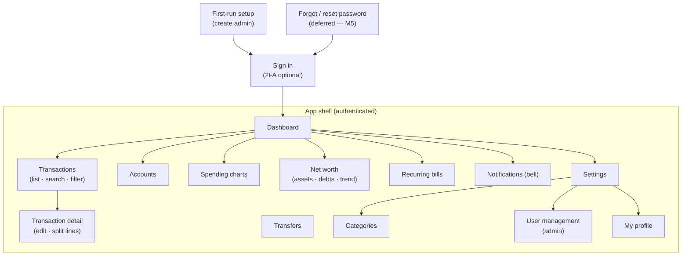
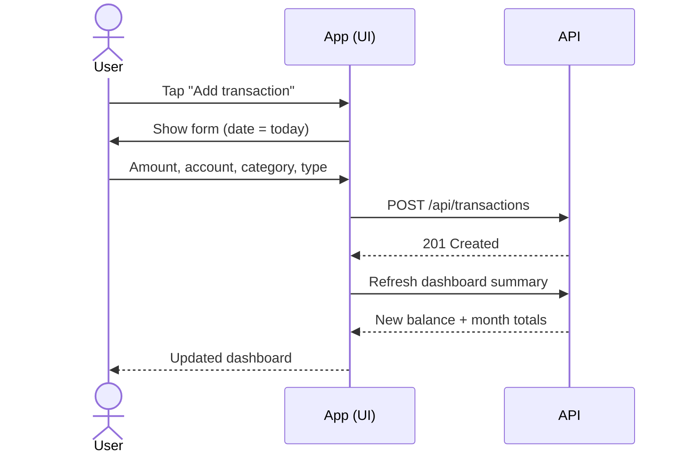
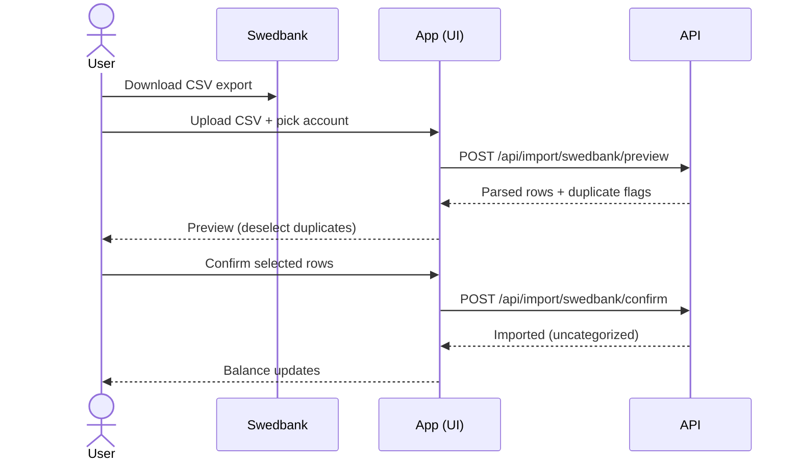
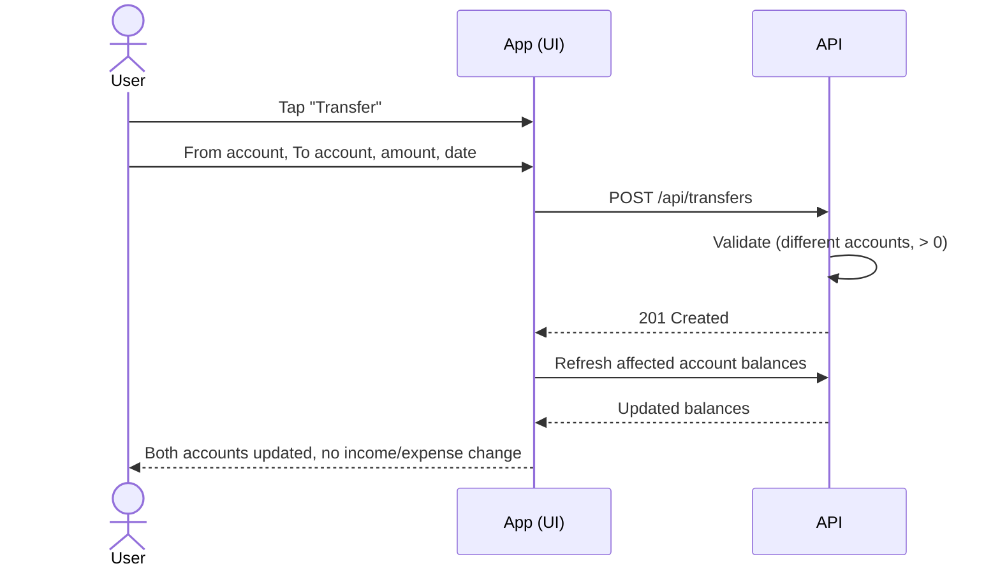
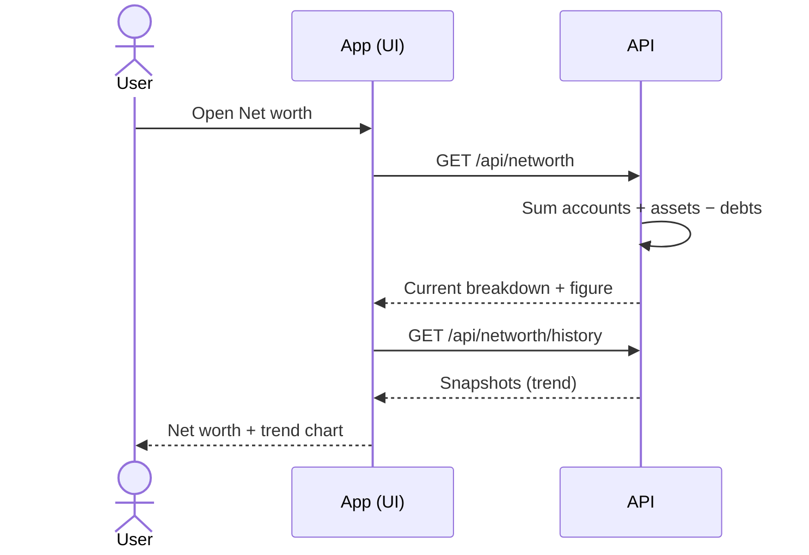
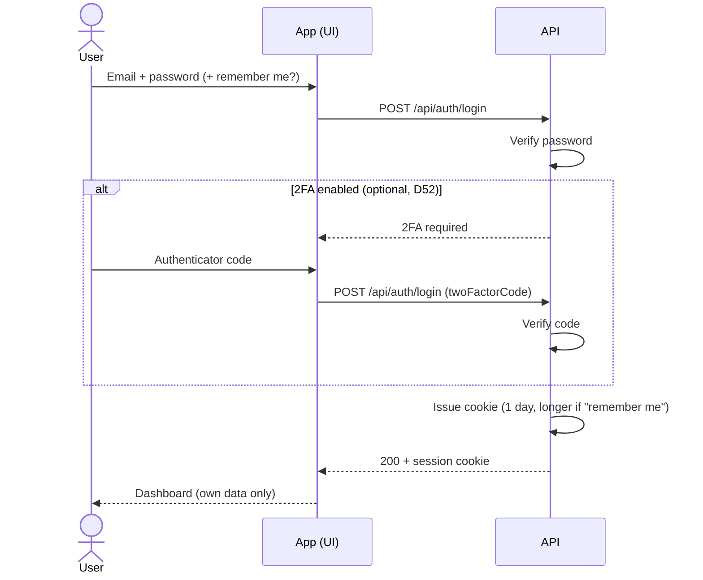

# 3. User flows

The key journeys through the app. Each maps onto features in [[2. Features]] and entities in [[5. Data model]]. The flows are *verb-shaped* (what you do); the [[#Navigation & screen map|screen map]] below is *noun-shaped* (what screens exist and how you move between them).

## Navigation & screen map
The screens behind an authenticated session and how navigation connects them. Auth screens (setup, sign-in, reset) sit outside the shell and lead into the dashboard.



| Screen | Purpose | Release | Backed by |
|--------|---------|:-------:|-----------|
| First-run setup | Create the first admin (password set directly) | M2 | [[6. API surface#Auth (MVP)\|/api/setup]] |
| Sign in (2FA optional) | Authenticate | M2 | [[6. API surface#Auth (MVP)\|/api/auth/*]] |
| Forgot / reset password | Recover access (email) | M5 *(deferred, [[9. Open questions & decisions\|D53]])* | [[6. API surface#Auth (MVP)\|/api/auth/*]] |
| Dashboard | Balance + month income/expense | M1 | [[6. API surface#Dashboard (MVP)\|/api/dashboard/*]] |
| Transactions + detail | Add/edit (M1) · search/**split** (M3) | M1 / M3 | [[6. API surface#Transactions (MVP)\|/api/transactions]] |
| Accounts | Manage accounts, see balances | M1 | [[6. API surface#Accounts (MVP)\|/api/accounts]] |
| Settings → Categories | Manage categories | M1 | [[6. API surface#Categories (MVP)\|/api/categories]] |
| Settings → My profile | Name, password, optional 2FA | M2 | [[6. API surface#Users (MVP)\|/api/users/me]] |
| Settings → User management | Create/role/deactivate (**admin**) | M2 | [[6. API surface#Users (MVP)\|/api/users]] |
| Transfers | Move money between accounts | M3 | [[6. API surface#Transfers (v1.1)\|/api/transfers]] |
| Spending charts | Category + trend visuals | M3 | [[6. API surface#Dashboard (MVP)\|/api/dashboard/*]] |
| Net worth | Assets, debts, trend | M4 | [[6. API surface#Net worth — assets & debts (v1.2)\|/api/networth]] |
| Recurring bills | Set up/confirm bills | M5 | [[6. API surface#Recurring bills (later)\|/api/recurring-bills]] |
| Notifications | Reminder inbox (bell) | M5 | [[6. API surface#Notifications (later)\|/api/notifications]] |

## Flow: First-time setup (your first account)
*(After the admin exists and you've signed in — see [[#Flow: First-run setup (create the admin)]] and [[#Flow: Sign in]].)*
1. Open the app for the first time
2. Create at least one [[5. Data model#Account|account]] (e.g. "Swedbank checking", starting balance)
3. Land on the dashboard, now showing a zero/starting balance
4. Prompted to add a first transaction or import a CSV

## Flow: Add a transaction (core action)
1. From the dashboard, tap "Add transaction"
2. Choose income or expense
3. Enter amount, pick account, pick category, set date (defaults to today)
4. Optionally add a description
5. Save → balance and dashboard update immediately



## Flow: Split a transaction into lines
*(Optional — e.g. one supermarket payment covering several categories.)*
1. While adding or editing a transaction, tap "Split"
2. Add lines, each with an amount, a category, and an optional label ("Food", "Clothes", "Cleaning supplies")
3. A running total must match the transaction amount before you can save
4. Save → the transaction shows its lines; spending-by-category counts each line, not the whole amount ([[5. Data model#TransactionLine]])

## Flow: Review the month
1. Open the app → land on the dashboard
2. See current total balance + this month's income vs. expenses
3. View spending breakdown by category (chart)
4. Tap a category or "see all" to drill into the transaction list

## Flow: Find a past transaction
1. Go to the transactions list
2. Filter by date range, category, account, or amount (or search by description)
3. Tap a result to view details
4. Edit or delete from there if needed

## Flow: Manage categories
1. Go to settings → categories
2. View default + custom categories
3. Add, rename, or remove a category
4. Removing one that's in use → its transactions are **un-categorized** (`CategoryId` → null), never deleted ([[9. Open questions & decisions|D8]])

## Flow: Import a Swedbank CSV
1. Download the CSV from the Swedbank app/site
2. In the app, go to import → upload the file → pick the target account
3. App parses the **transaction rows** (skipping the balance/turnover summary rows) and shows a preview — date, payee, amount, and income/expense from the `D/K` column
4. Rows already imported (matched on the bank's entry number) are **flagged as duplicates**; rows that look like own-account transfers / cash are flagged to **reclassify as a transfer**. Per row the user can keep, edit, reclassify, or skip ([[9. Open questions & decisions|D9]], [[9. Open questions & decisions|D47]])
5. Imported transactions land uncategorized for sorting later
6. Confirm → transactions added, balance updates



## Flow: Transfer between accounts
1. From an account or the transfer screen, tap "Transfer"
2. Pick the source and destination accounts, enter amount and date
3. Save → source balance drops, destination rises by the same amount
4. The transfer nets to zero overall and is excluded from income/expense totals and spending charts



## Flow: Add / update an asset or debt
1. Go to Net worth → Assets (or Debts)
2. Add an item (name, type, value/amount, as-of date) or update an existing one's value
3. Net worth recalculates immediately ([[5. Data model#Net worth (v1.2)]])

## Flow: Review net worth
1. Open the Net worth screen
2. See the current figure broken into accounts / assets / debts
3. View a trend line built from snapshots over time



## Flow: Set up a recurring bill
1. Go to Recurring bills → Add
2. Enter a name and pick the kind:
   - **Fixed** (e.g. Spotify) → enter the price; edit it later if the price changes
   - **Variable** (e.g. electricity) → leave the amount blank; you'll enter it when the bill arrives
3. Pick cadence (monthly, yearly, …), next due date, and optionally a category + account
4. For fixed bills, choose how many days ahead to be reminded; variable bills remind on the due date
5. Save → a reminder is scheduled

## Flow: Get reminded a bill is due
1. When a bill comes due, the app creates an in-app [[5. Data model#Notification|notification]]
2. Open the notification center (bell) → see "Spotify due" / "Electricity due"
3. Tap it → a prefilled transaction opens (amount filled for fixed; enter it for variable)
4. Confirm → the transaction is recorded and the bill's next due date advances
5. (Nothing posts automatically — you always confirm)

```mermaid
sequenceDiagram
    participant Job as Scheduler (daily)
    participant API as API
    participant DB as PostgreSQL
    actor U as User
    Job->>API: Check bills due / approaching
    API->>DB: Find RecurringBills at NextDueDate − RemindDaysBefore
    DB-->>API: Due bills
    API->>DB: Create Notification(s) (Channel = InApp)
    U->>API: Open notification center
    API-->>U: Unread reminders
    U->>API: Confirm "Spotify due" → create transaction
    API->>DB: Insert transaction, advance NextDueDate, mark read
    API-->>U: Recorded; balance updates
```

> [!note] Notifications are in-app primary; with SMTP set up early, the same reminders can also be sent by email ([[9. Open questions & decisions|D14]]).

## Flow: First-run setup (create the admin)
1. On a fresh install with no users, opening the app shows a one-time **setup page**
2. Create the first **admin** (email + password set directly — no email verification, [[9. Open questions & decisions|D53]]); optionally enrol 2FA now or later ([[9. Open questions & decisions|D52]])
3. Setup closes once the admin exists; from then on the normal sign-in page is shown ([[9. Open questions & decisions|D44]])

## Flow: Sign in
1. Open the app → enter email + password
2. **If you enabled 2FA**, enter the authenticator code (or a recovery code) — otherwise you're straight in ([[9. Open questions & decisions|D52]])
3. Optionally tick **"remember me"** to extend the 1-day session on this device
4. Land on the dashboard, seeing only your own data
5. Log out from settings when done



## Flow: Admin creates a user
1. An **admin** opens user management → "Add user" (email, name, role, **initial password**)
2. The admin shares the password with the user out-of-band (email invites are deferred — [[9. Open questions & decisions|D53]])
3. The user signs in, can change their password, and may **optionally** enrol 2FA from their profile ([[9. Open questions & decisions|D52]])

## Flow: Reset password *(deferred — M5, [[9. Open questions & decisions|D53]])*
Email-based self-service reset lands when SMTP is wired up. Until then the **admin resets a user's password directly** (and you, as the sole admin, set your own at first-run).
1. *(Later)* On the sign-in screen → "Forgot password", enter email
2. *(Later)* The system emails a reset link
3. *(Later)* Open the link, set a new password, sign in

---
[[2. Features|← Features]] · [[0. Home|🏠 Home]] · **Next:** [[4. Tech Stack|Tech Stack →]]
