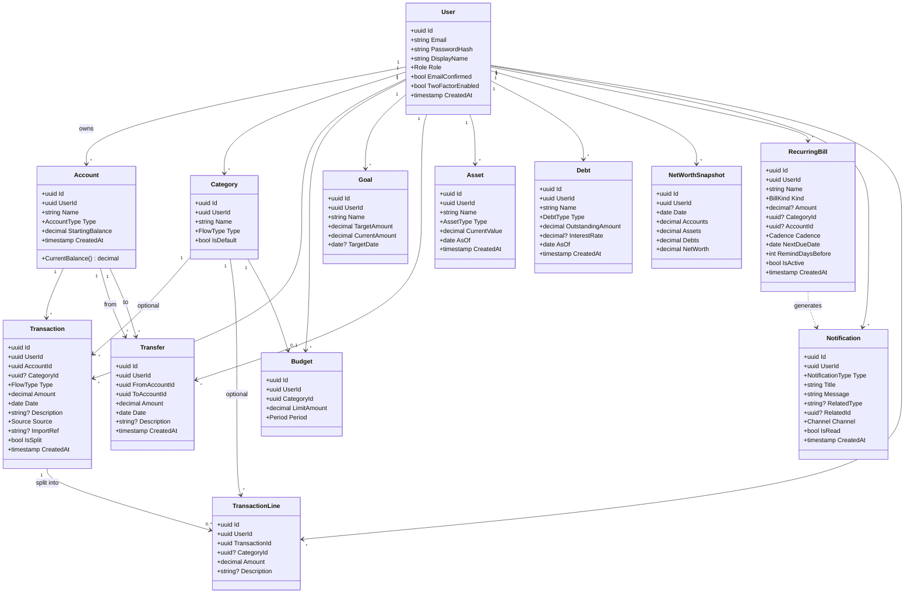
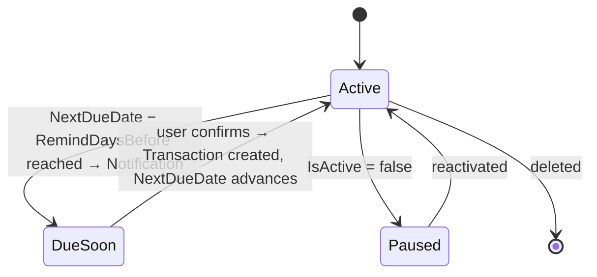

# 5. Data model

Entities and relationships for the finance tracker. Every owned record carries a `UserId` (its owner), so the schema is multi-user-ready without a later migration — but the MVP is **single-user** and there is no sharing yet. Field, money, and timestamp rules live in [[#Conventions]]; the ownership rule lives in [[#Ownership]]. These entities back the [[2. Features|features]] and the [[6. API surface|API]].

> [!note] **Single-user for the MVP ([[9. Open questions & decisions|D50]]).** Every row has a `UserId` owner and queries filter by it, so a second user would see only their own data. **Households & sharing** (a `Scope`/`HouseholdId` model and shared accounts) are **deferred to a later milestone** ([[11. Milestones & tasks#M6 — Households & sharing]]); adding them is a small *additive* migration when the time comes. Until then there is no `Scope`, no `HouseholdId`, and no `Household` tables.

## Glossary
The domain language used across these docs and (later) the code — keep names consistent.

| Term | Means |
|------|-------|
| **Account** | A place spendable money lives (checking, cash, savings). Has a computed balance. *Not* a login. |
| **Asset** | Something you own that isn't a cash account (car, property) — counts toward net worth, not balances. |
| **Debt** | Something you owe (mortgage, loan) — reduces net worth. Loans are debts, never accounts. |
| **Transaction** | A single income or expense event against one account. |
| **Line** (`TransactionLine`) | An optional part of a *split* transaction, putting slices of one payment into different categories. |
| **Transfer** | Money moved between two of *your own* accounts — not income or expense. |
| **Category** | A label for grouping transactions/lines (Food, Salary…). Income or Expense flavoured. |
| **Uncategorized** | A transaction/line with no category (`CategoryId` = null) — never a real "Uncategorized" row. |
| **Recurring bill** | A bill/subscription expected on a cadence; **Fixed** (known price) or **Variable** (amount entered when due). Reminds, never auto-posts. |
| **Archived** | A soft-deleted record, hidden from active lists/pickers but kept for history ([[9. Open questions & decisions\|D24]]). |

## Conventions
These apply to every entity below (kept out of the per-entity tables to keep them focused):
- **Strongly-typed IDs** — each `Id` and foreign key is a typed wrapper (e.g. `AccountId`), not a bare `Guid` ([[9. Open questions & decisions|D22]]). Shown as `uuid` in the tables for brevity.
- **Money as a `Money` value object** — wraps `decimal` + a **currency**, stored as `NUMERIC(_, 2)` (2 decimal places). The active currency is **EUR**, but the type is currency-aware so more can be added in code later — no user-facing multi-currency yet ([[9. Open questions & decisions|D40]], [[9. Open questions & decisions|D41]]). Tables show `decimal`.
- **Audit + soft-delete** — every entity also has `CreatedAt`, `UpdatedAt`, and `IsDeleted`; a global query filter hides soft-deleted rows. Nothing financial is hard-deleted ([[9. Open questions & decisions|D24]]).
- **Timestamps in UTC** — all `*At` timestamps are stored UTC and formatted in the frontend to the user's locale/zone. A transaction's `Date` is a plain **calendar date** (no time/zone) ([[9. Open questions & decisions|D42]]).
- **Reporting periods use one timezone** — because a transaction's `Date` is zoneless, "this month" and other period boundaries (dashboard, budgets) are computed in a single configured timezone (`App__TimeZone`, default `Europe/Vilnius`). Self-hosted and single-user, so one fixed reference is enough ([[9. Open questions & decisions|D56]]).
- **Enum wire form** — the per-entity tables list enum *names* in PascalCase (the C# form, e.g. `Expense`, `Imported`, `Checking`); over the JSON API they serialize as **camelCase strings** (`"expense"`, `"imported"`, `"checking"`) — see [[6. API surface#Conventions]].

## Ownership
The single rule that scopes data in the MVP ([[9. Open questions & decisions|D50]]). Applied to every ownable entity below, so it isn't repeated in each table.

Every ownable record carries one ownership field:
- **`UserId`** — the record's **owner** (its creator); always set. This is the `UserId` on every entity table.

**Visibility (who can read a row):**
> `UserId = currentUser`

One central filter adds this to *every* query — it's the isolation boundary, not a UI convenience. The MVP is single-user, but the filter is wired in from M1 so an admin-created second user ([[9. Open questions & decisions|D35]]) would see only their own data.

> [!info] **Sharing is deferred ([[9. Open questions & decisions|D50]]).** Households, a `Scope`/`HouseholdId` model, shared accounts, the account-as-scope-anchor inheritance, and household-scoped net worth were specced (old D49) but pulled out of the MVP — they were the largest source of per-query complexity for a feature not needed while it's just me. They return in [[11. Milestones & tasks#M6 — Households & sharing|M6]] as an *additive* migration on top of the `UserId` already present. The parked design questions live under [[9. Open questions & decisions#Households & sharing (deferred — D50)|Households & sharing (deferred — D50)]].

## Class diagram

> [!info] **Diagram legend.** `UserId` on every ownable entity is its **owner** (see [[#Ownership]]). The audit fields (`CreatedAt`/`UpdatedAt`/`IsDeleted`) apply to all ownable entities but are shown only on `Account` to keep the diagram readable. Typed IDs render as `uuid`; `Money` renders as `decimal` ([[#Conventions]]).

## Data integrity & invariants
Where each rule is actually enforced, so nothing relies on "the UI won't let you":

| Invariant | Enforced where |
|-----------|----------------|
| **Per-user visibility** — you only ever read your own rows | One central filter applied to *every* query (`UserId = currentUser`); never trust a client-supplied id ([[9. Open questions & decisions\|D50]]). *(Sharing/scope is deferred — D50.)* |
| Money is exactly 2 dp | `NUMERIC(_, 2)` column + the `Money` value object ([[#Conventions]]) |
| **Split lines sum to the parent `Amount`** | Validated in the transaction service inside one DB transaction (it's a cross-row rule, so no single `CHECK`); rejected as a `400` otherwise |
| **`ImportRef` unique per account** | DB **unique index** on `(AccountId, ImportRef)` where `ImportRef` is not null — makes re-imports idempotent ([[9. Open questions & decisions\|D47]]) |
| Transfer source ≠ destination, amount > 0 | FluentValidation + a DB `CHECK (FromAccountId <> ToAccountId)` |
| Soft-deleted rows stay hidden | EF Core **global query filter** on `IsDeleted` ([[9. Open questions & decisions\|D24]]) |
| A split transaction's lines die with it; **editing a split replaces them** | `TransactionLine` is part of the transaction **aggregate**: it **hard-cascades** on parent delete, and an edit **hard-deletes the old lines and inserts the new set** in one DB transaction — the one exception to the soft-delete rule ([[9. Open questions & decisions\|D55]]) |

### User
| Field | Type | Notes |
|-------|------|-------|
| Id | uuid | Primary key |
| Email | string | Unique |
| PasswordHash | string | Managed by ASP.NET Core Identity |
| DisplayName | string | Shown in the UI |
| Role | enum | `Admin` or `Member` — admins manage users ([[9. Open questions & decisions\|D35]]) |
| EmailConfirmed | bool | Identity field; **email verification is deferred (D53)**, so it's set at creation for now |
| TwoFactorEnabled | bool | TOTP authenticator (**optional**, [[9. Open questions & decisions\|D52]]); secret + recovery codes managed by Identity |
| CreatedAt | timestamp | |

The first user (an **admin**) is created via the first-run setup page; further users are admin-created (no open sign-up). See [[9. Open questions & decisions|D44]].

The **app role** is `Admin` vs `Member` — only `Admin` manages *users*. (A second *household* role axis arrives with sharing, which is deferred — [[9. Open questions & decisions|D50]].) See the [[6. API surface#Authorization matrix|authorization matrix]].

> [!note] **`Household` & `HouseholdMembership` are deferred ([[9. Open questions & decisions|D50]]).** They were specced under old D49 (a named group + a user↔household join carrying an Owner/Member role) and return in [[11. Milestones & tasks#M6 — Households & sharing|M6]]. They're out of the MVP schema, so they're not detailed here — see the parked questions under [[9. Open questions & decisions#Households & sharing (deferred — D50)|Households & sharing (deferred — D50)]].

### Account
A place money lives: a bank account, cash, or savings.

| Field | Type | Notes |
|-------|------|-------|
| Id | uuid | Primary key |
| UserId | uuid | FK → User (owner/creator) |
| Name | string | e.g. "Swedbank checking" |
| Type | enum | Checking, Savings, Cash, Other |
| StartingBalance | decimal | Balance when the account was added |
| CreatedAt | timestamp | |

Current balance is computed, not stored:
**`CurrentBalance = StartingBalance + Σ(income − expense transactions) + Σ(incoming transfers) − Σ(outgoing transfers)`** ([[9. Open questions & decisions|D2]]). Transfers move balance between accounts even though they aren't income/expense ([[#Transfer (v1.1)]]).

Accounts hold spendable money only. **Loans are not accounts** — they live in [[#Debt]] ([[9. Open questions & decisions|D43]]). **Credit cards are deferred to the far future**, so there's no `CreditCard` type yet.

**Deletion is archival** ([[9. Open questions & decisions|D48]]): deleting an account soft-deletes it. An account that still has transactions or transfers **can't be erased** — only archived, so history is never orphaned. Archived accounts disappear from pickers and the active total balance, but their rows stay for historical reports.

### Category
A label for grouping transactions.

| Field | Type | Notes |
|-------|------|-------|
| Id | uuid | Primary key |
| UserId | uuid | FK → User |
| Name | string | e.g. "Food", "Rent", "Salary" |
| Type | enum | Income or Expense |
| IsDefault | bool | True for the seeded starter categories |

Deleting a category does not delete its transactions: their `CategoryId` is set to null (Uncategorized). See [[9. Open questions & decisions|D8]].

### Transaction
A single income or expense event. It can optionally be **split into lines** (e.g. one supermarket payment divided into food, clothes, cleaning supplies) — see [[#TransactionLine]].

| Field | Type | Notes |
|-------|------|-------|
| Id | uuid | Primary key |
| UserId | uuid | FK → User |
| AccountId | uuid | FK → Account |
| CategoryId | uuid? | FK → Category; the transaction's category when **not** split. Null when split (categories come from the lines) or uncategorized |
| Type | enum | Income or Expense |
| Amount | decimal | Always positive; Type sets the direction. The total — when split, **must equal the sum of its lines** |
| Date | date | When the transaction occurred |
| Description | string? | Free text (e.g. the merchant, "Lidl") |
| Source | enum | Manual or Imported |
| ImportRef | string? | Bank entry number ("Įrašo Nr.") for imported rows; unique per account, used to dedup re-imports ([[9. Open questions & decisions\|D47]]) |
| IsSplit | bool | True when the transaction has lines |
| CreatedAt | timestamp | |

Only the **total** `Amount` affects an account's computed balance — splitting changes *categorisation*, not the balance. `UserId` records the owner; visibility is the per-user filter ([[#Ownership]]).

### TransactionLine
An optional part-line of a split transaction. Lines share their parent's `Type`, `AccountId`, and `Date`; only the category, amount, and a label differ.

| Field | Type | Notes |
|-------|------|-------|
| Id | uuid | Primary key |
| UserId | uuid | FK → User (mirrors the parent, per [[9. Open questions & decisions\|D3]]) |
| TransactionId | uuid | FK → Transaction (cascade delete with the parent) |
| CategoryId | uuid? | FK → Category; null means uncategorized |
| Amount | decimal | Always positive; the lines sum to the parent's `Amount` |
| Description | string? | e.g. "Clothes", "Cleaning supplies" |

**Editing a split replaces its lines.** Saving an edited split **hard-deletes** the old `TransactionLine`s and inserts the new set in one DB transaction — they're part of the aggregate, the one soft-delete exception ([[9. Open questions & decisions|D55]]).

**Spending by category** (charts and budgets) attributes a split transaction's amounts by **line**; an unsplit transaction attributes its whole amount to its own `CategoryId` ([[9. Open questions & decisions|D46]]). Because that's two paths, keep it in **one** shared projection (a "category attributions" view: emit the lines when `IsSplit`, else the header row) so charts and budgets can't drift apart.

### Transfer (v1.1)
Moving money between two of your own accounts. Not income or expense — it nets to zero overall and is excluded from spending charts and budgets.

| Field | Type | Notes |
|-------|------|-------|
| Id | uuid | Primary key |
| UserId | uuid | FK → User |
| FromAccountId | uuid | FK → Account (source) |
| ToAccountId | uuid | FK → Account (destination); must differ from source |
| Amount | decimal | Always positive |
| Date | date | When the transfer occurred |
| Description | string? | Free text |
| CreatedAt | timestamp | |

A transfer lowers the source account's computed balance and raises the destination's by `Amount`. Both accounts must belong to the user ([[#Ownership]]).

### Budget (v1.2)
A monthly spending cap for one category.

| Field | Type | Notes |
|-------|------|-------|
| Id | uuid | Primary key |
| UserId | uuid | FK → User |
| CategoryId | uuid | FK → Category |
| LimitAmount | decimal | Maximum spend allowed |
| Period | enum | Monthly |

### Goal (v1.2)
A savings target to work toward.

| Field | Type | Notes |
|-------|------|-------|
| Id | uuid | Primary key |
| UserId | uuid | FK → User |
| Name | string | e.g. "Emergency fund" |
| TargetAmount | decimal | The number being saved toward |
| CurrentAmount | decimal | Progress so far |
| TargetDate | date? | Optional deadline |

## Net worth (v1.2)
Net worth extends the ledger with things you own (assets) and owe (debts):
**net worth = total account balances + total assets − total debts**.
See the feature in [[2. Features#Should-have (v1.2)]] and flows in [[3. User flows#Flow: Review net worth]].

### Asset
Something you own that isn't a cash account (car, property, valuables, an investment lump sum). Value is entered manually and updated over time.

| Field | Type | Notes |
|-------|------|-------|
| Id | uuid | Primary key |
| UserId | uuid | FK → User |
| Name | string | e.g. "Car", "Apartment" |
| Type | enum | Property, Vehicle, Investment, Valuable, Other |
| CurrentValue | decimal | Latest known value (manual entry) |
| AsOf | date | When that value was recorded |
| CreatedAt | timestamp | |

### Debt
Something you owe (mortgage, loan). Credit cards are deferred to the far future ([[9. Open questions & decisions|D43]]).

| Field | Type | Notes |
|-------|------|-------|
| Id | uuid | Primary key |
| UserId | uuid | FK → User |
| Name | string | e.g. "Mortgage", "Car loan" |
| Type | enum | Mortgage, Loan, Other |
| OutstandingAmount | decimal | Amount still owed |
| InterestRate | decimal? | Optional, annual % |
| AsOf | date | When the amount was recorded |
| CreatedAt | timestamp | |

### NetWorthSnapshot
A point-in-time record so net worth can be charted over time without recomputing history. Created on a schedule (e.g. monthly) and/or on demand.

| Field | Type | Notes |
|-------|------|-------|
| Id | uuid | Primary key |
| UserId | uuid | FK → User |
| Date | date | Snapshot date |
| Accounts | decimal | Sum of account balances at that date |
| Assets | decimal | Sum of asset values |
| Debts | decimal | Sum of outstanding debts |
| NetWorth | decimal | Accounts + Assets − Debts |

## Recurring bills & notifications (later)
Reminders for bills that come around on a schedule. See the flows in [[3. User flows#Flow: Set up a recurring bill]] and the notifications design below.

### RecurringBill
A bill or subscription expected on a cadence. Two kinds:
- **Fixed** — known price (e.g. Spotify €11.99/mo). `Amount` is set and can be edited when the price changes.
- **Variable** — amount not known ahead (e.g. electricity). `Amount` is null; the reminder fires on the due date and the user enters the real amount when the bill arrives.

| Field | Type | Notes |
|-------|------|-------|
| Id | uuid | Primary key |
| UserId | uuid | FK → User |
| Name | string | e.g. "Spotify", "Electricity" |
| Kind | enum | `Fixed` or `Variable` |
| Amount | decimal? | Set for Fixed (editable); null for Variable |
| CategoryId | uuid? | FK → Category; suggested category for the resulting transaction |
| AccountId | uuid? | FK → Account; default account to pay from |
| Cadence | enum | Weekly, Monthly, Quarterly, Yearly |
| NextDueDate | date | When the next occurrence is due |
| RemindDaysBefore | int | Days ahead to remind (Fixed); Variable reminds on the due date |
| IsActive | bool | Pause without deleting |
| CreatedAt | timestamp | |

When a bill comes due the app raises a [[#Notification]] (no auto-posting — [[9. Open questions & decisions|D13]]). The user confirms it, which creates a [[#Transaction]] (amount prefilled for Fixed, entered for Variable), then `NextDueDate` advances by the cadence.

### Notification
A message to the user. Built channel-agnostic so the same record can be shown in-app or sent by email.

| Field | Type | Notes |
|-------|------|-------|
| Id | uuid | Primary key |
| UserId | uuid | FK → User |
| Type | enum | `BillDue` (more types later, e.g. BudgetExceeded) |
| Title | string | Short heading |
| Message | string | Body text |
| RelatedType | string? | What it refers to, e.g. "RecurringBill" |
| RelatedId | uuid? | Id of the related record (deep-link target) |
| Channel | enum | `InApp` (primary) or `Email` — SMTP is set up early ([[9. Open questions & decisions\|D14]]) |
| IsRead | bool | Mark-as-read state for the in-app list |
| CreatedAt | timestamp | |

### Relationships
- User owns (created) many Accounts, Categories, Transactions, TransactionLines, Transfers, Budgets, Goals, Assets, Debts, NetWorthSnapshots, RecurringBills, and Notifications
- Account has many Transactions, and is the source or destination of many Transfers
- Category has many Transactions and TransactionLines, and may have one Budget
- Transaction belongs to one Account and (optionally) one Category, and has zero or more TransactionLines (a split transaction)
- TransactionLine belongs to one Transaction and (optionally) one Category
- Transfer links two Accounts (from → to)
- Assets and Debts stand alone per user; net worth combines them with account balances
- RecurringBill (optionally) references a Category and Account, and generates Notifications when due

---
[[4. Tech Stack|← Tech Stack]] · [[0. Home|🏠 Home]] · **Next:** [[6. API surface|API surface →]]