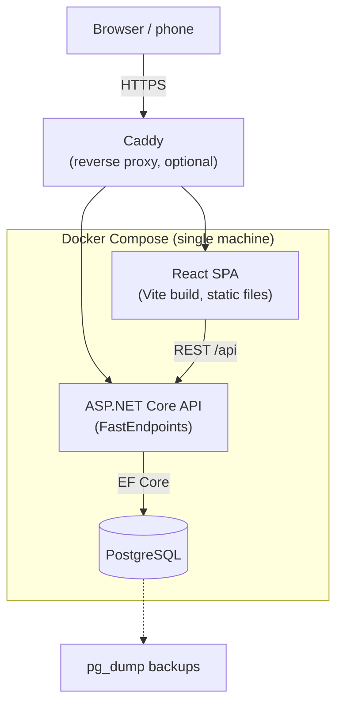
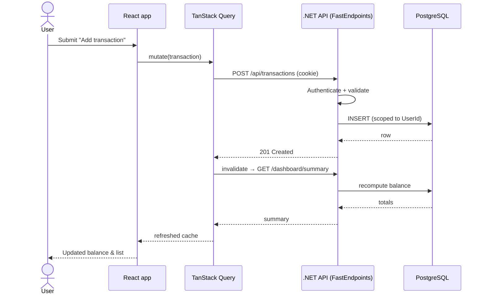
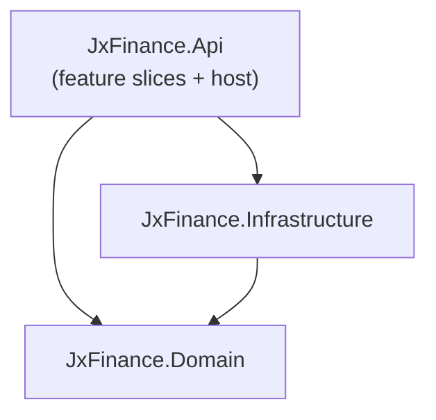
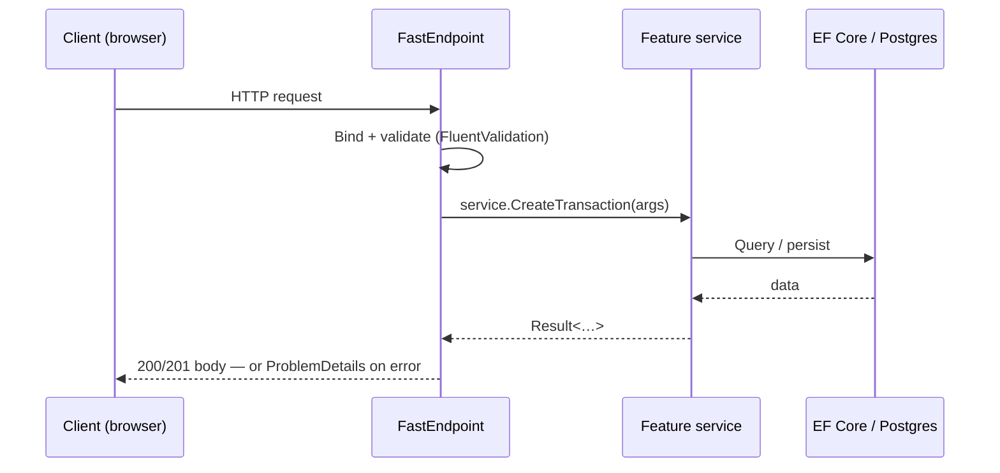
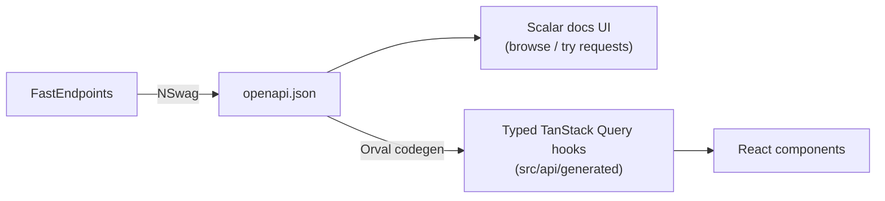

# 7. Architecture notes

How the pieces from the [[4. Tech Stack]] fit together. Decisions worth recording live in [[9. Open questions & decisions]].

## High-level shape

Three services — the **React SPA** (static files), the **.NET API**, and **PostgreSQL** — run via **Docker Compose** on a single machine; one command brings the whole stack up.

## Request flow
1. The React SPA loads in the browser; [[4. Tech Stack#Front-end|TanStack Router]] handles navigation.
2. **TanStack Query** calls the [[6. API surface|.NET API]] and caches server state.
3. The API authenticates the request (Identity cookie), validates input (FluentValidation), and talks to PostgreSQL via EF Core.
4. After a write, TanStack Query invalidates the affected queries so balances and lists refresh immediately.



## Key design decisions
- **Computed balances, not stored.** An account's current balance is `StartingBalance + Σ(transactions) ± transfers` (transfers move balance between accounts though they aren't income/expense), calculated on read. Avoids drift; no balance field to keep in sync. Full formula in [[5. Data model#Account]]. (Revisit if performance suffers — see [[9. Open questions & decisions#Risks & mitigations]].)
- **Money as `decimal` end to end.** `NUMERIC` in Postgres → `decimal` in C# → string over the wire. Never floating point.
- **Ownership & visibility (per-user).** Every owned row carries `UserId` (its owner). One central filter runs on *every* query — `UserId = currentUser` — and it's the security boundary, not a UI convenience. The MVP is single-user; the filter is wired in from M1 so an admin-created second user sees only their own data. Households/scope sharing is deferred ([[5. Data model#Ownership]], [[9. Open questions & decisions|D50]]).
- **CSV import is a two-step pipeline.** Preview (parse + flag duplicates, no writes) → confirm (commit selected rows). Imported rows are marked `Source = Imported` and land uncategorized.

## Background jobs
Some work isn't triggered by a user request and runs on a schedule inside the API (e.g. a hosted background service / timer):
- **Recurring-bill reminders** — a daily job finds [[5. Data model#RecurringBill|RecurringBills]] reaching `NextDueDate − RemindDaysBefore` (or the due date for variable bills) and creates [[5. Data model#Notification|Notifications]] (`Channel = InApp`). No transaction is posted automatically; the user confirms. See [[3. User flows#Flow: Get reminded a bill is due]].
- **Net-worth snapshots** — periodically writes a [[5. Data model#NetWorthSnapshot|NetWorthSnapshot]] so trends don't recompute history.
- **Backups** — scheduled `pg_dump` (see [[8. Non-functional requirements#Reliability & backups]]).

**Notification channels:** in-app is primary (the job writes a `Notification` row; the app reads it on focus, D38). With SMTP set up early, an `Email` channel can send the same reminders via the same model ([[9. Open questions & decisions|D14]]).

## Backend structure
ASP.NET Core with **FastEndpoints** (the REPR pattern — Request / Endpoint / Response) and **plain application services**, organised as **vertical slices**: everything for one feature lives in a single folder rather than being spread across technical layers. No mediator and no MediatR — endpoints (and background jobs) inject a feature service and call it directly, so you keep the reuse seam but get compile-time discoverability (F12 jumps to the implementation) and no reflection-based dispatch ([[9. Open questions & decisions|D16]], [[9. Open questions & decisions|D45]]).

Three projects + tests:
- **JxFinance.Api** — the host and all feature slices: thin FastEndpoints endpoints + the feature's application service, plus `Program.cs`, DI, OpenAPI config, [[#Global error handling|global error handling]], auth, and a `Common/` folder for error handling, service decorators, and FastEndpoints processors.
- **JxFinance.Domain** — entities, value objects (`Money`), enums, and domain rules. No framework dependencies, so the core stays testable and portable.
- **JxFinance.Infrastructure** — EF Core `DbContext` + configurations, migrations, ASP.NET Core Identity, email, and other external services.
- **JxFinance.Tests** — unit tests (domain + handlers) + integration tests (endpoints, real Postgres).

Dependencies stay almost linear — `Domain` depends on nothing (the rule the [[#Testing|architecture tests]] enforce):


A feature is **one folder** — thin endpoints over a service everything shares:
```
JxFinance.Api/Features/Transactions/
  ITransactionService.cs           the feature's use-case methods (Create, Update, …)
  TransactionService.cs            logic + EF Core — injected by endpoints AND jobs
  CreateTransaction/
    CreateTransactionEndpoint.cs   FastEndpoint: bind, validate, call _service.Create(…)
    CreateTransactionRequest.cs    request + response DTOs
    CreateTransactionValidator.cs  FluentValidation
  UpdateTransaction/ …
JxFinance.Api/Common/            error handling, service decorators, FE processors
```
Slices stay thin and independent; anything genuinely shared drops down into `Domain` (rules) or `Infrastructure` (data/IO), never sideways between features.

### Request flow
Endpoints stay thin — they bind/validate, then call a **feature service** that holds the use-case logic and talks to EF Core. The same service is injected into [[#Background jobs|background jobs]], so the logic has exactly one home.


### Application services, briefly
- A feature exposes an interface + implementation (`ITransactionService` / `TransactionService`); its methods are the use cases. Endpoints and jobs inject it and call directly — no marker interfaces, no `Send(command)` dispatch.
- **Discoverable:** F12 on a call jumps straight to the implementation; no "find the handler for this request type" hunt.
- **Cross-cutting is explicit, not magic:** request-level concerns (auth, logging, validation) via **FastEndpoints pre/post processors**; service-level concerns (transaction/unit-of-work, retry, caching) via **decorators** registered in DI around the interface.
- Services return `Result<T>` for expected failures (see [[#Global error handling]]).

## Global error handling
One predictable error shape for the whole API, so the client never guesses ([[9. Open questions & decisions|D18]]):
- All errors return **RFC 7807 ProblemDetails** JSON.
- Validation failures (FastEndpoints + FluentValidation) → `400` with field-level errors.
- **Result pattern for *expected* failures.** Services return `Result<T>` (success or a typed error) for things like "account not found" or "amount must be positive"; the endpoint translates the failure into ProblemDetails. Exceptions are reserved for the genuinely exceptional, so ordinary control flow stays explicit ([[9. Open questions & decisions|D23]]).
- A global exception handler maps known domain exceptions to status codes and logs everything else as `500` without leaking internals.
- Structured logging via **Serilog** (requests + slow queries) — see [[8. Non-functional requirements#Observability]].

## Backend conventions
- **Strongly-typed IDs.** Each entity gets its own id type (e.g. `readonly record struct AccountId(Guid Value)`) instead of a bare `Guid`, so you can't pass an `AccountId` where a `CategoryId` is expected. EF Core maps them with value converters ([[9. Open questions & decisions|D22]]).
- **`Money` value object.** A small type wrapping a `decimal` (EUR) with safe arithmetic and formatting, so money is never a loose `decimal` to mishandle. Stored as `NUMERIC` via a converter — see [[5. Data model#Conventions]].
- **Soft-delete + audit fields.** Every entity carries `CreatedAt`, `UpdatedAt`, and `IsDeleted`; a global query filter hides soft-deleted rows by default. Nothing financial is ever hard-deleted — you keep the history ([[9. Open questions & decisions|D24]]). Deleting a category soft-deletes the category *and* nulls its transactions' `CategoryId` (D8) — the two rules combine.
- **Mapping by hand.** Entity ↔ request/response mapping is written explicitly (small mapping methods), no AutoMapper/Mapperly — fewer surprises, easy to read, trivial at this scale ([[9. Open questions & decisions|D25]]).
- **Hardening.** ASP.NET Core **health checks** (DB ping, wired to the Docker healthcheck) and the built-in **rate limiter** on `/auth/*` ([[9. Open questions & decisions|D27]], [[8. Non-functional requirements#Security]]).
- **Migrations on startup — after a backup.** A `pg_dump` runs first, then EF Core migrations apply automatically when the API starts, so a deploy is just "pull + up" while a bad migration stays recoverable ([[9. Open questions & decisions|D39]], [[9. Open questions & decisions|D54]]).
- **Email via MailKit/SMTP (deferred).** Verification, password-reset, and notification emails go through SMTP behind an `IEmailSender` abstraction — but **email is decoupled from onboarding and lands in M5** ([[9. Open questions & decisions|D53]]); the seam goes in at M2 so it slots in cleanly later ([[9. Open questions & decisions|D34]]).

## API contract & client generation
The OpenAPI document is the **single source of truth** for the API shape, and the frontend client is generated from it — no hand-written fetch code, no drift between back and front ([[9. Open questions & decisions|D17]]).

1. **FastEndpoints + NSwag** (`FastEndpoints.Swagger`) generate the OpenAPI document — NSwag is FastEndpoints' first-class OpenAPI path, so endpoint schemas come through complete.
2. **Scalar** (`Scalar.AspNetCore`) serves the interactive API docs from that document — the modern replacement for Swagger UI, which .NET no longer ships. Scalar just consumes the spec, so it pairs fine with NSwag.
3. A frontend codegen step (**Orval**, or `@hey-api/openapi-ts`) reads the spec and generates typed fetchers + **TanStack Query** hooks.
4. Components import the generated hooks. Change the API → regenerate → breaks surface at compile time, not in production.

## Frontend structure
Vite + React + TypeScript, leaning on the **TanStack ecosystem** throughout (Router, Query, Table, Form) ([[9. Open questions & decisions|D20]]). Organised for growth: routing, feature modules, and the generated API stay separate so a new feature slots in without disturbing the rest ([[9. Open questions & decisions|D19]]).
```
src/
  routes/            file-based routes (TanStack Router): route tree + paths
  features/          one folder per feature (transactions, accounts, dashboard, …)
                       components/   feature UI
                       hooks/        feature logic
                       <feature>.api.ts   thin wrapper over generated hooks
  api/
    generated/       OpenAPI-generated client + query hooks — never hand-edited
    client.ts        configured fetch client: base URL, auth, error mapping
  components/ui/     shared presentational primitives (Tailwind)
  locales/           en/ + lt/ translation files (react-i18next)
  lib/               query client, helpers
  hooks/             shared hooks
  config/            env + app config
  main.tsx  app.tsx  global.css
```
- **Adding a feature** = a `features/<name>/` folder + a `routes/` entry. Nothing else needs to change.
- **Server state** lives in TanStack Query (the generated hooks); small **client state** uses TanStack Store; **local UI state** stays in components.

### Frontend conventions
- **UI primitives — shadcn/ui** (Radix + Tailwind) copied into `components/ui/`: accessible, owned, and on-brand with Tailwind ([[9. Open questions & decisions|D28]]).
- **Type-safe URL search params** (TanStack Router) for list filters — the [[2. Features#Should-have (v1.1)|search & filter]] state (date range, category, account, amount) lives in validated, typed search params, so filters are shareable and bookmarkable ([[9. Open questions & decisions|D29]]).
- **TanStack Query conventions:** query-key factories and a **global error handler** (ProblemDetails → toast). **Optimistically update lists and simple actions only**; for server-computed values like balances, show a loading state and refetch (D2 keeps the exact balance server-owned). **Refetch on window focus** keeps multi-device data fresh ([[9. Open questions & decisions|D30]], [[9. Open questions & decisions|D38]], [[8. Non-functional requirements#Performance]]).
- **End-to-end validation with zod.** Forms use TanStack Form + zod; schemas mirror the server's FluentValidation (ideally generated from the OpenAPI spec) so both ends agree ([[9. Open questions & decisions|D31]]).
- **Client state — TanStack Store** for the little non-server state (active locale, theme, UI toggles; *active scope arrives with households, M6*); server state stays in TanStack Query ([[9. Open questions & decisions|D32]]).
- **Active-scope selector (deferred — M6).** When households arrive ([[9. Open questions & decisions|D50]]), a header control will switch the working context — **Personal** or one of your households — filtering dashboards/lists (`scope`/`householdId` query param) and setting the default scope for new accounts (TanStack Store + a typed search param, shareable/bookmarkable). Not in the MVP — there's no scope selector while it's single-user.
- **Locale-bound formatters.** Shared `useMoney()` / `useDate()` helpers wrap `Intl.NumberFormat` / `Intl.DateTimeFormat` against the active language (EUR, EN/LT) — see [[8. Non-functional requirements#Localization (i18n)]].

## Testing
- **Backend — integration tests with Testcontainers:** spin up a real PostgreSQL in a container and exercise endpoints/handlers against it (no mocking EF), for high confidence in the data layer ([[9. Open questions & decisions|D26]]).
- **Backend — architecture tests** (NetArchTest) enforce layering: `Domain` depends on nothing, endpoints don't touch `DbContext` directly, etc.
- **Backend — unit tests** for domain logic and service behaviour.
- **Frontend — Vitest + React Testing Library** for component/hook tests, with the generated client mocked. **No end-to-end (Playwright) suite** — not worth the upkeep for a personal app ([[9. Open questions & decisions|D26]]).

## Developer experience & CI
- **Task runner** (`justfile` or `Taskfile.yml`) wraps the two ecosystems: `dev` (dotnet watch + vite), `gen` (regenerate the client from OpenAPI), `test`, `up` ([[9. Open questions & decisions|D33]]).
- **CI client-drift check:** a pipeline step regenerates the Orval client from the OpenAPI document and fails if it differs from what's committed — front and back can never silently drift (enforces [[9. Open questions & decisions|D17]] mechanically).

## Project layout (repo root)
- `frontend/` — Vite + React app, built to static assets.
- `backend/` — the .NET solution above.
- `docker-compose.yml` — frontend, backend, and Postgres services.
- `.env` — connection strings and secrets, git-ignored.

## Configuration (`.env`)
One git-ignored `.env` drives the whole stack; `.env.example` ships the keys with safe placeholders. The consolidated reference:

| Variable | Purpose | Required | Example / default |
|----------|---------|----------|-------------------|
| `POSTGRES_USER` | DB user | yes | `jxfinance` |
| `POSTGRES_PASSWORD` | DB password | yes | *(set a strong one)* |
| `POSTGRES_DB` | DB name | yes | `jxfinance` |
| `ConnectionStrings__Default` | EF Core connection string | yes | `Host=db;Port=5432;Database=jxfinance;Username=…;Password=…` |
| `App__TimeZone` | Timezone for period boundaries ([[9. Open questions & decisions\|D56]]) | no | `Europe/Vilnius` |
| `App__DefaultCulture` | Fallback locale | no | `en` (also `lt`) |
| `Auth__RememberMeDays` | "Remember me" cookie lifetime ([[9. Open questions & decisions\|D36]]) | no | `30` |
| `Smtp__Host` / `Smtp__Port` | SMTP server — **only needed for the deferred email features (M5, [[9. Open questions & decisions\|D53]])** | no (M5) | `smtp.example.com` / `587` |
| `Smtp__User` / `Smtp__Password` | SMTP credentials | no (M5) | — |
| `Smtp__FromAddress` | Sender for verify/reset/notification mail | no (M5) | `jx-finance@example.com` |
| `App__BaseUrl` | Public URL used in email links (M5) | no (M5) | `https://finance.local` |

> [!tip] Keys use ASP.NET Core's `__` (double-underscore) nesting so they bind straight to `IConfiguration` sections. Never commit a filled-in `.env`.

## Deployment topology
- **Frontend** is static files (the Vite build) served by Caddy; no separate Node runtime in production.
- **Local only** by default; reachable on the home Wi-Fi via the host's local IP.
- **Remote access** via WireGuard (private VPN tunnel) rather than exposing ports to the internet.
- **HTTPS** handled by Caddy when used.

## Deploying with Docker
The whole stack ships as Docker images orchestrated by one `docker-compose.yml`, so it runs the same on any machine with Docker — a home server, a VPS, or a laptop. Goal: **clone → set secrets → one command up**.

**Prerequisites:** [Docker](https://docs.docker.com/get-docker/) and Docker Compose (bundled with Docker Desktop / `docker compose` v2).

**Steps:**
1. **Get the code**
   ```bash
   git clone <repo-url> jx-finance
   cd jx-finance
   ```
2. **Set secrets** — copy the example env file and fill it in (DB password, etc.). Kept out of source control.
   ```bash
   cp .env.example .env
   # edit .env: POSTGRES_PASSWORD, connection string, any keys
   ```
3. **Start everything** — builds and runs frontend, API, and PostgreSQL:
   ```bash
   docker compose up -d
   ```
4. **Migrations apply automatically** when the API starts (D39) — no manual step. (To run them by hand if ever needed: `docker compose exec api dotnet ef database update`.)
5. **Open the app** at `http://<host-ip>:<port>` (e.g. `http://localhost:8080`). On first run the **setup page** prompts you to create the admin ([[9. Open questions & decisions|D44]]); then sign in and create other users.

**Update to a new version:**
```bash
git pull
docker compose up -d --build
```

**Common operations:**

| Task | Command |
|------|---------|
| View logs | `docker compose logs -f` |
| Stop | `docker compose down` |
| Back up the DB | `docker compose exec db pg_dump -U <user> <db> > backup.sql` |
| Restore | `cat backup.sql \| docker compose exec -T db psql -U <user> <db>` |

> [!tip] To deploy on a different host, copy the repo + `.env` (or just `docker-compose.yml` + `.env` if using prebuilt/pushed images) and run step 3. Nothing else is host-specific.

See [[4. Tech Stack#Local deployment]] for the chosen tools and [[8. Non-functional requirements#Reliability & backups]] for the backup policy.

---
[[6. API surface|← API surface]] · [[0. Home|🏠 Home]] · **Next:** [[8. Non-functional requirements|NFRs →]]
