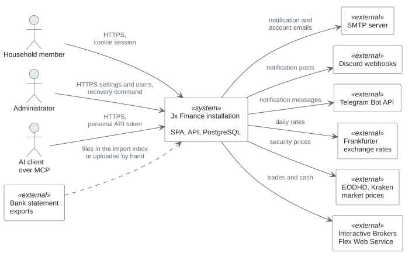
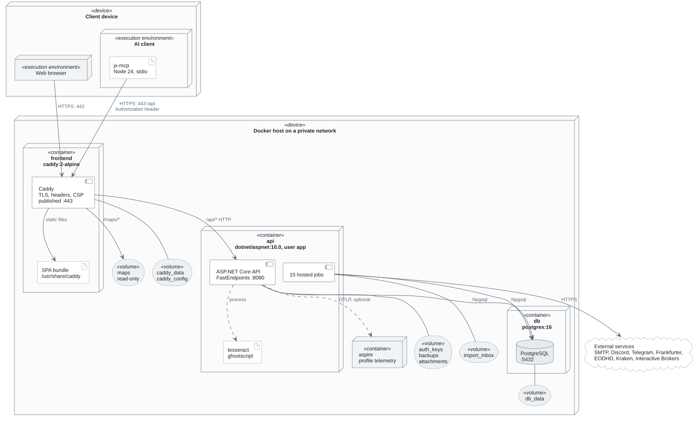
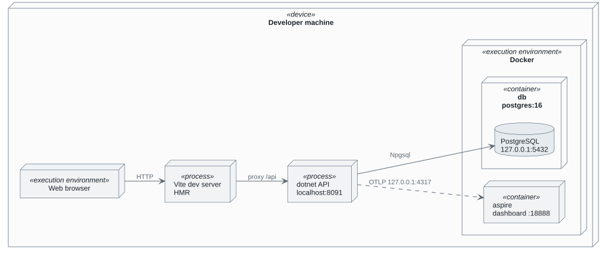
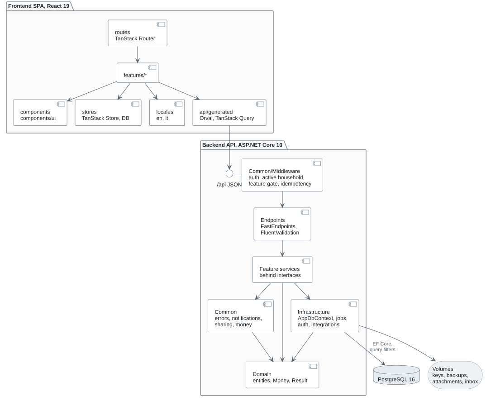
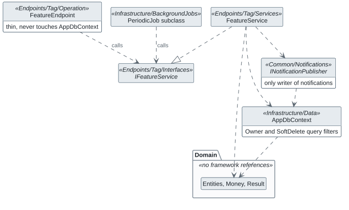
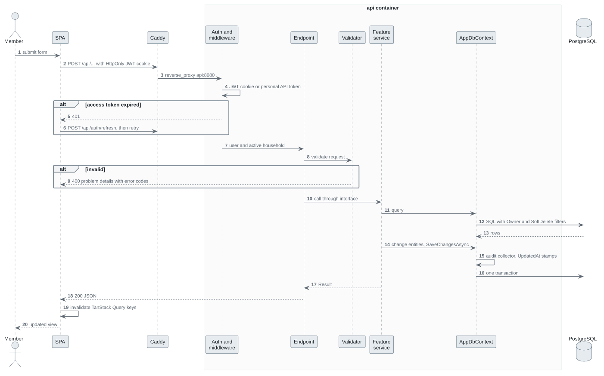
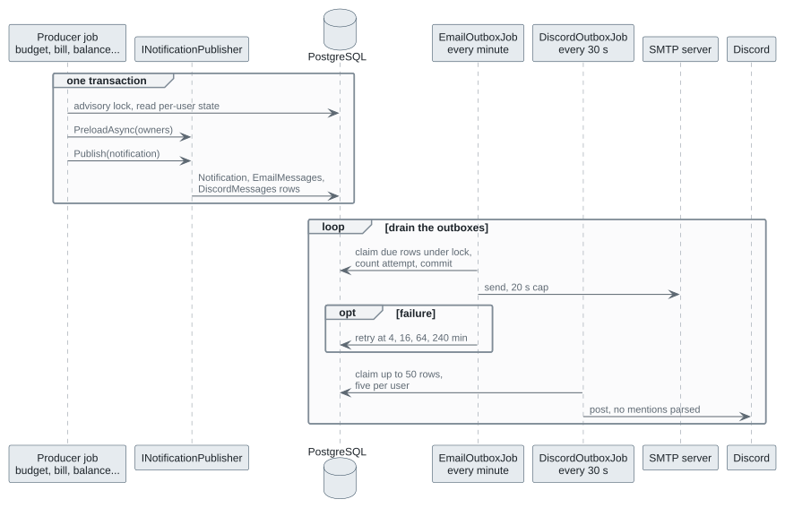
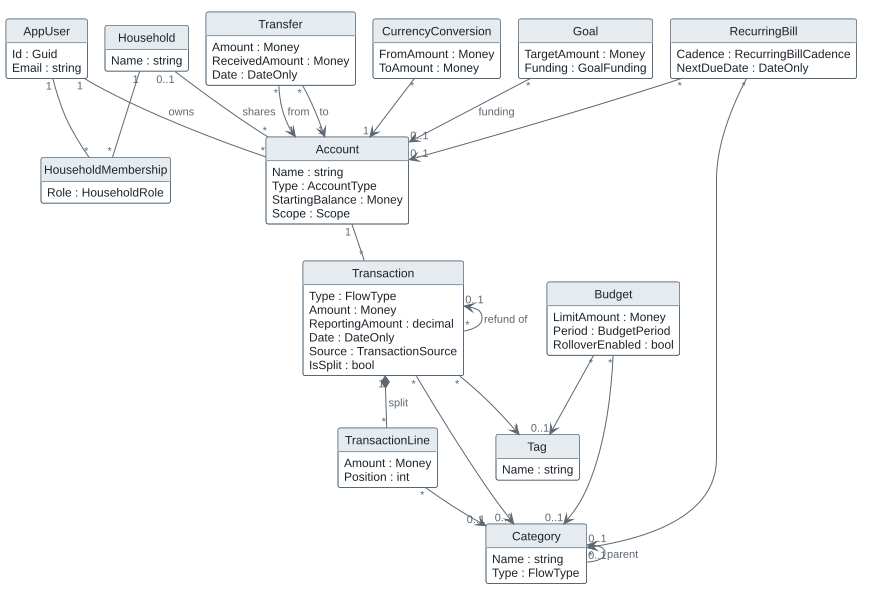
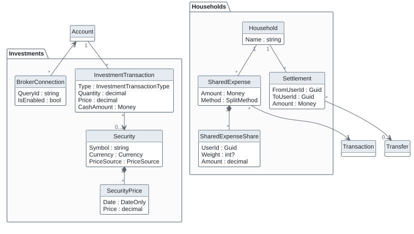
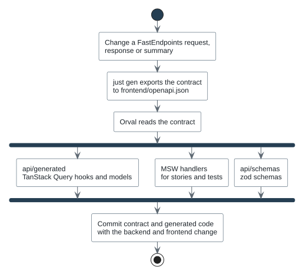

# System diagrams

Top-level UML views of the whole system. Each feature page has its own detailed Mermaid diagrams; these show how the parts fit together, in UML notation that Mermaid cannot draw (deployment nodes, components with interfaces, class associations with multiplicities).

The sources are PlantUML files in [diagrams](diagrams/), sharing [style.iuml](diagrams/style.iuml), which takes its colours from [DESIGN.md](../../DESIGN.md) and lays out with PlantUML's built-in Smetana engine, so Graphviz is not needed. After editing a `.puml` file, run `just diagrams` and commit the source with its regenerated SVG. The recipe needs Java and downloads the pinned PlantUML jar to `.local/` on first use.

## System context

Who and what talks to the installation. Everything outside the box is optional except the browser: each integration is switched on by the administrator or by a member, and the application works with all of them off. The application never connects to a bank and never moves money; statements arrive as files. Receipt reading runs Tesseract inside the API container and sends nothing out.

## Deployment

The production stack, `docker-compose.yml` with `docker-compose.production.yml` on one Docker host. Only Caddy's HTTPS port is published; PostgreSQL and the API are reachable only on the Compose network. Each named volume is mounted only into the container it is linked to. Details are in [Containers and the recovery command](deployment.md).

### Development

`just dev` runs only PostgreSQL in Docker; the API and Vite run on the host, and Vite proxies `/api` to the API so the browser still sees one origin. The Aspire dashboard runs only with the `telemetry` profile.

## Components

The logical building blocks and their dependencies. The SPA talks to the API only through the client generated from the OpenAPI contract ([API contract and generated client](api-contract.md)).

## Backend layering

The dependencies the architecture tests in `backend/JxFinance.Tests/Architecture` enforce. Endpoints and jobs call a feature service through its interface; only services reach `AppDbContext`; only `INotificationPublisher` writes notifications; the domain references no framework.

## Request lifecycle

A write from the SPA, from the click to the database and back. Errors leave as RFC 9457 problem details with a published error code ([API surface](../api.md)).

## Notification fan-out

Every job derives from `PeriodicJob`, runs in the API process and opens a scope per user, so ordinary query filters apply ([Background work and notifications](background-jobs.md)). Notifications fan out through outbox tables, so no socket is opened inside the transaction that decided to notify.

## Core domain

The main entities and their associations, without every property. Every owned entity carries `UserId`, timestamps and soft deletion from `OwnableEntity`; shareable ones also carry `Scope` and `HouseholdId` ([Sharing and households](sharing.md), [Data model](../data-model.md)).

Household settle-up and investments hang off the same accounts and transactions.

## Contract and code generation

How a backend change reaches the SPA. The generated files are committed with the change.

