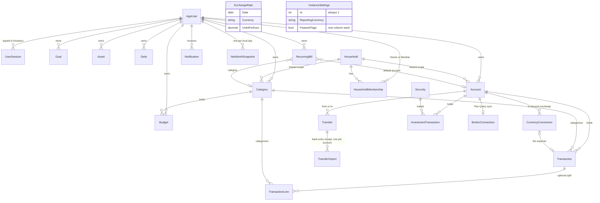

# Core data model

Back to the [feature walkthrough](<../14. Feature walkthrough with diagrams.md>).

Money is `decimal` and `numeric(18,2)`, travels as a dot-decimal string, and rounds half away from zero. Balances, holdings, cost basis and gains are never stored; they are computed from the rows. See [Data model](<../5. Data model.md>).
