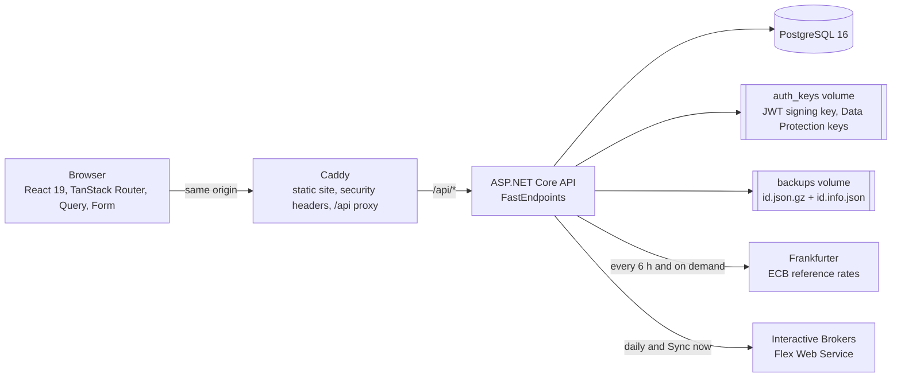
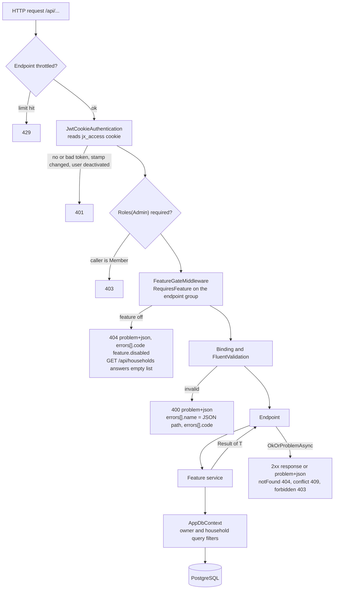
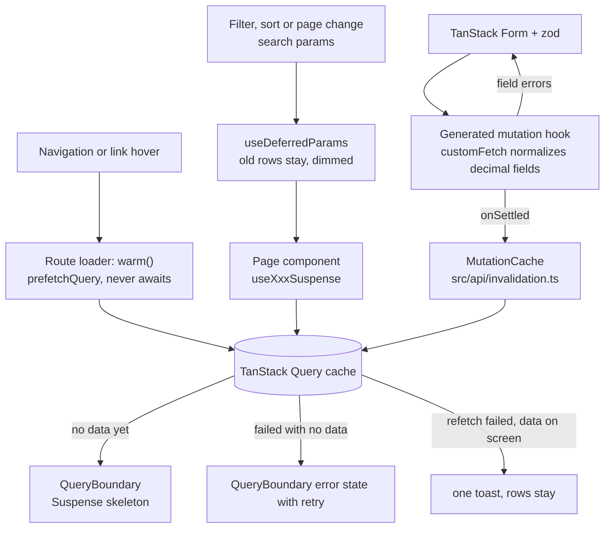
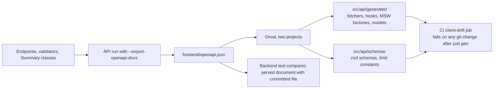

# System overview

Back to the [feature walkthrough](<../14. Feature walkthrough with diagrams.md>).

```mermaid
flowchart LR
    Browser["Browser<br/>React 19, TanStack Router, Query, Form"]
    Caddy["Caddy<br/>static site, security headers, /api proxy"]
    Api["ASP.NET Core API<br/>FastEndpoints"]
    Db[("PostgreSQL 16")]
    Keys[["auth_keys volume<br/>JWT signing key, Data Protection keys"]]
    Backups[["backups volume<br/>id.json.gz + id.info.json"]]
    Ecb["Frankfurter<br/>ECB reference rates"]
    Ibkr["Interactive Brokers<br/>Flex Web Service"]

    Browser -->|"same origin"| Caddy
    Caddy -->|"/api/*"| Api
    Api --> Db
    Api --> Keys
    Api --> Backups
    Api -->|"every 6 h and on demand"| Ecb
    Api -->|"daily and Sync now"| Ibkr
```

## Path of one request

```mermaid
flowchart TD
    Req["HTTP request /api/..."] --> Throttle{"Endpoint throttled?"}
    Throttle -->|"limit hit"| R429["429"]
    Throttle -->|"ok"| Auth["JwtCookieAuthentication<br/>reads jx_access cookie"]
    Auth -->|"no or bad token, stamp changed, user deactivated"| R401["401"]
    Auth --> Role{"Roles(Admin) required?"}
    Role -->|"caller is Member"| R403["403"]
    Role --> Gate["FeatureGateMiddleware<br/>RequiresFeature on the endpoint group"]
    Gate -->|"feature off"| R404F["404 problem+json, errors[].code feature.disabled<br/>GET /api/households answers empty list"]
    Gate --> Bind["Binding and FluentValidation"]
    Bind -->|"invalid"| R400["400 problem+json<br/>errors[].name = JSON path, errors[].code"]
    Bind --> Endpoint["Endpoint"]
    Endpoint --> Service["Feature service"]
    Service --> Ctx["AppDbContext<br/>owner and household query filters"]
    Ctx --> Db[("PostgreSQL")]
    Service -->|"Result of T"| Endpoint
    Endpoint -->|"OkOrProblemAsync"| Resp["2xx response or problem+json<br/>notFound 404, conflict 409, forbidden 403"]
```

## Frontend data path

```mermaid
flowchart TD
    Nav["Navigation or link hover"] --> Loader["Route loader: warm()<br/>prefetchQuery, never awaits"]
    Loader --> Cache[("TanStack Query cache")]
    Page["Page component<br/>useXxxSuspense"] --> Cache
    Cache -->|"no data yet"| Boundary["QueryBoundary<br/>Suspense skeleton"]
    Cache -->|"failed with no data"| ErrState["QueryBoundary error state with retry"]
    Cache -->|"refetch failed, data on screen"| Toast["one toast, rows stay"]
    Filter["Filter, sort or page change<br/>search params"] --> Deferred["useDeferredParams<br/>old rows stay, dimmed"]
    Deferred --> Page
    Form["TanStack Form + zod"] --> Mutation["Generated mutation hook<br/>customFetch normalizes decimal fields"]
    Mutation -->|"field errors"| Form
    Mutation -->|"onSettled"| Invalidation["MutationCache<br/>src/api/invalidation.ts"]
    Invalidation --> Cache
```

## API contract pipeline

```mermaid
flowchart LR
    Endpoints["Endpoints, validators, Summary classes"] --> Export["API run with --export-openapi-docs"]
    Export --> Spec["frontend/openapi.json"]
    Spec --> Orval["Orval, two projects"]
    Orval --> Hooks["src/api/generated<br/>fetchers, hooks, MSW factories, models"]
    Orval --> Zod["src/api/schemas<br/>zod schemas, limit constants"]
    Spec --> Test["Backend test compares served document with committed file"]
    Hooks --> Ci["CI client-drift job<br/>fails on any git change after just gen"]
    Zod --> Ci
```
