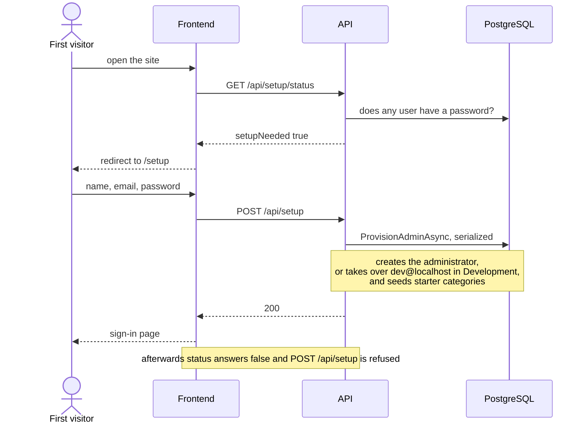

# First-run setup

Back to the [feature walkthrough](<../14. Feature walkthrough with diagrams.md>).

Backend `Auth/Setup`, routes `GET /api/setup/status`, `POST /api/setup`. Anonymous and serialized.

