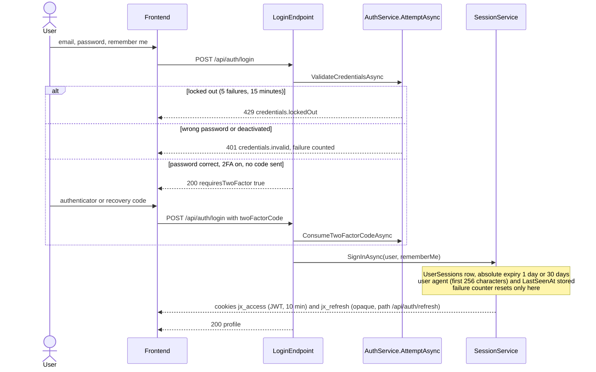
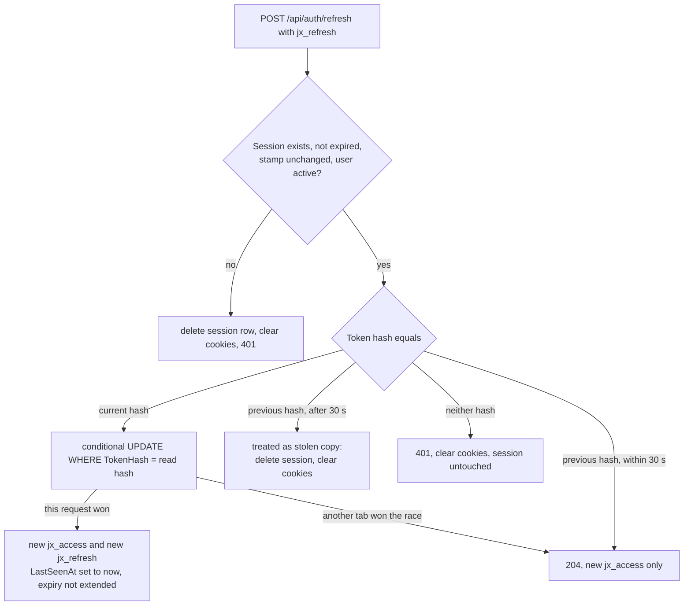
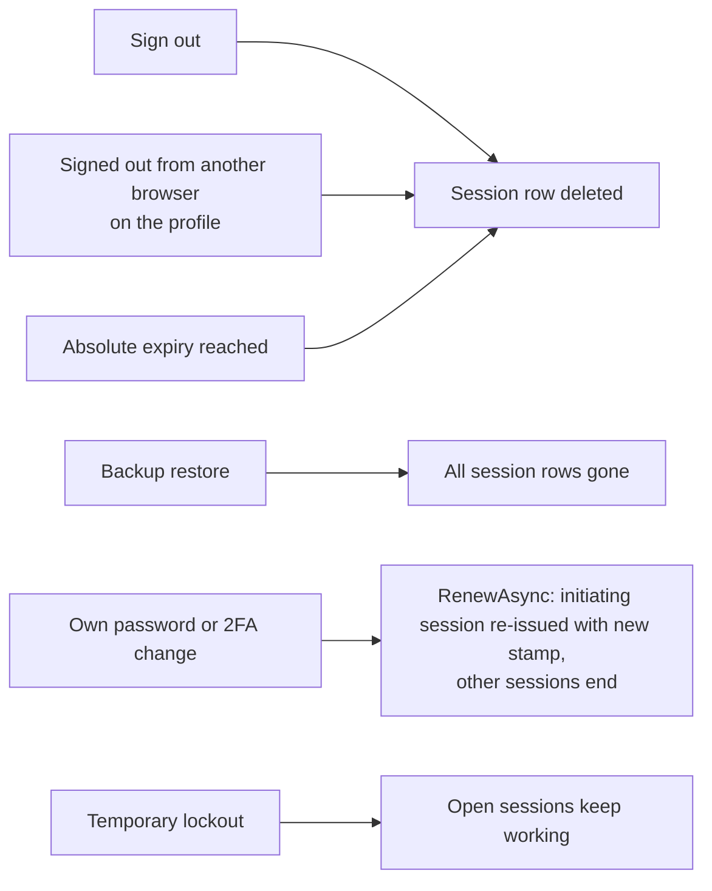
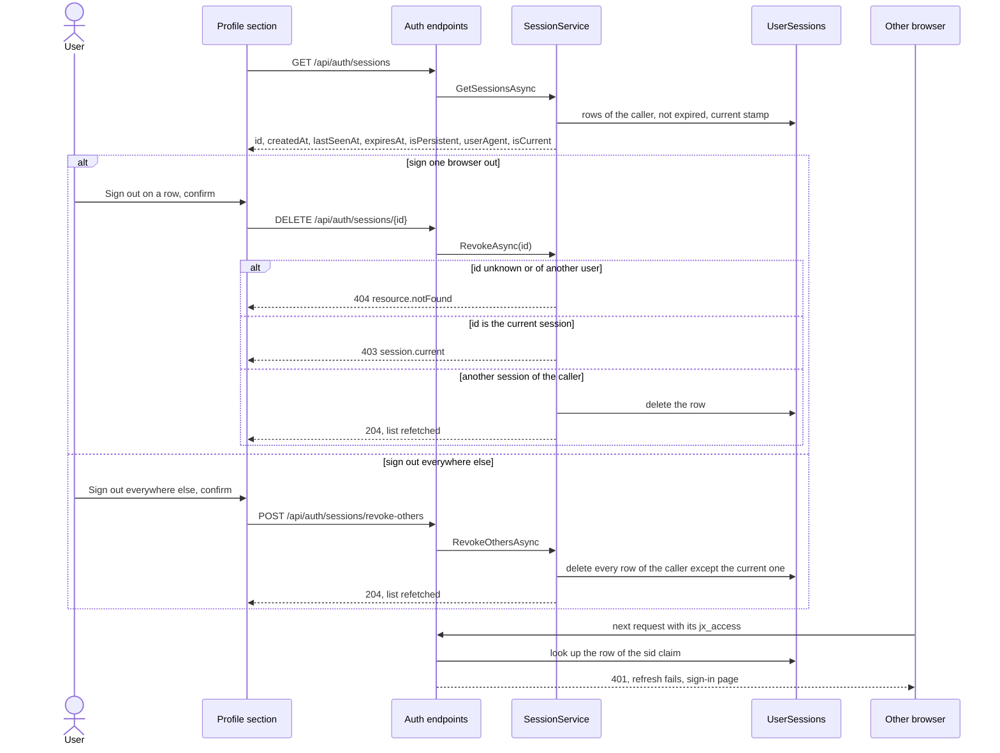

# Sign-in, sessions and lockout

Back to the [feature walkthrough](<../14. Feature walkthrough with diagrams.md>).

## Sign-in

## Forgot password

## Refresh token rotation

The client calls refresh once on a 401 and retries the request. The database keeps only SHA-256 hashes.

## What ends a session

## Every request checks the session row

The access token is a JWT, but it is not trusted on its signature alone. After the signature and the lifetime are validated, `JwtCookieAuthentication` loads the user and compares the security stamp, refuses a deactivated user, and then checks that the `UserSessions` row named by the `sid` claim still exists, belongs to that user and has not expired. A deleted row therefore ends the browser on its next request with a 401; the refresh that the client tries next fails too, because the row is gone, and the client goes to the sign-in page. There is no ten-minute tail after sign out, after a revocation from another browser or after a restore.

## Signed-in browsers on the profile

The profile has a "Signed-in browsers" section (`features/profile/sessions-section`). It lists the caller's sessions that have not expired and that carry the current security stamp, newest activity first. A row shows a browser and operating system label that `describeUserAgent` in `src/lib/user-agent.ts` derives from the stored user agent, "Unknown browser" when nothing is recognised, a "This browser" tag on the session that made the request, and the last active, signed-in and expiry times. "Last active" is the time of sign-in or of the last refresh token rotation, so it is at most about ten minutes behind for a browser that is in use. Token hashes and the security stamp never leave the server.

Every other row has a "Sign out" button and the section ends with "Sign out everywhere else", which is disabled when the current session is the only one. Both ask for confirmation first. The current session cannot be revoked through this route: the server answers 403 `session.current`, and the user signs out the usual way, which also clears the cookies. An id that is unknown or belongs to someone else answers 404, the same as any resource that is not yours. The list is refetched after either action, and also after a change of the own password or of two-factor authentication, because those end the other sessions by changing the security stamp.

