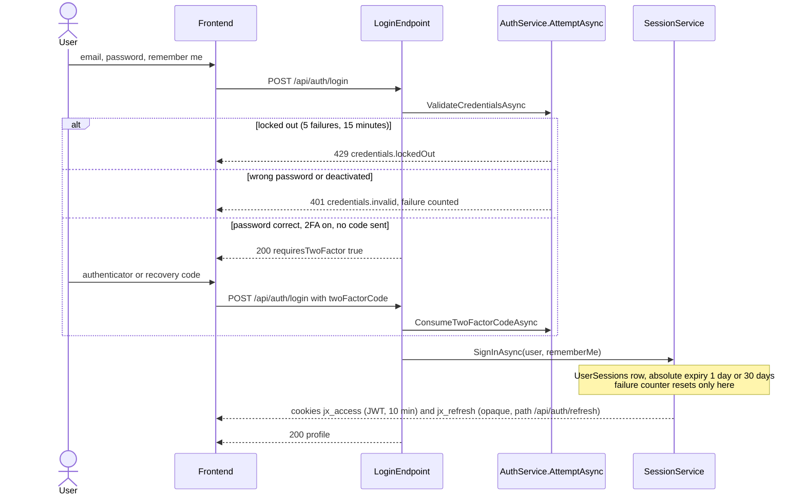
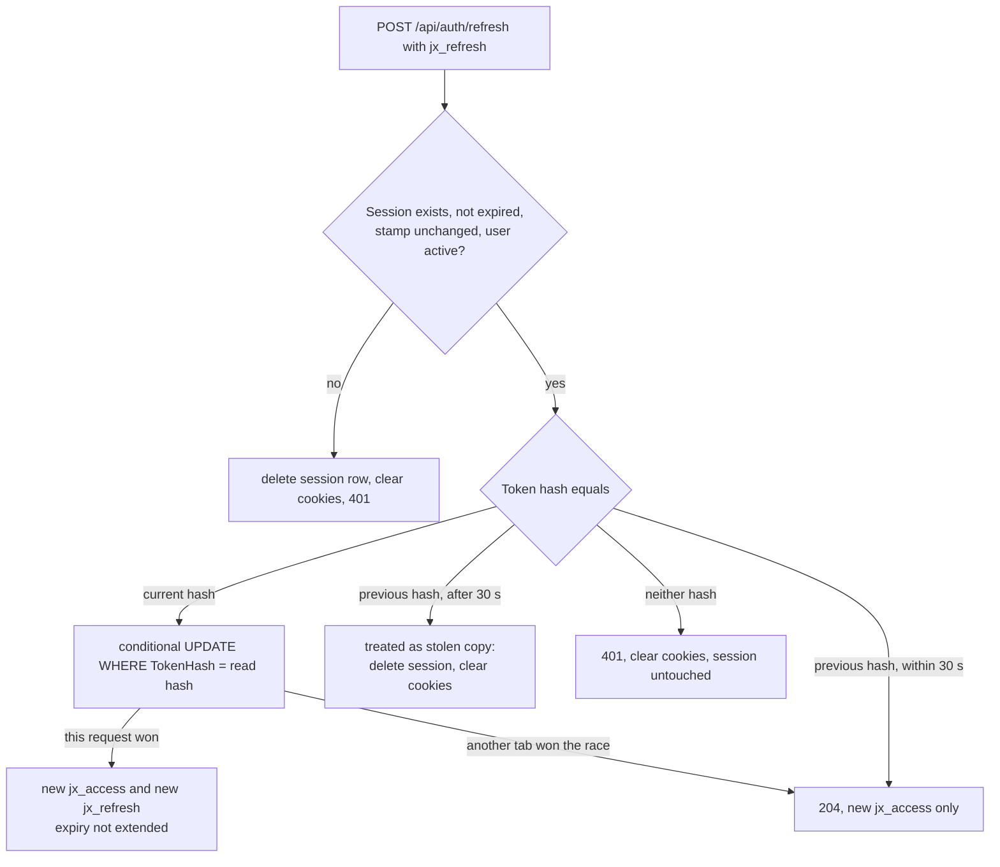
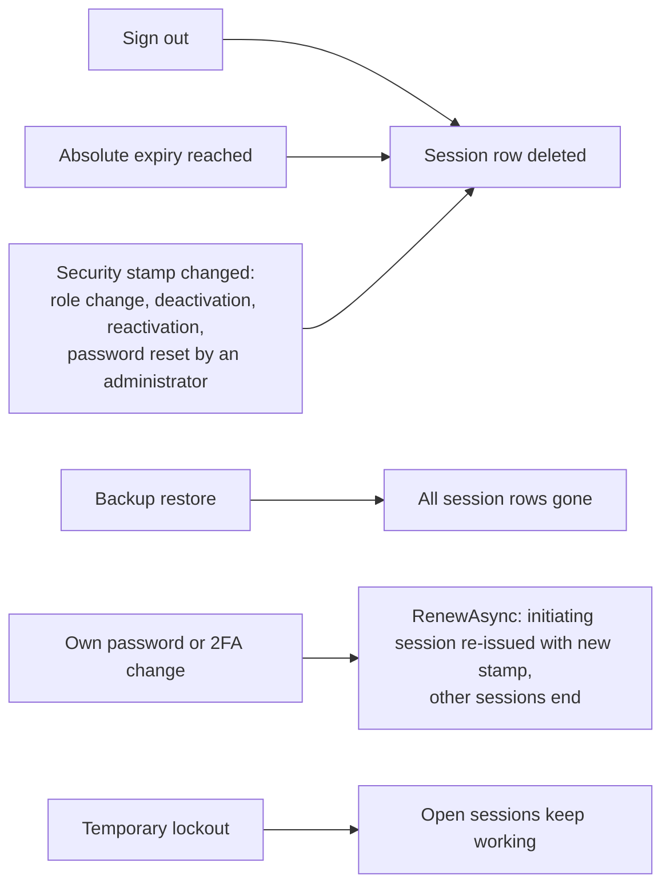

# Sign-in, sessions and lockout

Back to the [feature walkthrough](<../14. Feature walkthrough with diagrams.md>).

Backend `Auth` (`AuthService`, `SessionService`), routes `login`, `logout`, `me`, `refresh`. Login is throttled to 10 calls per five minutes per client.

## Sign-in

## Refresh token rotation

The client calls refresh once on a 401 and retries the request. The database keeps only SHA-256 hashes.

## What ends a session

