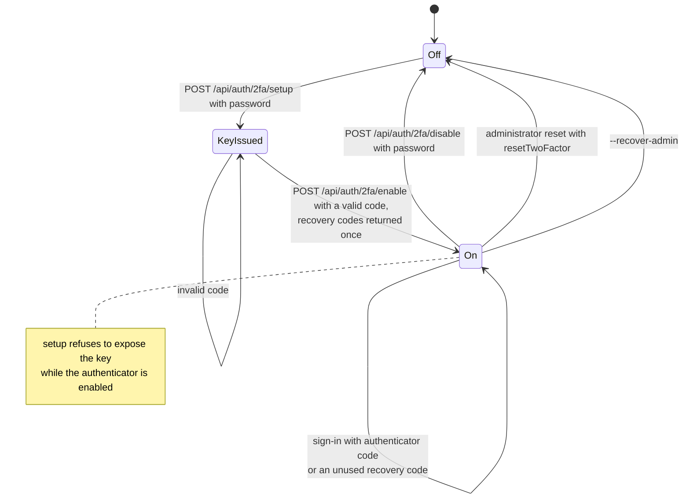

# Two-factor authentication

Back to the [feature walkthrough](<../14. Feature walkthrough with diagrams.md>).

Backend `Auth/TwoFactor`. Setup and disable require the current password, which counts toward the lockout.

