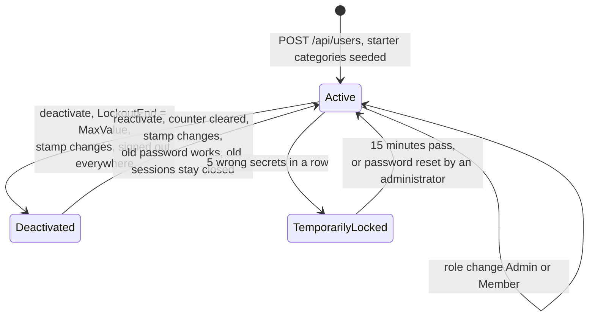
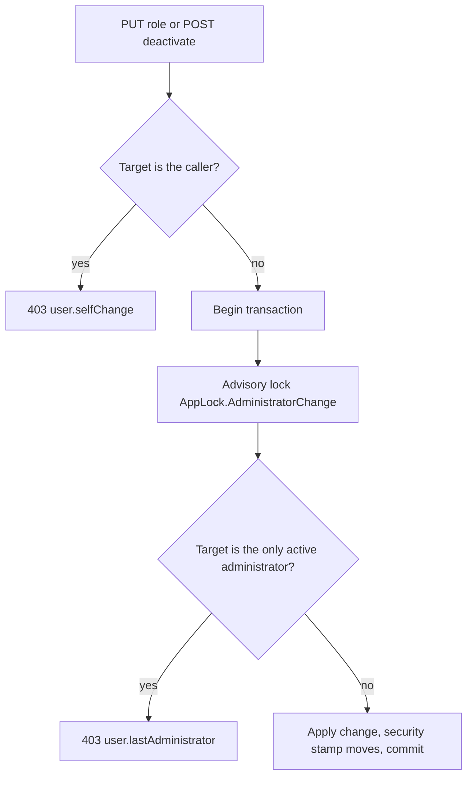
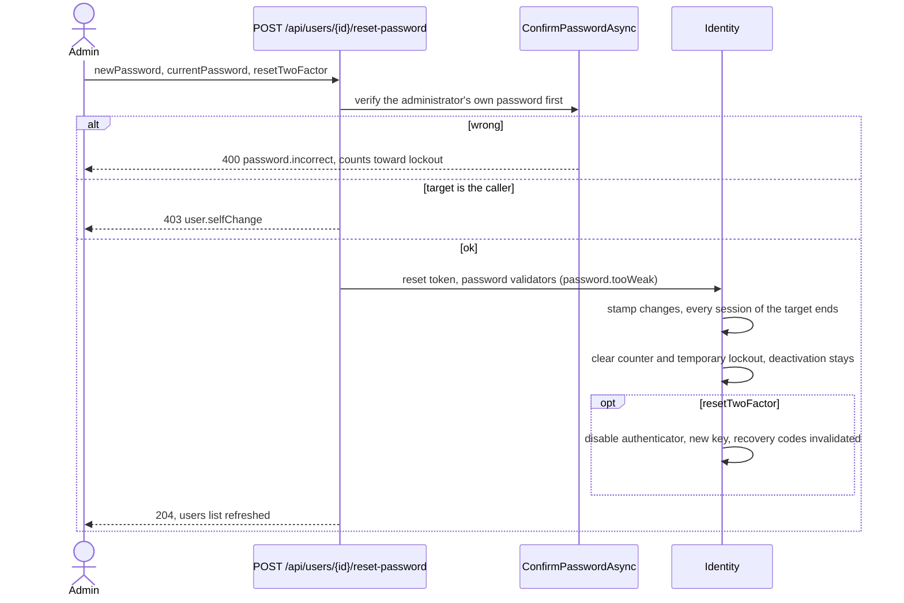

# User management

Back to the [feature walkthrough](<../14. Feature walkthrough with diagrams.md>).

Backend `Users`, Admin role only, page `/users`. There is no public registration.

A created user starts with an unconfirmed address and, when the installation has a mail server, one queued confirmation link. Nothing waits for it: the account is usable at once, and an unconfirmed address blocks only unsolicited mail to that address. The administrator's password reset below stays the primary way back in; a user with a working mailbox can now also reset their own password from the sign-in screen. See [Email](<26. Email.md>).

## Listing users

`GET /api/users` used to load every user and then ask Identity for each one's roles, so a hundred users cost a hundred and one queries, and the role and status filters were applied to the materialized list afterwards. The role now comes back with the user, as an `IsAdmin` flag computed from `AspNetUserRoles` and `AspNetRoles` in the same statement, and both filters are `WHERE` clauses: a deactivated user is one whose `LockoutEnd` reaches the deactivation sentinel, and a role that is neither `Admin` nor `Member` matches nobody and answers an empty list without asking the database at all. Sorting by name, email, role or status still happens in memory over the answered page, because role and status are computed values and the sort has to be stable on the email order the query returns.

## Last administrator guard

## Password reset by an administrator

