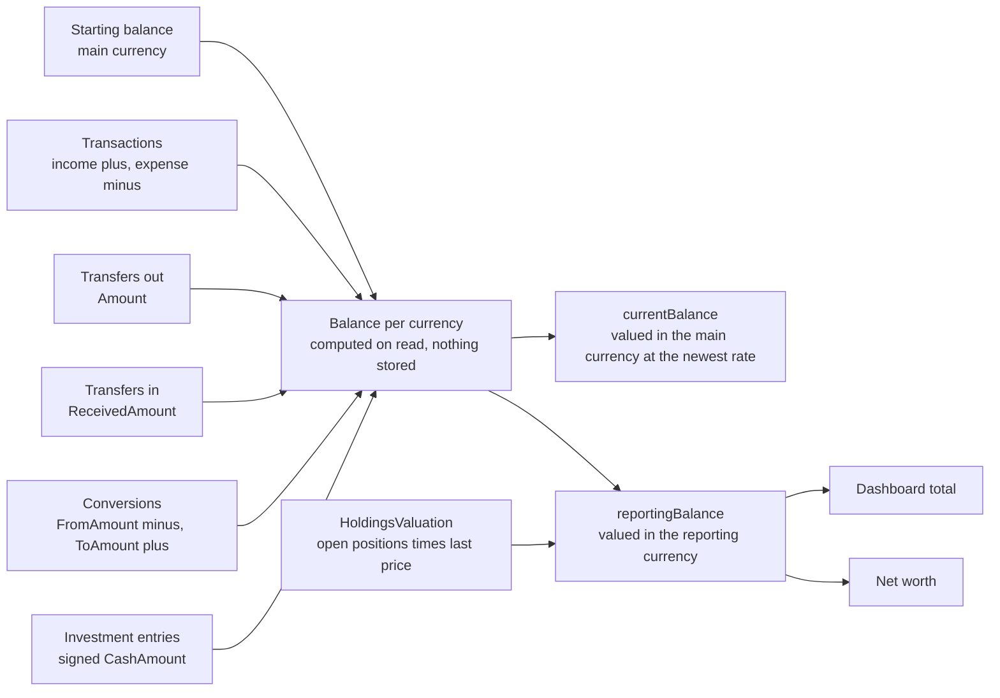
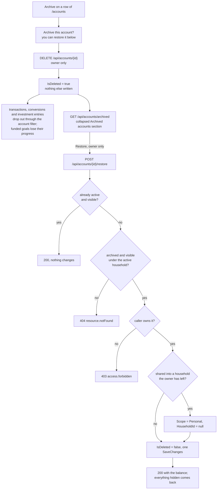

# Accounts

Back to the [feature walkthrough](<../14. Feature walkthrough with diagrams.md>).

Backend `Accounts`, page `/accounts`. Personal or shared scope, archive instead of delete, only the owner archives, restores or changes sharing.

`AccountMovements.SumAsync` is the five boxes feeding `Sum`. Each source projects the account, the currency and the signed amount, the six projections are `Concat`ed, and one `GROUP BY` sums them, so the whole list of accounts costs one `UNION ALL` round trip instead of six grouped queries. Every source keeps its own query filter, because the filter sits inside each branch of the union. `AccountMovementsTests` captures the statement and fails if it splits up again.

## Archiving and restoring

The Archive button on a row soft-deletes the account: `IsDeleted` goes true and nothing else is written. That one flag hides a good deal, because transactions, currency conversions and investment entries are filtered through the account they belong to: they drop out of lists, balances and reports. A transfer stays visible while its other account is. A goal funded from the account keeps its row and answers `progressAmount` null. The broker sync skips the account. Recurring entries belong to their owner rather than to the account, so they stay listed and keep pointing at it. None of those rows is touched, no foreign key is cleared, and nothing forbids a second account of the same name, so there is no uniqueness to re-check.

That makes the restore the exact inverse. `POST /api/accounts/{id}/restore` sets the flag back, and everything the archive hid is visible again with the balance it had. Accounts have no trash entry and no 30-day window: the archived list is the record, and it lasts as long as the account does.

### Who sees an archived account

The list applies the rule the account list applies, written out by hand, because reading a soft-deleted row needs `IgnoreQueryFilters()` and that drops ownership with it. A row is listed when the caller owns it, or when it is shared into a household that still exists and that both the caller and the owner still belong to. The `X-Active-Household` narrowing then keeps personal rows and the rows of the active household only. A household member therefore sees the shared accounts its owner archived, with a note in place of the button: archiving and changing sharing are the owner's, and so is restoring. `canRestore` in the response says which case a row is, so the screen does not compare user ids.

The restore looks the account up through the same rule. That is why a stranger's account answers 404 and a household member's answers 403: the member can see the row and is told why they cannot act on it, and the stranger learns nothing. An account of a household other than the active one answers 404, exactly as `GET /api/accounts/{id}` does.

### The one thing that can change while an account is archived

Its sharing. Removing a member from a household makes the accounts that member shared into it personal, and deleting a household does the same for every account shared into it. That update used to run through the filtered `Accounts` set, so it skipped archived accounts — and, when the household owner had another household active, the active accounts the narrowing hid as well. It now runs over every account row of that household, and leaves `UpdatedAt`, which the archived list reports as `archivedAt`, alone on archived rows. An archived account therefore comes back personal after its household went away, which is what would have happened to it while active, and the remaining members no longer see an archived account of someone who left.

Rows archived before that change can still say they are shared into a household their owner has left. The list hides them from the remaining members, and the restore makes them personal instead of refusing. Refusing would leave the owner with an account that can never come back; restoring the sharing as it was would show it to people it is no longer shared with.

### Idempotent, and nothing refused beyond access

Restoring an account that is already active answers 200 with the account, so a double click or a second browser tab is harmless. Beyond 404 and 403 nothing is refused, on purpose. A currency that was switched off since does not block an account that already exists in it; editing such an account does not refuse either. Every record the archive hid is still consistent with the account, because nothing it points at was changed and the account itself cannot be edited while archived. The trash needs refusals because its deletes race with other deletes and edits; an archived account has nothing that could have drifted from it.

### On the screen

The archived accounts sit in a collapsed `details` section directly under the accounts table, the pattern the investments page uses for closed positions, and the section is absent while there are none. Each row shows the type icon, the name, a shared-with tag when it is shared, the type, the starting balance, the IBAN and the date it was archived. An archived row shows no current balance, because its transactions are filtered out with it and a sum over nothing would read as zero. The confirm dialog on Archive now says the account can be restored from this section instead of "This can't be undone". Restoring shows "Account restored" and refreshes every query, because a restored account can bring rows back on any screen.
