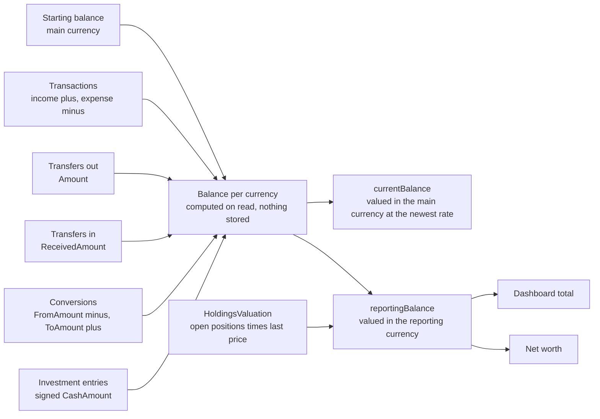

# Accounts

Back to the [feature walkthrough](<../14. Feature walkthrough with diagrams.md>).

Backend `Accounts`, page `/accounts`. Personal or shared scope, archive instead of delete, only the owner archives or changes sharing.

