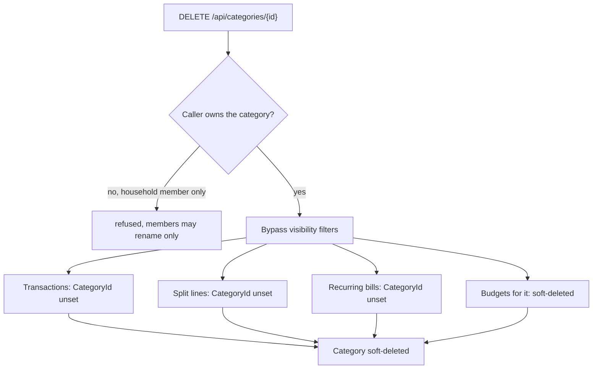

# Categories

Back to the [feature walkthrough](<../14. Feature walkthrough with diagrams.md>).

Backend `Categories`, page `/categories`. Income or expense type, personal or shared. New users get starter categories from `StarterCategories.SeedAsync`.

