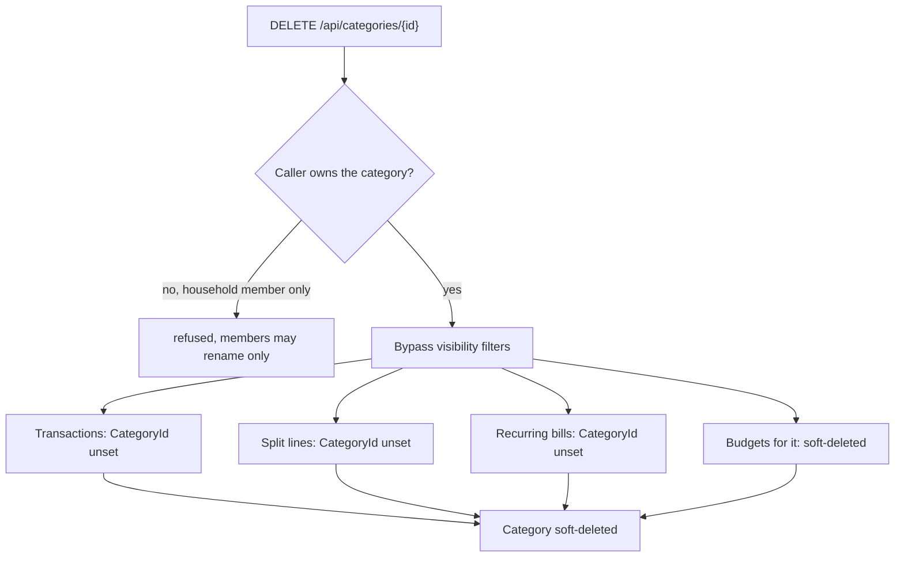

# Categories

Back to the [feature walkthrough](<../14. Feature walkthrough with diagrams.md>).

Backend `Categories`, page `/categories`. Income or expense type, personal or shared. New users get starter categories from `StarterCategories.SeedAsync`.

[Tags](<27. Tags.md>) are the other way to classify a transaction, added on 2026-09-20. A tag is owned, shared and deleted under the same rules as a category — the same `IShareable` query filter, the same "only the owner may delete or change the sharing, a household member may rename", and the same promise that deleting the classifier never deletes the transactions. The two differ in what they answer: a category says what kind of spending it was and a transaction has at most one, while a tag says what the payment was for and a transaction can carry several. A tag has no flow type and no icon, and it sits on the transaction rather than on a split line.
