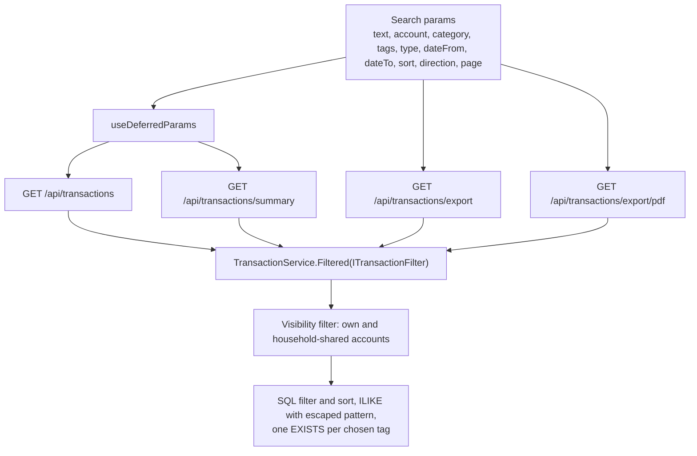
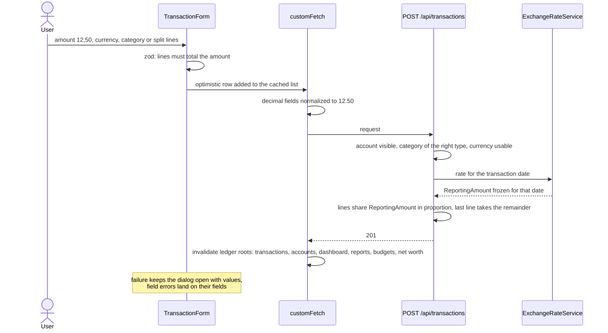
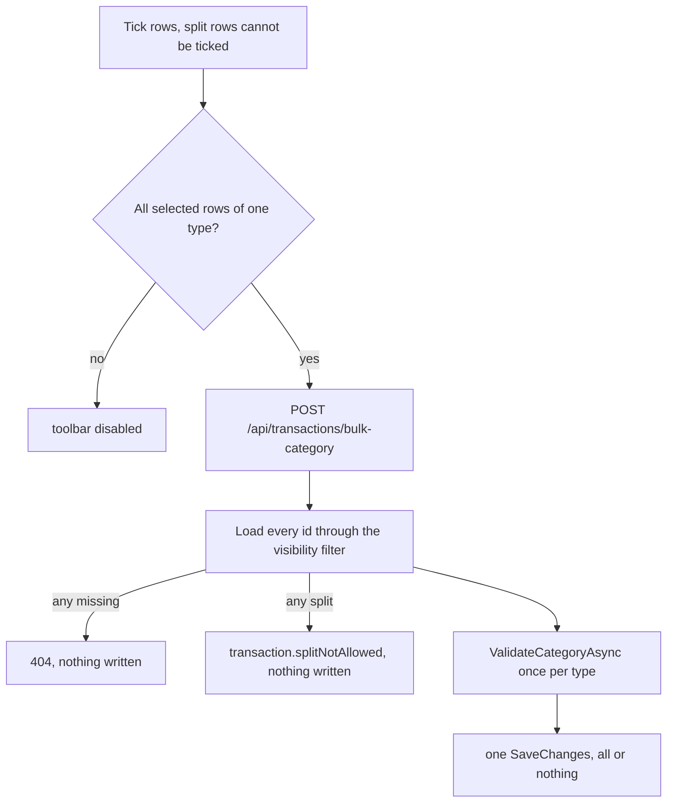

# Transactions

Back to the [feature walkthrough](<../14. Feature walkthrough with diagrams.md>).

Backend `Transactions`, page `/transactions`. One `Filtered` method builds the query for the list, the summary, the CSV and the PDF, so the four cannot disagree.

A transaction also carries tags, which are described on their own page: [Tags](<27. Tags.md>). They are part of the create and update bodies as `tagIds`, they come back on every transaction response, `tagIds` is a comma-separated filter on the same four endpoints, and `POST /api/transactions/bulk-tags` sets the whole set on a selection. Tags sit on the transaction and never on a split line.

## Create with a split

## Bulk recategorize and bulk tagging

`POST /api/transactions/bulk-tags` is the same operation for tags and replaces the whole set on every listed row. It differs in two ways: it accepts split rows, because a tag belongs to the payment rather than to a line, and it does not care whether the selection mixes income and expense, because a tag has no flow type. It is all or nothing in the same way: an invisible transaction answers 404, an invisible tag answers 400 `reference.notFound`, and nothing is written in either case.

## Saved filters

The page number and the row selection are never saved: the page number belongs to one reading of one list, and the selection is cleared by any navigation. Sorting is not saved either, so applying a saved filter never reorders the table under the reader; the sort the reader chose stays where it was.

Applying goes through `navigate` exactly as every filter control does, so the URL is the only state, the back button undoes an applied filter, and the link is still shareable. A name that points at a deleted category, account or tag is applied as stored rather than repaired: dropping the missing part would silently answer a wider list than the name promises, which is the one failure a filter must not have. The entry says so in the menu, and the ledger answers the empty list that the filter honestly describes.

