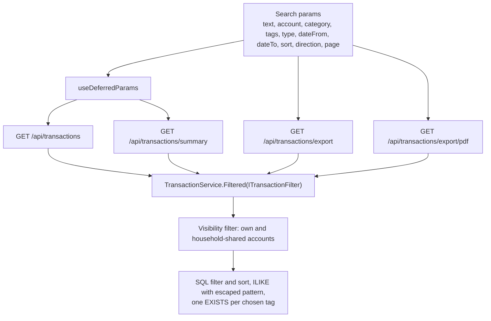
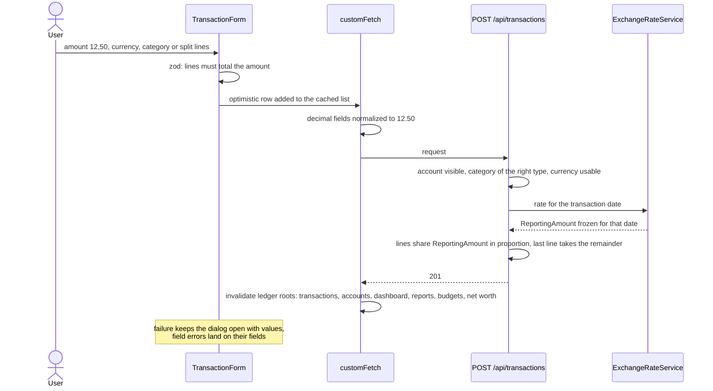
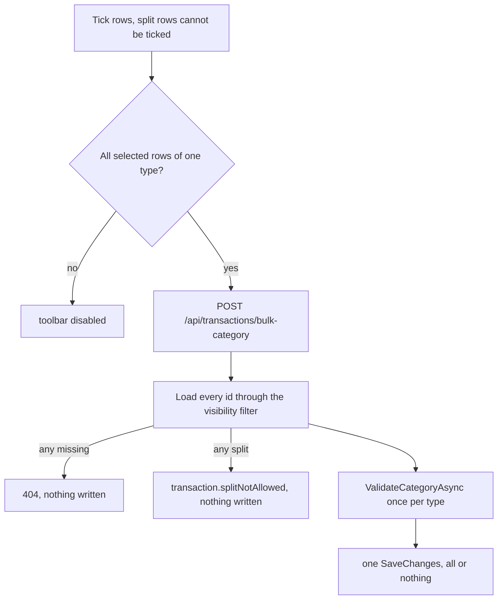
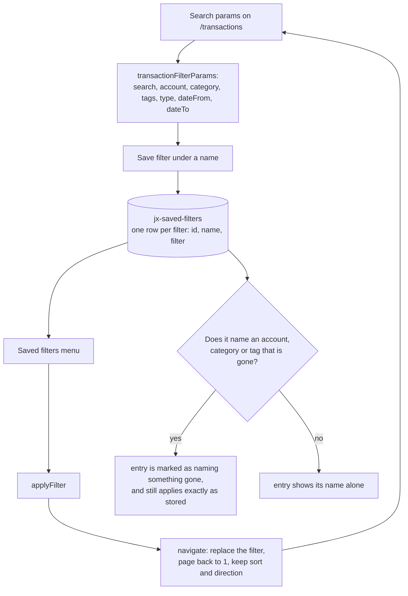
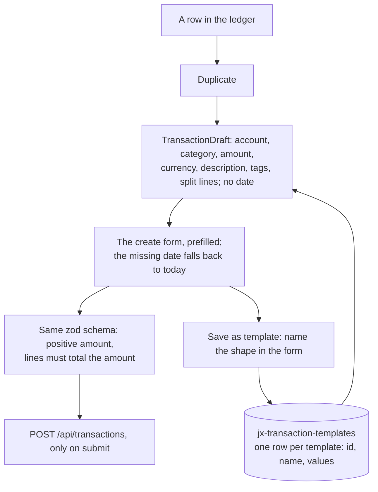

# Transactions

Back to the [feature walkthrough](<../14. Feature walkthrough with diagrams.md>).

Backend `Transactions`, page `/transactions`. One `Filtered` method builds the query for the list, the summary, the CSV and the PDF, so the four cannot disagree.

A transaction also carries tags, which are described on their own page: [Tags](<27. Tags.md>). They are part of the create and update bodies as `tagIds`, they come back on every transaction response, `tagIds` is a comma-separated filter on the same four endpoints, and `POST /api/transactions/bulk-tags` sets the whole set on a selection. Tags sit on the transaction and never on a split line.

A transaction can also carry up to ten files — a receipt photo, an invoice PDF — added and removed from its edit dialog and counted with a paperclip in the ledger; every transaction response carries `attachmentCount`. They follow the transaction's visibility, stay with it in the trash, and are described on their own page: [Attachments](<31. Attachments.md>).

## Create with a split

## Bulk recategorize and bulk tagging

`POST /api/categorization-rules/run` is the third way a category or a tag arrives on a row that already exists, and it plays by stricter rules than either bulk operation: it only offers rows that carry no category at all, unless the caller explicitly asks to recategorize, it never touches a split transaction, and it adds tags without removing any. See [Categorization rules](<28. Categorization rules.md>).

`POST /api/transactions/bulk-tags` is the same operation for tags and replaces the whole set on every listed row. It differs in two ways: it accepts split rows, because a tag belongs to the payment rather than to a line, and it does not care whether the selection mixes income and expense, because a tag has no flow type. It is all or nothing in the same way: an invisible transaction answers 404, an invisible tag answers 400 `reference.notFound`, and nothing is written in either case.

## Saved filters

A saved filter is a name put on the filter half of the search params. It lives in the browser, in the `jx-saved-filters` TanStack DB local-storage collection, next to the preferences row; there is no table, no endpoint and nothing to invalidate. The menu sits in the page header beside the export menu, holds the whole list, and saves, renames, deletes and applies.

The page number and the row selection are never saved: the page number belongs to one reading of one list, and the selection is cleared by any navigation. Sorting is not saved either, so applying a saved filter never reorders the table under the reader; the sort the reader chose stays where it was.

Applying goes through `navigate` exactly as every filter control does, so the URL is the only state, the back button undoes an applied filter, and the link is still shareable. A name that points at a deleted category, account or tag is applied as stored rather than repaired: dropping the missing part would silently answer a wider list than the name promises, which is the one failure a filter must not have. The entry says so in the menu, and the ledger answers the empty list that the filter honestly describes.

## Templates and duplicate

Duplicate is one action on a row. It opens the ordinary create dialog filled from that row, with today's date, its tags ticked and its split lines copied, and it writes nothing until the form is submitted; the split lines arrive without their server ids, because they will be new lines of a new transaction.

A template stores the same shape under a name, minus the date, in `jx-transaction-templates`. It is saved from inside the create dialog, so a template can be composed from nothing or, with Duplicate first, from an existing row. The amount is normalized before it is stored, so a comma typed in the form becomes the canonical `12.50`.

Both paths reach the server through the create form and its schema, not through a second writer: a template whose amount was left empty opens a form that refuses to submit until an amount is typed, exactly like a blank one.

