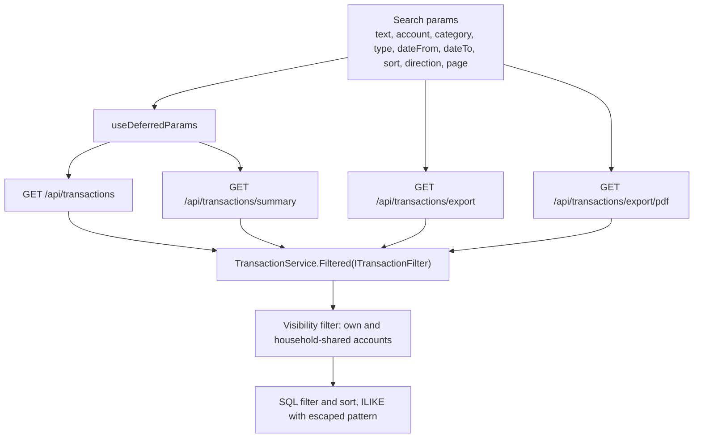
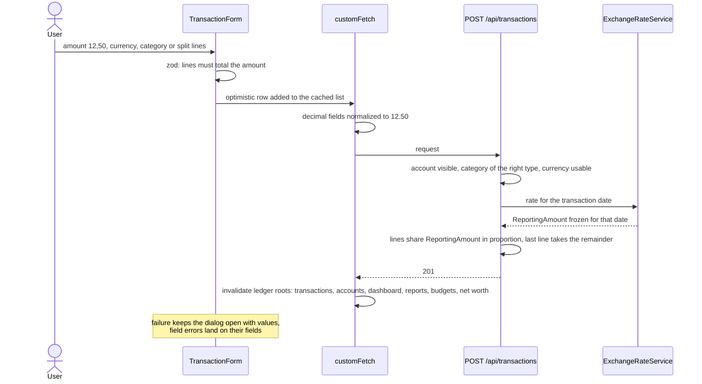
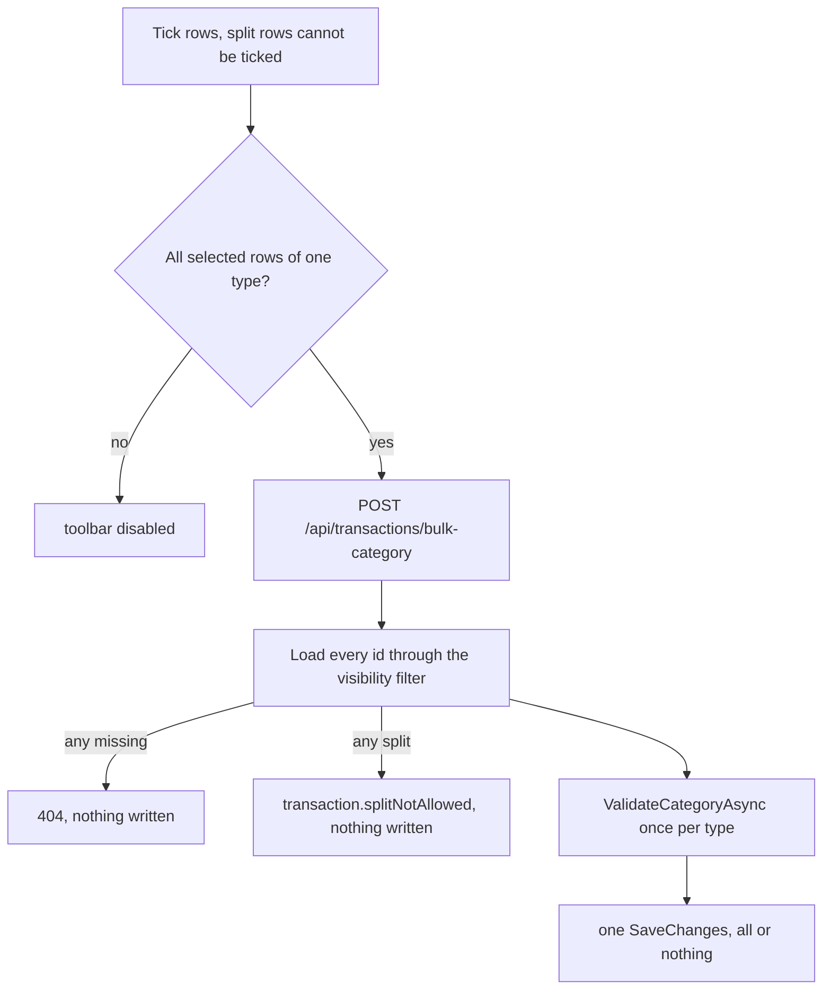

# Transactions

Back to the [feature walkthrough](<../14. Feature walkthrough with diagrams.md>).

Backend `Transactions`, page `/transactions`. One `Filtered` method builds the query for the list, the summary, the CSV and the PDF, so the four cannot disagree.

## Create with a split

## Bulk recategorize

