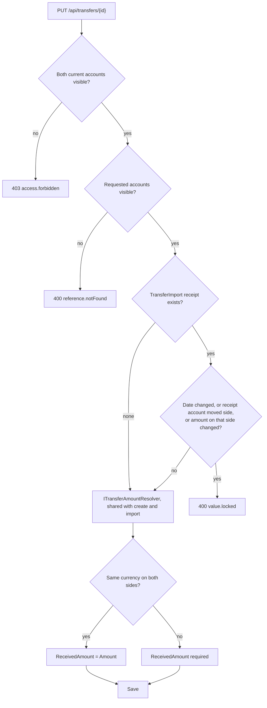

# Transfers

Back to the [feature walkthrough](<../14. Feature walkthrough with diagrams.md>).

Backend `Transfers`, shown in the Transfers section of `/accounts`. A transfer is never income or expense. Visibility needs either account, mutation needs both.

The response carries `fromAccountImported` and `toAccountImported`; the form disables the fixed fields with the hint "Fixed by the import."
