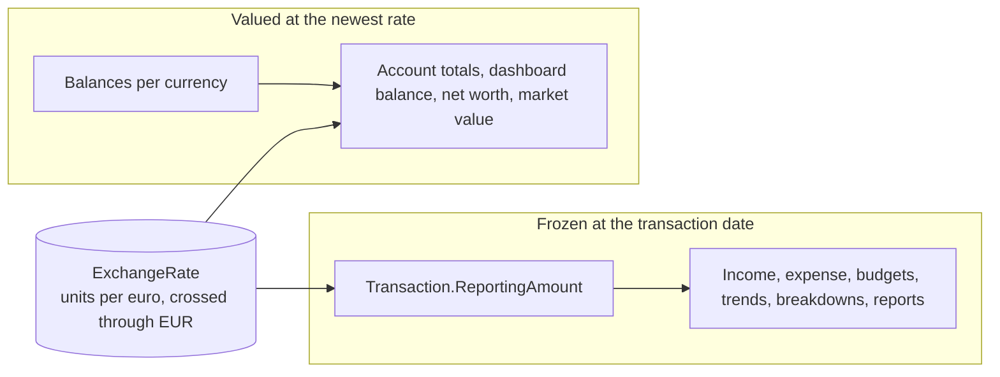
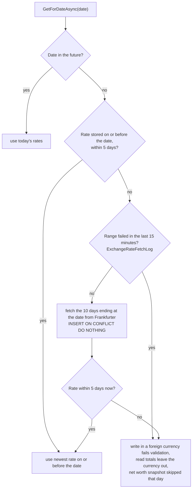
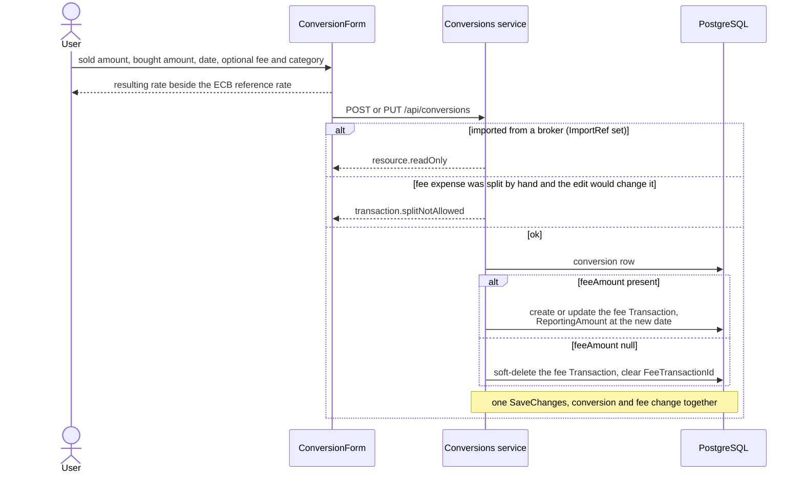
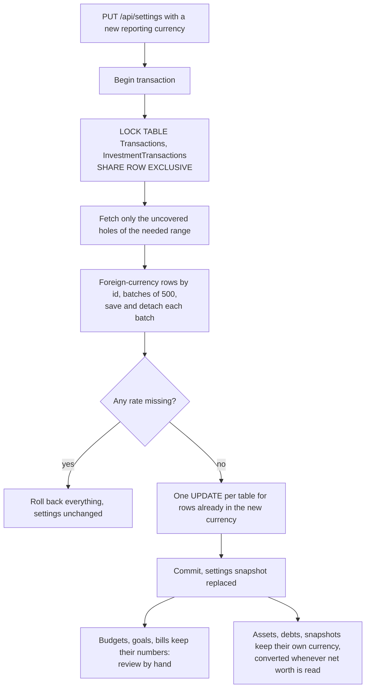

# Multi-currency

Back to the [feature walkthrough](<../14. Feature walkthrough with diagrams.md>).

Backend `Conversions`, `Currencies`, `Infrastructure/ExchangeRates`. Feature `MultiCurrency` gates `/api/conversions`; with it off only the reporting currency can be entered.

## Two kinds of value

## Rate lookup

## Filling a range once

`EnsureRangeAsync(from, to)` is what a broker import and a reporting-currency change call before they value many dates at once. It used to re-download the whole range on every call. It now reads the dates already stored between `from - 10` and `to` in one query and downloads only the holes that would leave a date stale, that is a hole wider than the five days `GetForDateAsync` tolerates. Weekends and bank holidays are therefore never fetched again, while a range that was never fetched, or one whose history stops early, is still downloaded in 90-day chunks. Rates already stored are never overwritten either way, because the insert is `ON CONFLICT DO NOTHING`.

`PreloadAsync(from, to)` is the read-side counterpart. Valuing many rows used to cost one query per distinct date, because `GetForDateAsync` caches per date but loads each one on its own. A caller that knows its date range up front loads the whole history once with `GetHistoryAsync` and every later lookup inside that range is answered from it by binary search. The Swedbank CSV confirm does this for the dates it has to convert. Any fetch that adds rows drops the preloaded history, so a lookup after a fetch reads the database again.

## Conversion with a fee

## Changing the reporting currency

