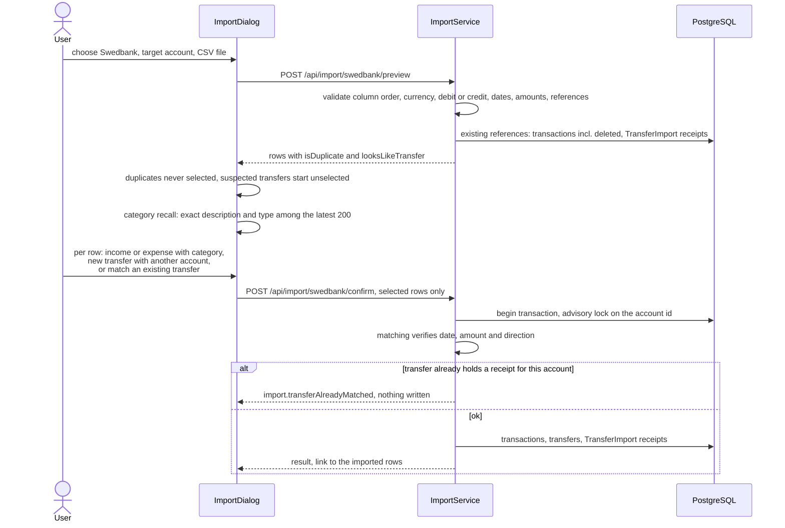

# Swedbank CSV import

Back to the [feature walkthrough](<../14. Feature walkthrough with diagrams.md>).

Backend `Imports` (`ImportService`), frontend `imports` (`ImportDataSection`, `ImportDialog`, `ImportSection`). No route of its own; the dialog opens from Settings and Profile.

