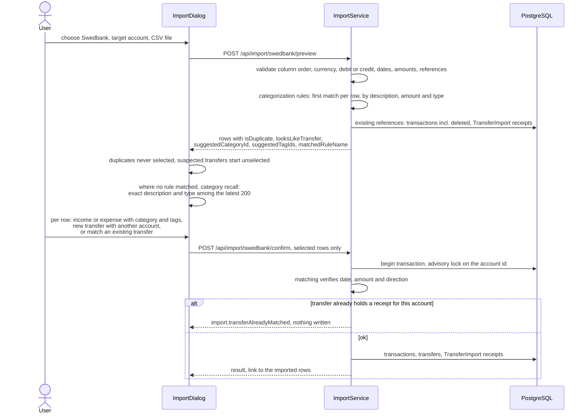

# Swedbank CSV import

Back to the [feature walkthrough](<../14. Feature walkthrough with diagrams.md>).

Backend `Imports` (`ImportService`), frontend `imports` (`ImportDataSection`, `ImportDialog`, `ImportSection`). No route of its own; the dialog opens from Settings and Profile.

The preview fills each row in twice over. Your [categorization rules](<28. Categorization rules.md>) run first: the first rule that matches a row's description, amount and flow type puts its category and its tags on the row and names itself in `matchedRuleName`, which the screen shows as a "Filled by a rule" mark with the rule's name in its tooltip. Where no rule has an opinion, the older recall still guesses a category from the most recent transaction with the same description, marked "Suggested category" as before. A duplicate row gets neither, because it cannot be imported. Both are suggestions: the per-row category select, the per-row tag picker and the "set category for selected" action all replace them, the mark disappears, and the confirm request carries whatever the user decided — including `tagIds`, which `ImportService` writes as `TransactionTags` beside the new transaction in the same database transaction.

