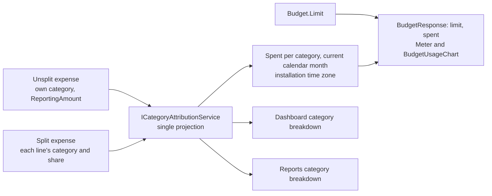

# Budgets

Back to the [feature walkthrough](<../14. Feature walkthrough with diagrams.md>).

Backend `Budgets`, page `/budgets`. Monthly limit per expense category in the reporting currency, personal only.
Spend comes from `ICategoryAttributionService`, the single projection that budgets, the dashboard breakdown and the reports share: an unsplit expense contributes its own category and reporting amount, a split expense contributes each line's category and its share. Each attribution now carries the transaction's date, so one query over the whole span the budgets need can be bucketed per window instead of asking the database once per window. Investment income, taxes and fees are never attributed to a category and therefore never reach a budget.

