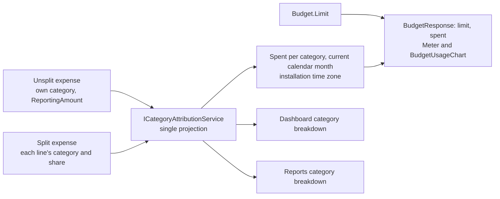

# Budgets

Back to the [feature walkthrough](<../14. Feature walkthrough with diagrams.md>).

Backend `Budgets`, page `/budgets`. Monthly limit per expense category in the reporting currency, personal only.

