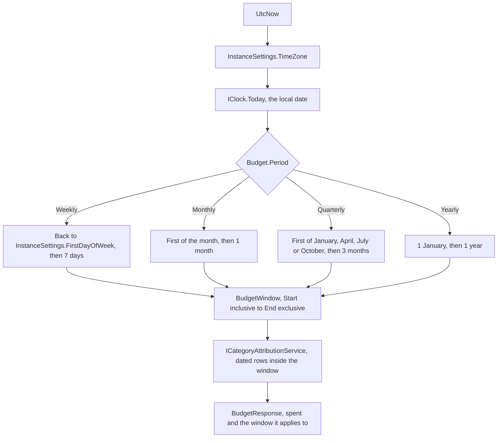
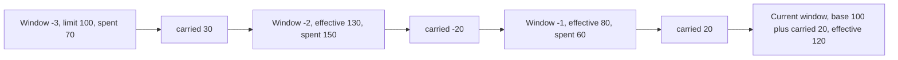
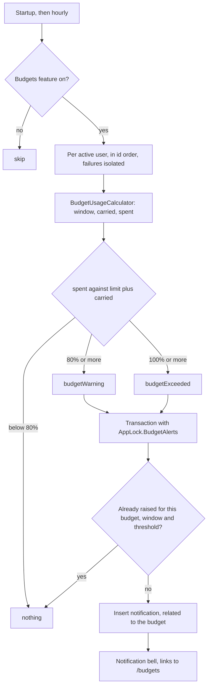

# Budgets

Back to the [feature walkthrough](<../14. Feature walkthrough with diagrams.md>).

Backend `Budgets`, page `/budgets`. A limit per expense category in the reporting currency, personal only. A budget carries a period — weekly, monthly, quarterly or yearly — and is always read against the one window of that period that holds today.

## The window

A budget has no start or end date of its own. The window is derived from the period and from today in the installation time zone, so a budget created in March and a budget created yesterday answer the same question in September. `IClock.Today` converts the current instant into the installation time zone, and `BudgetWindow.For` turns that date into a half-open range: `Start` is inclusive, `End` is exclusive, and the response publishes the inclusive last day as `windowEnd`, like every other period in the API.

Only the weekly window depends on `InstanceSettings.FirstDayOfWeek`: with Monday it runs Monday to Sunday, with Sunday it runs Sunday to Saturday. The other three follow the calendar. Changing the time zone or the first day of the week moves every window at once, which is why an update to the settings refreshes every query in the client.

## One budget per category and period

The uniqueness rule is one budget per category and period. Two budgets of the same period on the same category would always cover exactly the same window, so they are rejected with `conflict.duplicate` and 409. Different periods on one category are allowed and useful: a weekly limit on groceries to pace the week, and a yearly limit on the same category to cap the year. Their windows overlap by design, and each counts the same spending inside its own window.

The check runs in `BudgetService` against the budgets the caller can see, not as a unique index, because duplicates were reachable before this rule existed and a unique index would fail the migration on an installation that already has one.

## Spending in the window

Spend comes from `ICategoryAttributionService`, the single projection that budgets, the dashboard breakdown and the reports share: an unsplit expense contributes its own category and reporting amount, a split expense contributes each line's category and its share. Each attribution now carries the transaction's date, so one query over the whole span the budgets need can be bucketed per window instead of asking the database once per window. Investment income, taxes and fees are never attributed to a category and therefore never reach a budget.

## Rollover

Rollover is a switch on the budget. When it is off, the effective limit is the base limit and nothing older than the current window is read: that is the behaviour every budget had before this feature, and the migration leaves existing rows with the switch off. When it is on, the remainder of the previous window is added to the current limit, and an overspend is subtracted. The remainder of that previous window includes what it carried in turn, so the carry is a walk backwards over whole windows.

The walk is bounded twice: it never goes back more than twelve windows, and it never goes back past the window in which the budget was created. A budget created inside the current window therefore carries nothing, and a budget older than twelve windows starts its walk exactly twelve windows back with a carry of zero. Nothing is stored per window; the carry is recomputed on every read from the same attribution rows as the spend.

The response separates the three numbers so the client can explain the total rather than show a limit the user never typed:

| Field | Meaning |
| --- | --- |
| `limitAmount` | The base limit as it was typed |
| `carriedAmount` | What the walk brought forward; negative after an overspend |
| `effectiveLimit` | `limitAmount` plus `carriedAmount`, the number the progress bar fills |
| `spent` | Attributed expense inside `windowStart` to `windowEnd` |
| `remaining` | `effectiveLimit` minus `spent`, negative when the window is overspent |

## Alerts at 80% and 100%

`BudgetAlertJob` turns the same numbers into in-app notifications. Every hour it walks the active users, calls `BudgetUsageCalculator` for that user's budgets and compares the spend against the effective limit — the base limit plus the carry, not the typed limit — so a budget that carried a remainder forward alerts later than its base limit would suggest, and one that carried an overspend alerts sooner.

One row per budget, per window, per threshold. Spending that drops back under a threshold inside the same window and rises again does not alert a second time, because the threshold was already crossed in that window; the next window starts fresh. When a carry has wiped the effective limit out — zero or negative — any spending at all counts as the limit reached. The rest of the rule, and why the rows survive the feature being switched off, is in [Notifications](<14. Notifications.md>).

## On screen

The budgets page lists every budget with its period and window, the meter against the effective limit, and, when rollover is on, the base plus carried breakdown underneath. The category name links to the transactions list filtered to that category and that window, not to the calendar month. The dashboard snapshot and the budgeted-against-spent chart read the effective limit for the same reason. The form has the period select and the rollover switch next to the category and the limit.
