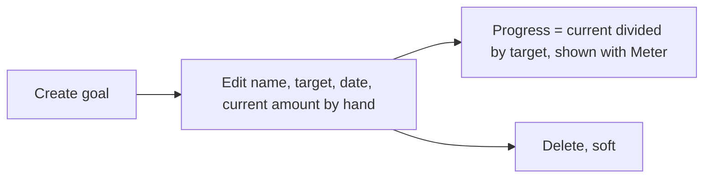

# Goals

Back to the [feature walkthrough](<../14. Feature walkthrough with diagrams.md>).

Backend `Goals`, page `/goals`. Name, target above zero, optional target date, manual current amount of zero or more; above the target is allowed. Nothing is allocated from accounts.

