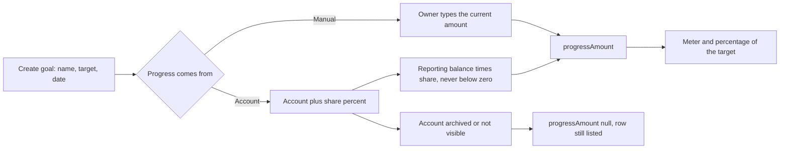

# Goals

Back to the [feature walkthrough](<../14. Feature walkthrough with diagrams.md>).

Backend `Goals`, page `/goals`. Name, target above zero, optional target date. A goal says where its progress comes from, and there are two answers.

A manual goal is the default and behaves as it always did: the owner types a current amount of zero or more, and above the target is allowed. Nothing else moves it.

A funded goal names one account the owner can see and a whole percentage of it, `fundingSharePercent`, from 1 to 100 with 100 as the default. Its progress is that share of the account's reporting balance, worked out while the request is answered and never written down. The stored current amount stays where it is and is not used. A negative balance reads as no progress rather than a negative amount, which keeps the existing rule that a goal's progress is zero or more.

The list answers both kinds in one field, `progressAmount`. For a manual goal it repeats `currentAmount`; for a funded goal it is the computed share; and it is null when the funding account has been archived or is no longer shared with the reader. A null does not fail the list: the row is still returned, and the page shows "Progress unavailable" with no meter instead of a number.

Editing switches between the two modes. Switching to account funding leaves the stored `currentAmount` untouched and stops using it, so switching back brings the same amount into use again. Creating or editing with an account that does not exist, or that the signed-in user cannot see, is refused by the service with 400 `reference.notFound`, the same code and shape the recurring bills use for their account; the two cases are indistinguishable on purpose, because telling them apart would say whether somebody else's account exists. A funded goal without an account and a manual goal that names one are refused earlier by the validator, which names `fundingAccountId` as the field at fault.

Balances come from the same service the accounts endpoints use, so investments held on the account count exactly as they do on the accounts page. The list asks for every funding account's balance in one call, whatever the number of goals.

