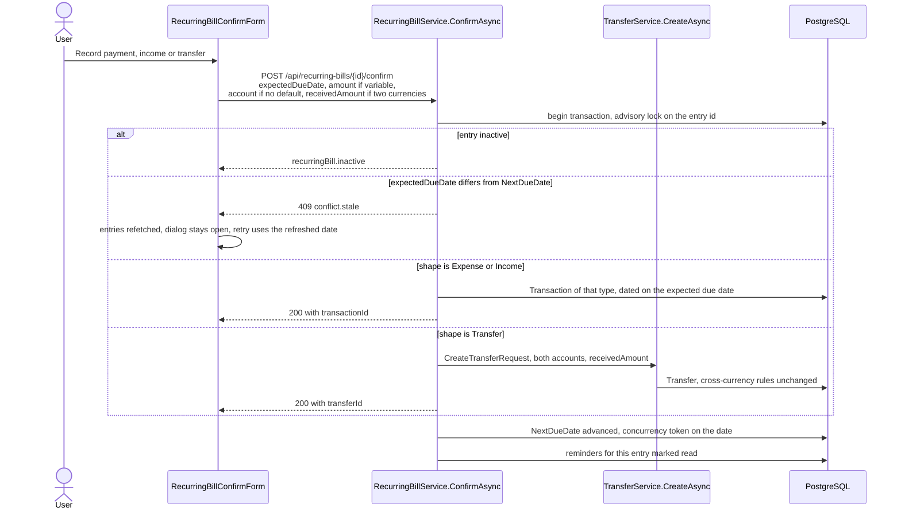
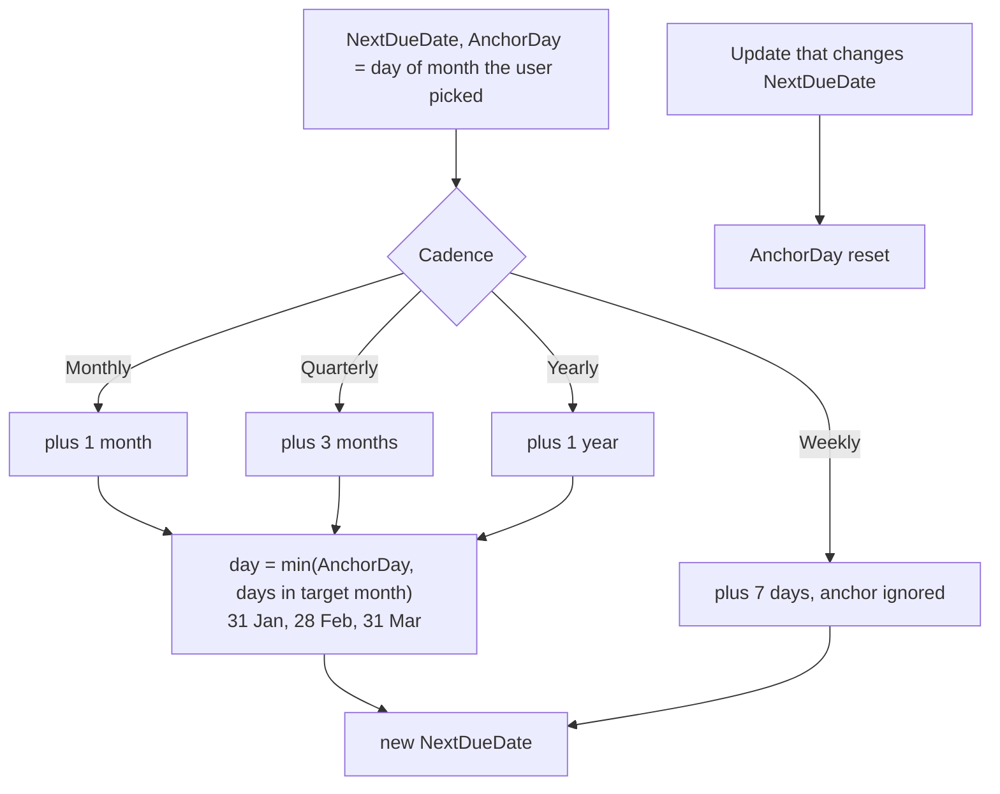

# Recurring entries

Back to the [feature walkthrough](<../14. Feature walkthrough with diagrams.md>).

Backend `RecurringBills`, page `/recurring-bills`. A recurring entry is a schedule, not a posting: nothing reaches the ledger until somebody confirms an occurrence.

Two properties describe an entry. Its **shape** says what a confirmation writes — an expense, an income, or a transfer between two of your own accounts — and its **kind** says whether the amount is always the same (fixed, carried on the entry) or changes each time (variable, typed at confirmation). Every combination is allowed, so a variable transfer is as ordinary as a fixed expense.

The user-facing name is "recurring entries" in both locales, because "bills" stopped covering two of the three shapes. The table, the entity, the service and the route prefix are still `RecurringBill` and `/api/recurring-bills`: a rename would mean a migration plus a backup format that no file taken by an older version could be restored into, since a backup names the tables it carries. The names are documented as a deliberate mismatch rather than paid for.

## What each shape needs

| Shape | Account | Second account | Category |
| --- | --- | --- | --- |
| Expense | Optional default, asked for at confirmation when empty | Rejected | Optional expense category |
| Income | Optional default, asked for at confirmation when empty | Rejected | Optional income category |
| Transfer | Required, the account the money leaves | Required, the account the money arrives in, and different | Rejected |

The same rules run on create and on update, so a shape change that would leave a required field empty is refused with the field at fault and a published code (`required`, `transfer.sameAccount`, `value.mustBeEmpty`). The form follows the choice: picking Transfer swaps the category select for the destination account, picking Expense or Income swaps it back.

## Confirming an occurrence

The transfer branch calls the ordinary transfer create path instead of writing a second one. That path resolves the two account currencies, demands `receivedAmount` when they differ (`transfer.receivedAmountRequired`), refuses a mismatched pair in one currency and checks that both currencies are enabled — behaviour a copy inside this service would have had to repeat and would have drifted from. Because both services share the request-scoped `AppDbContext`, the transfer is written inside the same database transaction and under the same advisory lock as the schedule advance.

The confirm dialog names what it will create, per shape and per kind, and shows the "amount received" field only when the two accounts hold different currencies.

What lands in the ledger is an ordinary row, so nothing downstream needs to know it came from a schedule: a confirmed income counts as income in reports, on the dashboard and against no budget; a confirmed expense counts against the budget of its category; a confirmed transfer moves both balances and counts as neither.

## Schedule advance

Since 2026-09-21 the page also offers entries it found by itself. `GET /api/recurring-bills/suggestions` is a read-only analysis of the ledger: it writes nothing, it is behind the same `RecurringBills` switch as the rest of the route prefix, and it reads through `db.Transactions`, so account visibility and the active household narrow it exactly as they narrow the ledger.

### The numbers, and why they are those numbers

| Constant | Value | Why |
| --- | --- | --- |
| `LookBackMonths` | 24 | Two years is the shortest window that can see three yearly occurrences, which is the hardest cadence to confirm. A longer one would only add dead subscriptions. |
| `MinimumOccurrences` | 3 | Two payments are a coincidence: any two dates define a gap, so two of anything would "repeat". Three is the first number that can disagree with itself. |
| Cadence gaps | 7 ± 2, 30 ± 5, 91 ± 12, 365 ± 30 days | The tolerance of each cadence is the largest drift a real calendar produces — a 28-day February against a 31-day March, a quarter of 89 against 92 days, a leap year — plus the day or two a bank takes over a weekend. The four ranges do not overlap, so a series belongs to at most one cadence. |
| `MaxScannedTransactions` | 4000 | The bound the brief asks for. Ordered by date descending, so what is read is the most recent part of the window. |
### One pass, bounded, and one pure function

An **active recurring entry** whose name normalizes to the group's description hides it, when that entry has no default account or names the same one. Inactive entries do not: switching an entry off is how you say you no longer track it, and the suggestion coming back is the honest consequence.

### The two actions

Creating goes through `RecurringBillForm` and `POST /api/recurring-bills`, the same path the **Add recurring entry** button uses. The form gained a `draft` prop that seeds its default values and nothing else: `bill` still means "edit this one", `draft` means "start from this", and the validation, the shape rules and the error handling are the ones that were already there. A candidate is always offered as a fixed expense, because that is what was detected; the kind, the shape and everything else can be changed before saving.

## Reminders and the forecast

`RecurringBillReminderJob` treats all three shapes alike: it scans every 15 minutes, raises one `billDue` notification per entry and local day, and the confirmation marks the unread ones read. The payload carries the shape beside the due date, so the bell says "Payment due", "Expected" or "Transfer due" in English and the matching sentence in Lithuanian. Reminders written before shapes existed carry no shape and read as an expense.

Since 2026-09-20 the same pass can also queue an email. It does so only for the owner of the entry, only when that person switched "Email me about a due recurring entry" on in their profile, only when their address is confirmed and only while the installation has a mail server. The email row is written in the same transaction and under the same lock as the notification, with the dedupe key `bill:{id}:{local date}`, so the two are raised together or not at all and a second pass on the same day raises neither. The job never talks to SMTP itself: `EmailOutboxJob` drains the rows a minute later, so a dead mail server cannot slow the scan or delay another household's reminder. The sentence follows the shape as well — "due to be paid", "due to arrive", "due to be transferred". See [Email](<26. Email.md>).

The six-month forecast chart on the page counts fixed **expenses** only. Income and transfers are on the same list and in the same reminders, but a bar that added an incoming salary to an outgoing rent would answer no question anybody asks.
