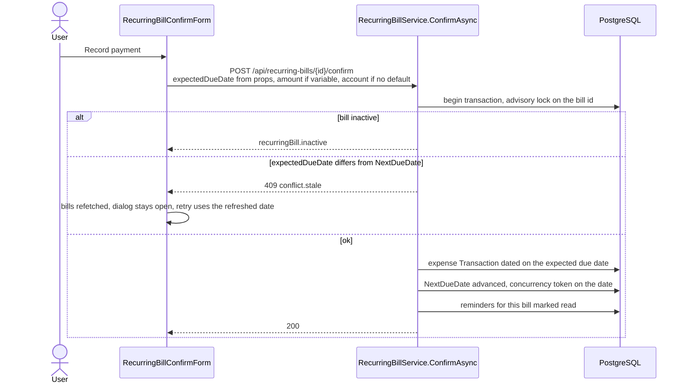
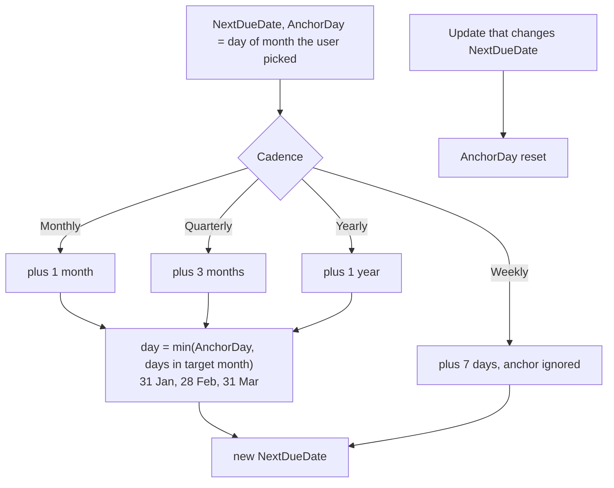

# Recurring bills

Back to the [feature walkthrough](<../14. Feature walkthrough with diagrams.md>).

Backend `RecurringBills`, page `/recurring-bills`. Fixed bills carry an amount, variable bills ask for it at confirmation.

## Confirming a payment

What lands in the ledger is an ordinary row, so nothing downstream needs to know it came from a schedule: a confirmed income counts as income in reports, on the dashboard and against no budget; a confirmed expense counts against the budget of its category; a confirmed transfer moves both balances and counts as neither.

## Schedule advance

| `LookBackMonths` | 24 | Two years is the shortest window that can see three yearly occurrences, which is the hardest cadence to confirm. A longer one would only add dead subscriptions. |
