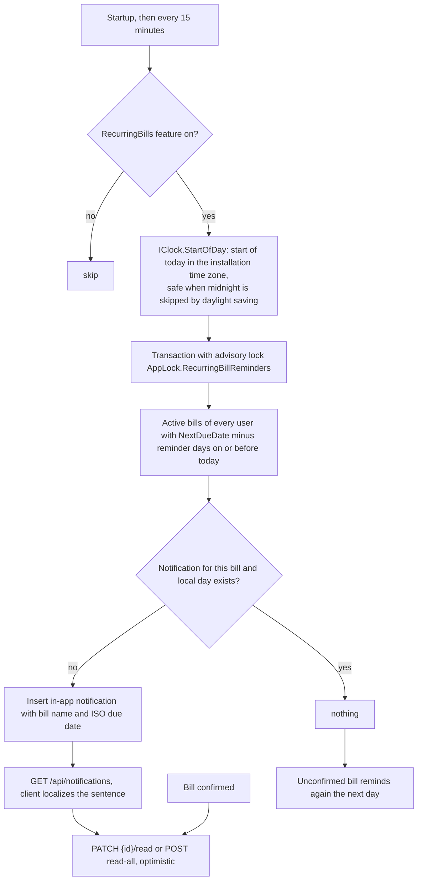

# Notifications

Back to the [feature walkthrough](<../14. Feature walkthrough with diagrams.md>).

Backend `Notifications` and `RecurringBillReminderJob`, shown by `NotificationBell` in the sidebar foot.

