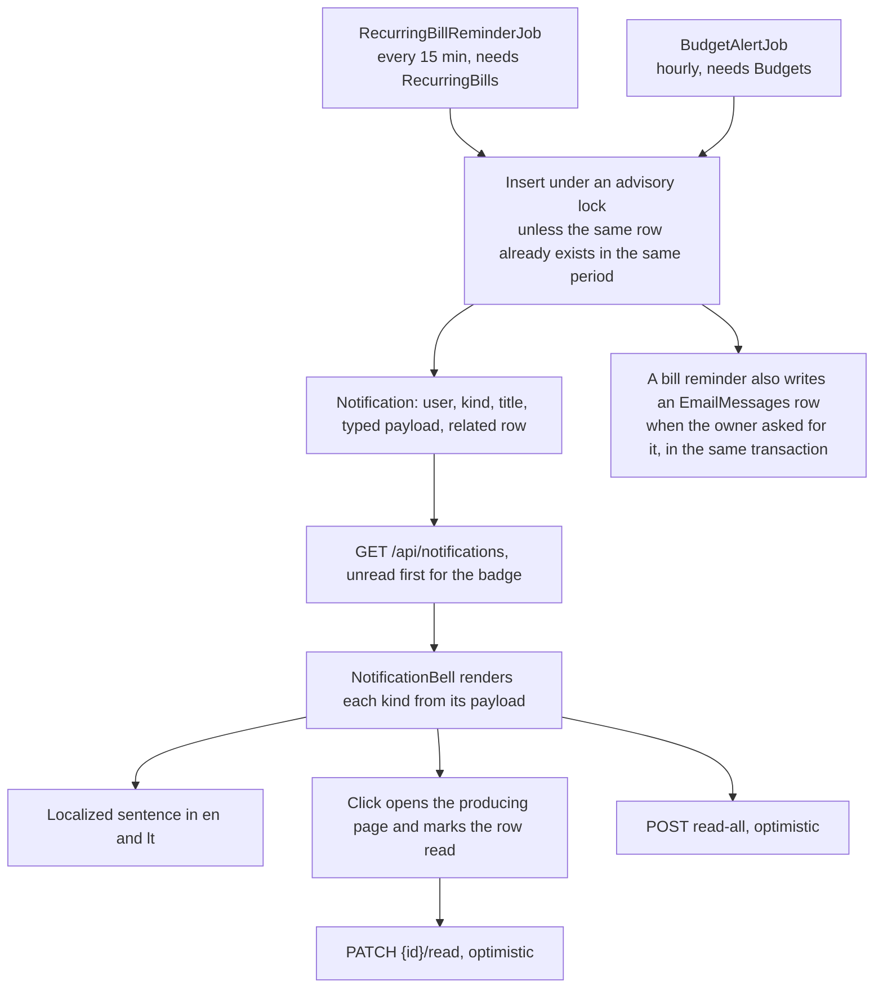

# Notifications

Back to the [feature walkthrough](<../14. Feature walkthrough with diagrams.md>).

Backend `Notifications`, written by background jobs and shown by `NotificationBell` in the sidebar foot. Notifications are not a feature of their own: they are the shared mechanism a producer uses to tell one user that something happened while nobody was looking. Two producers exist today, `RecurringBillReminderJob` and `BudgetAlertJob`, and each is gated by the feature it belongs to. The notification endpoints themselves are behind no feature switch and are not listed in `FeatureGateMiddleware`, so listing, the unread badge, marking one read and marking all read keep working as long as any producer is enabled — and also when none is.

## The email beside the bell

## Kinds and the typed payload

`NotificationType` names the kind, and `Notification.Payload` carries the few values the sentence needs. The payload is one `jsonb` column holding a `NotificationPayload` record; every property is optional and a kind fills only its own:

| Kind | Title | Payload | Raised by |
| --- | --- | --- | --- |
| `billDue` | The recurring entry's name | `dueDate`, `shape` | `RecurringBillReminderJob` |
| `budgetWarning` | The category name | `thresholdPercent` (80), `period` | `BudgetAlertJob` |
| `budgetExceeded` | The category name | `thresholdPercent` (100), `period` | `BudgetAlertJob` |

Before the payload existed, a bill reminder put the bill name in `Title` and the ISO due date in `Message`, and the client parsed that text. Rows written that way are still in the database, so `NotificationMapper` fills the payload from `Message` when the column is null: a `billDue` row whose message parses as `yyyy-MM-dd` answers with that date in `dueDate`, anything else answers with an empty payload. `Message` is still written and still returned as the plain-text fallback the client shows when a payload it does not recognise arrives, which is what a client one version behind a new kind sees.

The client never builds a sentence from server text. It reads the kind and the payload and calls `t("notifications.…")`, so the same row reads "Monthly limit: 80% used" in English and "Mėnesinis limitas: panaudota 80%" in Lithuanian.

`billDue` needs more than the date, because a recurring entry can be an expense, an income or a transfer and one sentence cannot cover all three — "Mokėjimo data" is wrong for money that is coming in. The payload therefore carries `shape` beside `dueDate`, and the bell picks `notifications.billDue.expense`, `.income` or `.transfer`. A row written before shapes existed has no `shape` and reads as an expense, which is what every such row was.

## A producer that was switched off

A notification outlives the switch that produced it. When `Budgets` or `RecurringBills` is turned off, the rows already written stay in the list and stay in the unread count: they are a record of something that was true when it happened, hiding them would make the badge jump when an administrator flips a switch, and the list would have to learn which feature each kind belongs to in order to filter. What does change is the link. `NotificationBell` maps each kind to the page that explains it and to the feature that owns that page, and renders the entry as a link only while that feature is on; otherwise the entry is a plain button that marks the row read, because the page it would open is not in the navigation either.

## Budget alerts

`BudgetAlertJob` walks every active user hourly and, for each of that user's budgets, asks `BudgetUsageCalculator` for the current window — the same call the budgets page makes, so rollover, the carried amount and the effective limit are the numbers the user sees. Spending at or above 80% of the effective limit raises `budgetWarning`, at or above 100% raises `budgetExceeded`, and a budget whose effective limit is not positive after an overspend carried forward counts as fully spent as soon as anything is spent in the window.

Deduplication is one row per budget, per window, per threshold. The job reads the budget notifications already written since the start of the current window and skips a threshold that is among them, so a restart, a second pass or two instances running at once cannot double up; the read and the insert happen in one transaction that holds `AppLock.BudgetAlerts`. Spending that falls back below a threshold inside the same window — an edited or deleted transaction — does not re-arm it: the alert says the threshold was crossed, and crossing it twice in one window is one event, not two. The next window starts the count again, so a budget that is overspent every month is reported every month. A budget that jumps past both thresholds between two passes gets both rows, so the 80% warning is never silently swallowed by the 100% one.

The alert links to `/budgets`, where the meter, the window and the carried breakdown explain the number.

## Reading and clearing

`GET /api/notifications` answers newest first and takes `unread` to filter. The bell asks for unread only, shows the count as a badge and, when the popover is open, one row per notification with its localized sentence. Clicking a row marks it read optimistically (`PATCH /api/notifications/{id}/read`) and, when the row has a link, navigates. "Mark all as read" is one `POST /api/notifications/read-all`. Confirming a recurring entry also invalidates the notification query, which is why a confirmed entry's reminder disappears without a refresh; it invalidates the transfer list too, because a transfer-shaped entry writes one.
