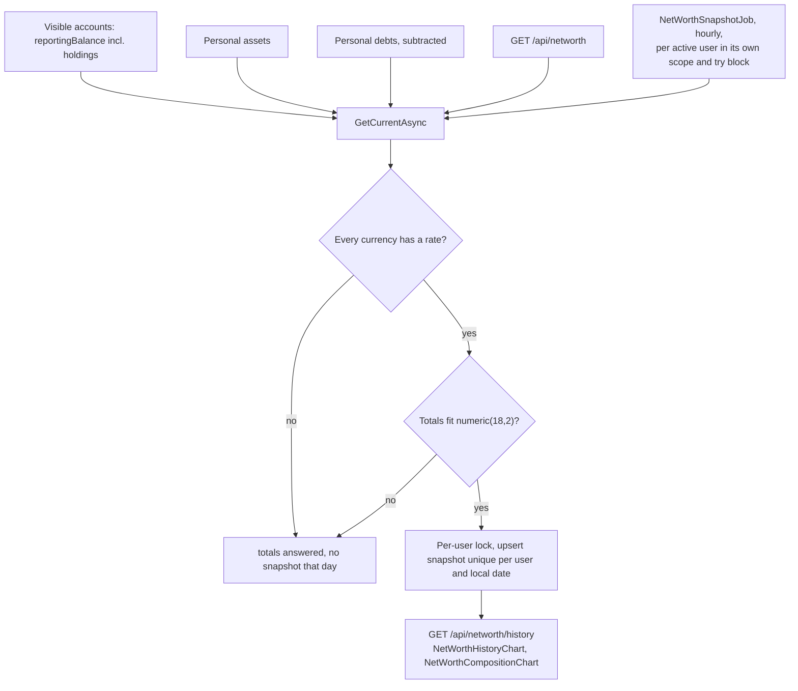
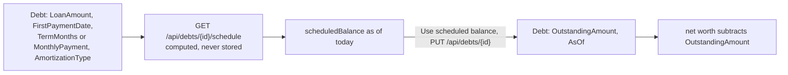

# Net worth

Back to the [feature walkthrough](<../14. Feature walkthrough with diagrams.md>).

Backend `NetWorth` (net worth, assets, debts), page `/net-worth`. Assets and debts are personal and in the reporting currency.

A debt subtracts its recorded `OutstandingAmount`, as of its `AsOf` date. Since 2026-09-21 a debt can also carry its repayment terms — loan amount, first payment date, a term or a fixed monthly payment, annuity or linear — and then has a computed repayment schedule with a payoff date, the interest and principal of every payment and a "what if I pay more" preview, on its own page `/net-worth/debts/$debtId`. The schedule never changes net worth by itself: its scheduled balance for today is shown beside the recorded amount, and "Use scheduled balance" copies it into the debt as an ordinary update.

See [Debt amortization](<32. Debt amortization.md>) for the terms, the formulas, the rounding and the API.
