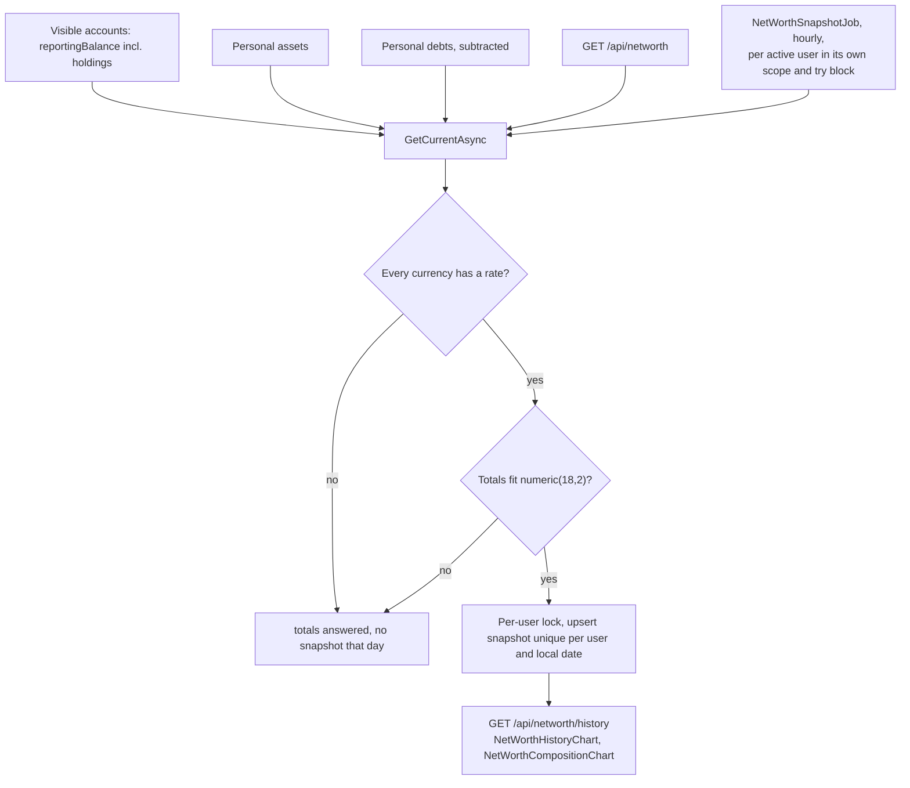

# Net worth

Back to the [feature walkthrough](<../14. Feature walkthrough with diagrams.md>).

Backend `NetWorth` (net worth, assets, debts), page `/net-worth`. Assets and debts are personal and in the reporting currency.

