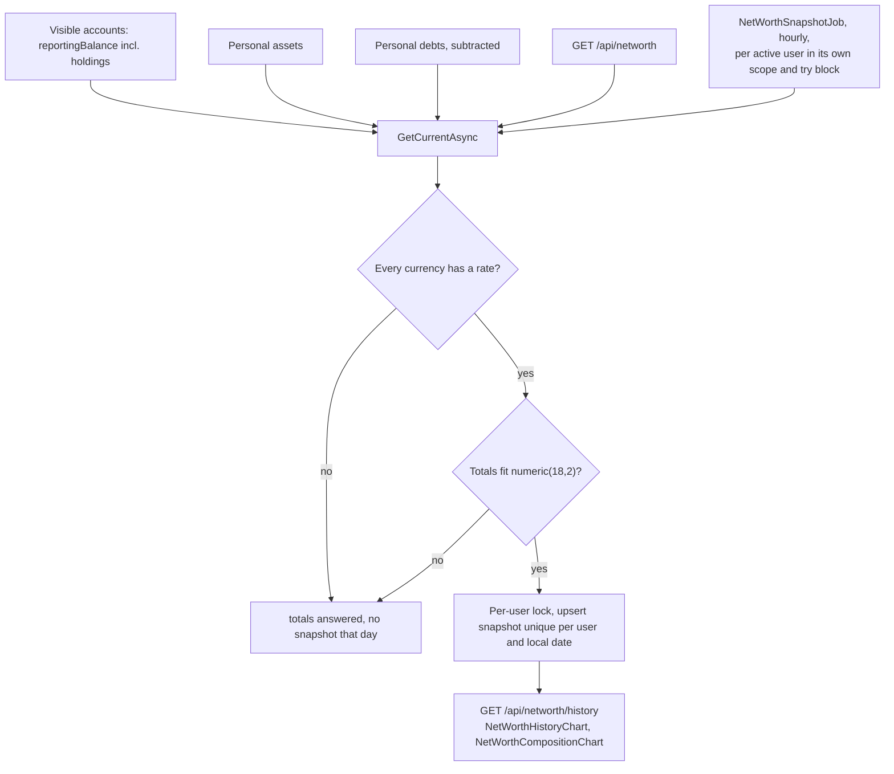
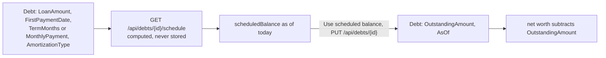

# Net worth

Back to the [feature walkthrough](<../14. Feature walkthrough with diagrams.md>).

Backend `NetWorth` (net worth, assets, debts), page `/net-worth`. Assets and debts are personal. Each takes the reporting currency of the day it is created, keeps it through later edits and answers it as `currency`.

Since 2026-09-22 the totals are added up in the reporting currency. Assets and debts are summed per currency and each sum is converted at today's rate, the same way account balances are, so an asset entered before the reporting currency changed still counts at its value. When a currency has no usable rate its assets or debts are left out, `isComplete` is false and no snapshot is written, exactly as for an account balance or a holding without a price. A snapshot stores the currency it was taken in; the history converts a snapshot taken in another currency at the rate of its own date, and leaves out a point for which no rate is known. Changing the reporting currency fetches the rates for those dates along with the ones transactions need.

A debt subtracts its recorded `OutstandingAmount`, as of its `AsOf` date. Since 2026-09-21 a debt can also carry its repayment terms — loan amount, first payment date, a term or a fixed monthly payment, annuity or linear — and then has a computed repayment schedule with a payoff date, the interest and principal of every payment and a "what if I pay more" preview, on its own page `/net-worth/debts/$debtId`. The schedule never changes net worth by itself: its scheduled balance for today is shown beside the recorded amount, and "Use scheduled balance" copies it into the debt as an ordinary update.

See [Debt amortization](<32. Debt amortization.md>) for the terms, the formulas, the rounding and the API.
