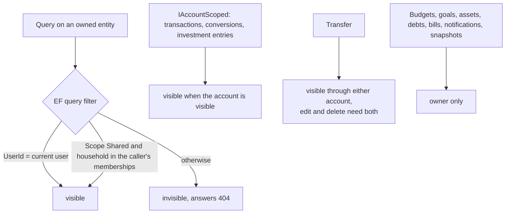
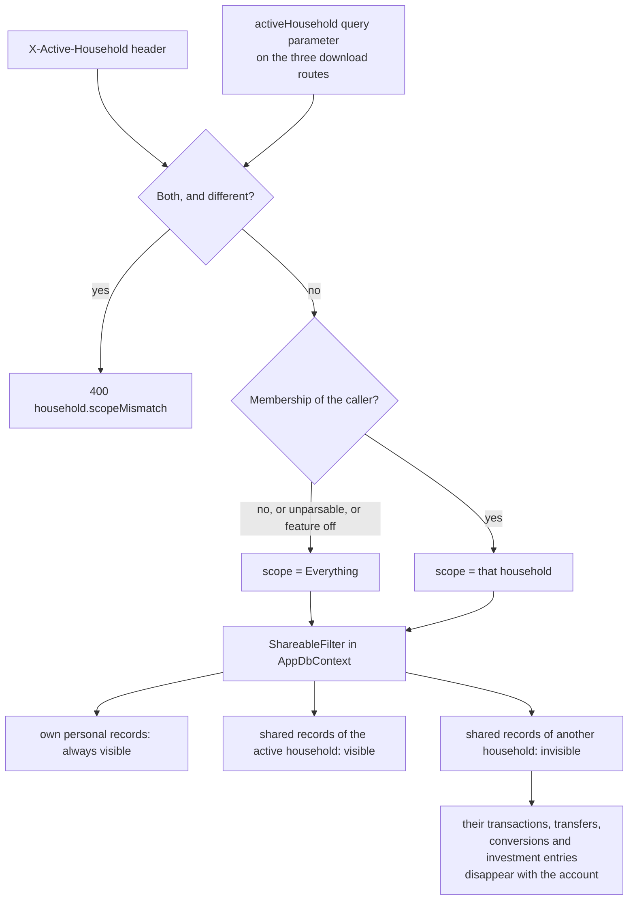
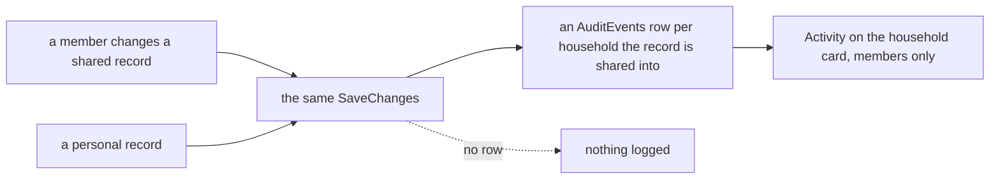
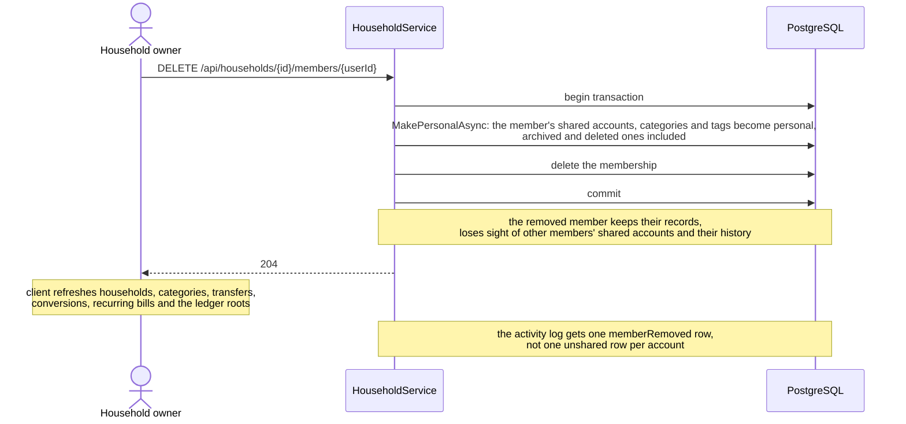

# Households and sharing

Back to the [feature walkthrough](<../14. Feature walkthrough with diagrams.md>).

Backend `Households`, page `/households`. Household roles (Owner, Member) are independent of application roles (Admin, Member). Only accounts, categories and tags can be shared.

## Who sees what

## The active household

A user who belongs to several households sees the union of everything shared with them. The switcher in the sidebar (and in the header on a phone) narrows that view to one household without changing a single record. It offers "Everything", which is the default and the behaviour described above, plus one entry per membership. It is hidden for a user with no household, and for an installation where the Households feature is switched off.

The choice lives in the browser, in the `jx-preferences` row, and travels with every request as the `X-Active-Household` header. The server validates the header against the caller's memberships on each request and ignores anything it cannot confirm: an unparsable value, a household the caller left, a household they were never in, or any value at all while the Households feature is off. An ignored header means "Everything"; it never widens what the caller may see, so no request can reach a household the caller is not a member of.

A file download started from a plain link is the one request the browser makes without the header, because an `<a href>` carries no headers of its own. Those three routes — the transaction CSV, the transaction PDF and the investment tax summary CSV — therefore also read the scope from an `activeHousehold` query parameter. It is the same value, read by the same middleware, put through the same membership check, and it is read on those three routes only: on any other route the parameter is an ordinary unknown query string and is ignored. A request that carries both, as the PDF does because it goes through the API client and the client builds its URL the same way, must carry the same value in both; two different values are a confused client rather than a choice to make, so the request is refused with 400 `household.scopeMismatch` instead of one of the two being picked silently. A value that differs only by letter case counts as the same value.

A household id in a query string is the only scope value that travels that way. It is an opaque identifier of a household the caller is already a member of, it names no person and reveals nothing the caller could not see anyway, and a value that fails the membership check is dropped, so a copied link is worth no more than the session it is used in. Nothing else about the caller — no user id, no email, no filter over personal records — is ever put in an export URL.

The narrowing happens in one place, the shareable branch of `ApplyQueryFilters` in `AppDbContext`, so it reaches accounts, categories and tags, and through them everything that hangs off an account: transactions, transfers, currency conversions and investment entries. An endpoint cannot forget it, because an endpoint never writes the filter. The rules that follow from that:

- Personal records of the caller stay visible in every scope. A scope hides other households, not your own things.
- Writing follows reading. While a household is active, an account of another household is not a valid reference, so a transaction or transfer cannot be pointed at it and the attempt answers `reference.notFound` exactly as it does for an account belonging to somebody else.
- A transfer between accounts in two different households stays visible while either of its accounts is visible, which is the rule sharing already used. Under a scope you therefore still see the money leaving the household, but editing or deleting that transfer needs both accounts, so it answers 403 until the scope is widened back to Everything.
- The household list itself is never narrowed. `GET /api/households` answers every membership whatever the header says, otherwise the switcher could not offer a way back. It reads the members of every household it answers in one left join over memberships and users, rather than two queries per household; `GET /api/households/{id}` goes through the same code with a list of one.
- Creating a record while a household is active proposes that household on the forms that already ask for a scope (a new account, a new category). It is a default in an empty form, nothing more: editing an existing record keeps the scope that record has, and switching the scope never rewrites a stored record.
- Background jobs, the reminder and alert jobs, the broker sync, the snapshotter, backup and restore and the administrator recovery command run outside a request and keep the unscoped view. `ICurrentUser.ActiveHouseholdId` defaults to "no household", so anything that is not an HTTP request is unscoped by construction.
- Every export answers the scope of the screen it was started from. The CSV exports stay plain browser downloads and carry the scope in the URL; the PDF export goes through the API client and carries it in the header as well. The backup download is not scoped: a backup is the whole installation, taken by an administrator, and it is written and read outside the query filter exactly as the background jobs are.

## Deleting and restoring a household

Deleting a household makes every account, category and tag shared into it personal to the member who owns it, and keeps the memberships. Since 2026-09-21 it first records the id of every one of those rows, archived and deleted ones included, beside a trash entry that reads `Family, 2 accounts, 5 categories, 1 tag`, so the owner who deleted it can undo it from the toast or restore it from the trash for 30 days. A restore brings the household back and shares into it again each recorded row that is still personal and still owned by a member; a row somebody has shared into another household since stays there. Only an owner can restore it, and nobody else sees the entry. While it is deleted, a stored active-household selection that names it is ignored by the middleware, so members see "Everything" rather than an empty scope, and after the restore the selection applies again. The details are in [Trash and undo](<29. Trash and undo.md#deletes-that-rewrite-other-rows>).

## Who did what: the activity log

Since 2026-09-21 every change to what is shared into a household is recorded for its members: a transaction, transfer, conversion or investment entry on a shared account created, edited, deleted or restored, an account, category or tag shared, unshared, edited, deleted or restored, a member added, removed or given another role, and the household renamed, deleted or restored. An edit keeps its changed fields with their old and new values as they read then, and an import or bulk edit is one row that counts what it touched. Personal records are never recorded. Each household card has "Show activity", with filters by member, kind and date; only members can read it, and while one household is active the others' activity answers 404 like any other record of theirs. Rows are pruned after 400 days. The details are in [Audit log](<30. Audit log.md>).

## Removing a member

