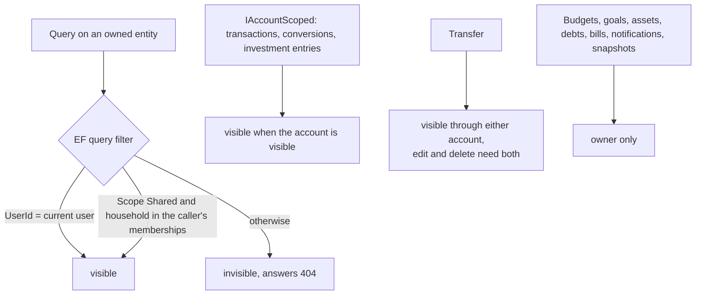
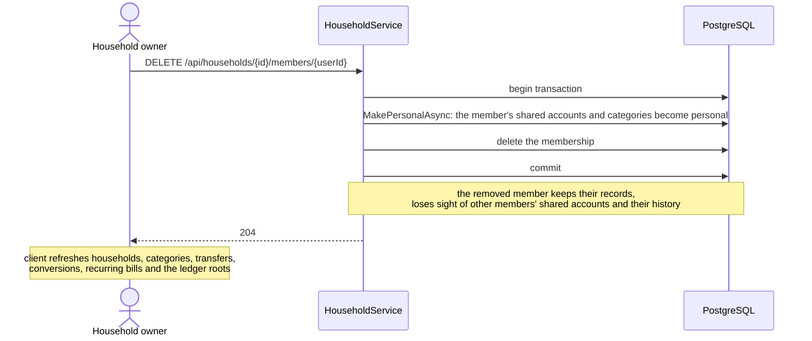

# Households and sharing

Back to the [feature walkthrough](<../14. Feature walkthrough with diagrams.md>).

Backend `Households`, page `/households`. Household roles (Owner, Member) are independent of application roles (Admin, Member). Only accounts and categories can be shared.

## Who sees what

## Removing a member

