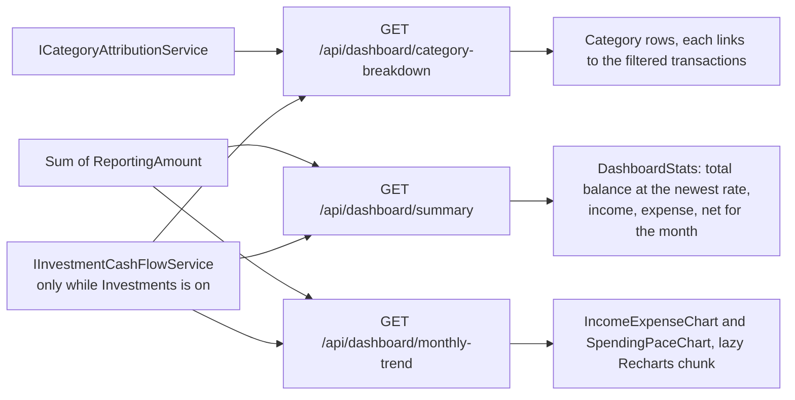

# Dashboard

Back to the [feature walkthrough](<../14. Feature walkthrough with diagrams.md>).

Backend `Dashboard`, page `/`. Three endpoints, each section in its own `QueryBoundary` so a slow one does not blank the rest.

The month figures, the monthly trend and the spending breakdown count investment dividends and interest as income and withholding tax and standalone fees as expense, exactly as the [report](<18. Reports.md>) does, so the dashboard month and the report for that month agree. In the breakdown they are one row, "Investment taxes and fees", without a link. With the `Investments` feature off nothing is added.
