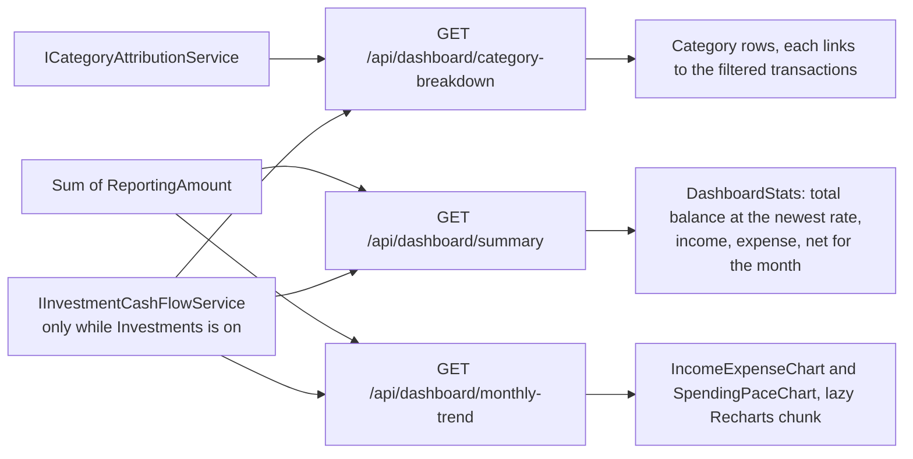
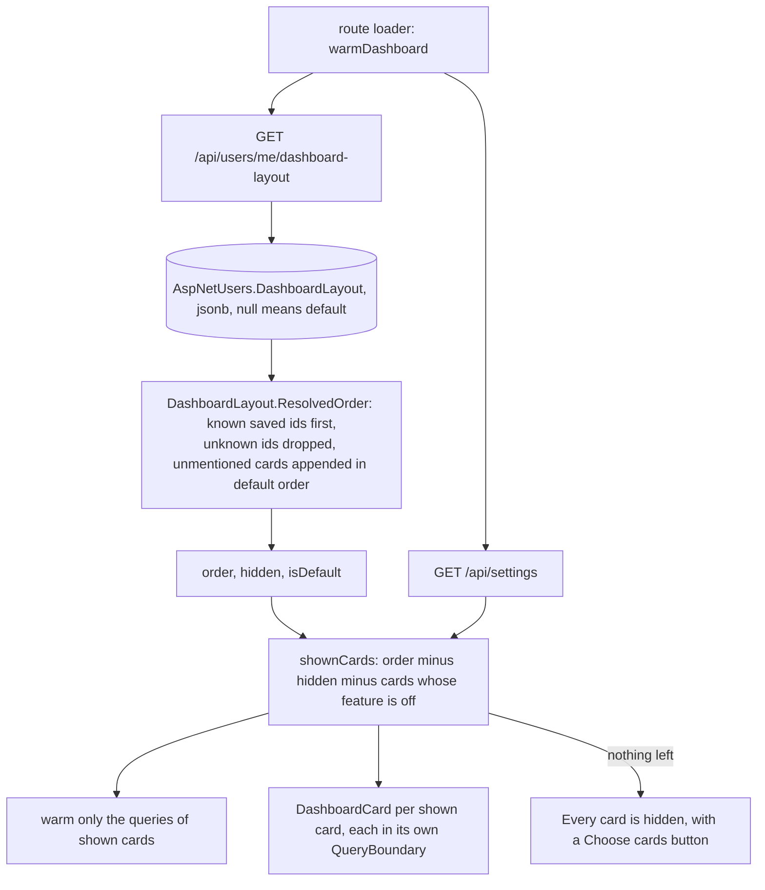
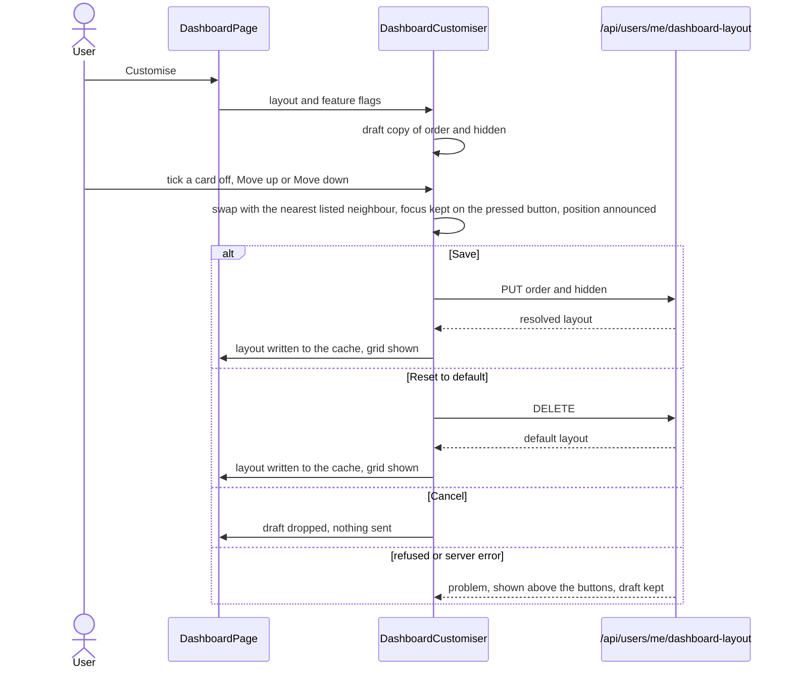

# Dashboard

Back to the [feature walkthrough](<../14. Feature walkthrough with diagrams.md>).

Backend `Dashboard`, page `/`. Three data endpoints, each card in its own `QueryBoundary` so a slow one does not blank the rest, and a per-user layout that chooses and orders the cards, described [below](#choosing-and-ordering-the-cards).

The month figures, the monthly trend and the spending breakdown count investment dividends and interest as income and withholding tax and standalone fees as expense, exactly as the [report](<18. Reports.md>) does, so the dashboard month and the report for that month agree. In the breakdown they are one row, "Investment taxes and fees", without a link. With the `Investments` feature off nothing is added.

## Choosing and ordering the cards

Each user decides which of the nine cards the dashboard shows and in what order. The layout belongs to the person, not to a household or a browser: it is stored on the user row, so it follows them to every browser and device, and two members of one household each keep their own. Backend `Dashboard` (`GetDashboardLayout`, `SaveDashboardLayout`, `ResetDashboardLayout`, `DashboardLayoutService`) and `Domain/Dashboard`; frontend `dashboard-layout.ts`, `dashboard-card`, `dashboard-customiser` and the page.

| Card id | Card | Feature switch |
| --- | --- | --- |
| `summary` | Total balance and the month figures | always on |
| `monthlyTrend` | Income vs. expenses | always on |
| `spendingByCategory` | Spending by category | always on |
| `spendingPace` | Spending pace | `Reports` |
| `budgets` | Budgets in their window | `Budgets` |
| `netWorth` | Net worth | `NetWorth` |
| `accounts` | Balance by account | always on |
| `recentTransactions` | Recent transactions | always on |
| `upcomingBills` | Upcoming bills | `RecurringBills` |

The table order is the default. The ids are the published `DashboardCard` enum.

### Storage and reading

`AspNetUsers` gained a nullable `jsonb` column `DashboardLayout` holding `{ "order": [...], "hidden": [...] }` as card id strings. Null means the user never saved one, and `GET` answers the default order, nothing hidden and `isDefault: true`. The ids are stored as strings, not as the enum's numbers, so a layout written by a newer version with a card this version does not know, or by an older one with a card that has since gone, still reads: unknown ids are dropped, a repeated id counts once, and every known card the saved order does not mention is appended after the saved ones in its default position relative to the others. A card added in a later release therefore appears at the end of an existing custom layout and is shown, so the user notices it and can move it; it is never slipped between cards the user placed on purpose. A saved layout is stored already resolved, so it always lists every card this version knows.

Feature switches are not applied on the server. A card whose switch is off keeps its place in the stored order and its hidden flag, and comes back exactly there when an administrator switches the feature on again. The client leaves it out of the grid, out of the customiser and out of the warmed queries.

### Saving and validation

`PUT /api/users/me/dashboard-layout` takes `order` and `hidden`, two lists of card ids, and answers the resolved layout. `DELETE` on the same route forgets the saved layout and answers the default one; it is safe to repeat. Both act on the signed-in user only; there is no way to read or change another user's layout.

| Rule | Code | Field |
| --- | --- | --- |
| Both lists are present | `required` | `order`, `hidden` |
| Every id is one of the published card ids, matched exactly | `dashboard.cardUnknown` | `order[n]`, `hidden[n]` |
| An id appears at most once in a list | `dashboard.cardDuplicate` | `order`, `hidden` |

`order` may leave cards out, which are then appended as on read. A hidden card need not be listed in `order`. The request takes strings rather than the enum so that an unknown id is answered with a field-level code instead of a whole-body `request.malformed`.

### Performance

A hidden card never mounts, so its suspense queries never run, and the route loader asks for the layout and the settings in parallel and warms only the queries of the cards that will be shown, so hiding a card removes its requests entirely. Two cards share a query: `accounts` and `recentTransactions` both read `/api/accounts`, which is fetched once while either is shown. The layout query is warmed with an infinite stale time like the rest of the page; saving and resetting write their answer straight into the cache instead of invalidating it, because the response is the new layout and nothing else reads it.

### The customise mode

The customiser replaces the grid while it is open, so no card data loads behind it. Each card is a row with a checkbox named by the card's title and two icon buttons, "Move up" and "Move down", named with the card too; there is no drag and drop, so reordering works the same with a keyboard, a pointer or a screen reader. Moving swaps a card with the nearest neighbour that is listed, stepping over cards whose feature is off so their stored position is left alone. After a move the focus stays on the pressed button, or moves to the opposite one when the card reached the end of the list, and a polite status region says the card's new position. On a phone the rows keep one line per card, the buttons grow to the 44-pixel touch size and the action row wraps; the grid itself is one column below the `lg` breakpoint, as before.

The grid places cards in the chosen order with their usual widths. It does not pack them densely, because a visual order that differs from the reading and focus order is worse than a gap at the end of a row.

"Reset to default" deletes the saved layout at once rather than resetting the draft, so the user goes back to having no layout and later cards take their default positions. Nothing about the layout is in the trash or the household audit log: it is a personal preference, not a record. It is part of every backup, because the backup copies every column of `AspNetUsers`.
