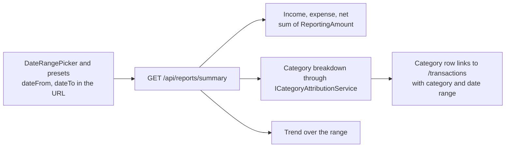

# Reports

Back to the [feature walkthrough](<../14. Feature walkthrough with diagrams.md>).

Backend `Reports`, page `/reports`. One endpoint, `GET /api/reports/summary`, for any date range; the year presets use the same report.

