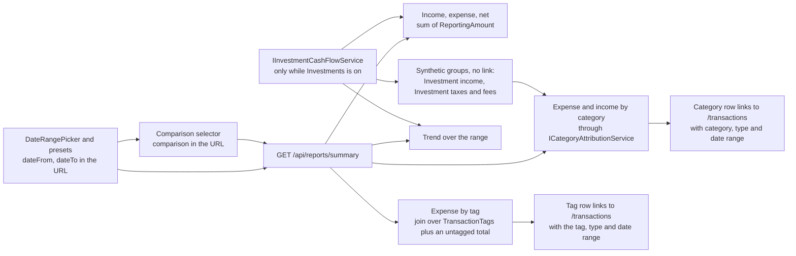

# Reports

Back to the [feature walkthrough](<../14. Feature walkthrough with diagrams.md>).

Backend `Reports`, page `/reports`. One endpoint, `GET /api/reports/summary`, for any date range; the year presets use the same report. The same endpoint can answer a second, earlier period beside the chosen one; see [Comparing with an earlier period](#comparing-with-an-earlier-period).

## Comparing with an earlier period

### How the earlier range is derived

| Chosen range | A year earlier | Why |
| --- | --- | --- |
| 1–31 March 2026 | 1–31 March 2025 | Nothing to clamp |
| 1–28 February 2025 | 1–29 February 2024 | 28 February is a month end, so February meets the whole of February |
| 29 February 2024 alone | 28 February 2023 | `AddYears` clamps the start, and the end is the month end |
| 10–20 April 2026 | 10–20 April 2025 | Mid-month, nothing snaps |
| 1 January – 31 December 2026 | 1 January – 31 December 2025 | A whole year is a month end at each end |

### What the response carries

The two breakdowns are merged on their key — the category id, the synthetic group, the tag id, or "none of those" for the uncategorized and untagged entries. A key only one period touched is still one entry, with `0.00` on the side that has nothing, because a category that stopped costing anything is the most interesting row a comparison has. That is also why the list is sorted by the larger of the two amounts rather than by the current one: a category that fell to zero keeps its place near the top instead of sinking out of sight. The list does not grow without bound — it is at most the union of two periods' categories or tags — and the page still shows five categories and eight tags, rolling the rest into "Other", with the earlier amounts of the rolled-up rows added into that row too.

### The difference and the zero base

### The cost

The comparison must not double the work, so it is not a second pass. Each range-scoped query already ran once per report; it now carries both windows in one predicate (`Date` inside either window) and returns the date, and the rows are split between the two periods in memory. `ICategoryAttributionService` and `IInvestmentCashFlowService` take the second window as a nullable parameter and build the narrower predicate when it is absent, so a report without a comparison emits exactly the query it emitted before. The number of round trips per report is the same whether a comparison was asked for or not — in fact one lower than before, because the totals are now summed from the same grouped query the trend uses instead of a separate aggregate.

The alternative, widening one range to span both, was rejected: for the previous period the two windows are adjacent and it would be the same thing, but for the same period a year earlier it would read a whole year of rows to show two months.

### What is not exported

## Expense breakdown by tag

`expenseByTag` sits beside the two category breakdowns and answers the other question a household asks of a period: not what kind of spending it was, but what it was for. It holds one `TagBreakdownItem` per tag the period touches, sorted by amount, and a final item with `tagId` null for the expenses that carry no tag at all. The amounts are sums of `ReportingAmount` over whole transactions, because a tag sits on the transaction and never on a split line, so there is no proration to do.

A transaction can carry several tags, and then it counts once under each of them. The tag items can therefore add up to more than `totalExpense`; only the untagged item is disjoint from the rest. That is the nature of the question — one receipt really can be both the holiday and the thing a colleague will pay back — and the page says so in a line under the list. Investment cash flows carry no tag and are left out of the list entirely, so it can also come to less than `totalExpense`.

The list covers expenses only. Tags in practice mark spending themes, the untagged group is about spending, and an income split by tag would double the page for a question `incomeByCategory` already answers. Visibility needs no code: the breakdown joins `TransactionTags` onto `db.Transactions`, which is already scoped by account visibility and by the active household, and the names come from `db.Tags`, filtered exactly as categories are. Tags are described in full on [Tags](<27. Tags.md>).

## What counts as income and expense

Two ledgers feed the report. Ordinary transactions contribute their `ReportingAmount` by `FlowType`, as before. While the `Investments` feature is on, the investment ledger contributes too, through `IInvestmentCashFlowService` in `Common/InvestmentCashFlows`:

| Investment entry | In the report |
| --- | --- |
| Dividend, Interest | income |
| WithholdingTax, standalone Fee | expense |
| Buy, Sell, Split | nothing |

A buy moves money into a holding and a sell moves it back, so neither is income or expense. The realised gain of a sale stays in the portfolio view on `/investments` and is not report income. The commission of a buy or sell is part of its cost or proceeds (decision of 2026-09-19) and therefore stays out as well; only `Fee` entries of their own count. The amount used is the entry's frozen `ReportingAmount`, so a dividend paid in US dollars counts at the rate of its own date, exactly like a foreign-currency transaction. The side is decided by the entry type and the sign is kept, the same way the portfolio totals on `/investments` are built: a dividend reversal or margin interest that the broker reports as a negative amount lowers income instead of raising expense, and a withholding tax refund lowers expense. Net is the same either way.

With the feature off the service returns nothing and every figure equals the sum of the transactions alone.

Visibility needs no code in the report. `InvestmentTransaction` is `IAccountScoped`, so the global query filter in `AppDbContext` shows a caller only entries on accounts visible to them, the same filter that scopes `Transaction`. The report has no account filter of its own.

## Category breakdown and the synthetic groups

The response carries `expenseByCategory` and, new with this change, `incomeByCategory`; both are lists of `CategoryBreakdownItem`. Investment entries have no category, so their total arrives as one extra item per list: `categoryId` null, a plain English `categoryName` as a fallback, an icon name, and `syntheticGroup` set to `investmentIncome` or `investmentTaxesAndFees`. Every other item, the uncategorized one included, has `syntheticGroup` null. The field and the income list are additions, so a client written against the older shape keeps working: it sees an item without a category id, which it already had to handle for uncategorized spending, and shows the English name.

The reports page reads `syntheticGroup`, takes the name from `reports.syntheticGroups.*` in the locale files (English and Lithuanian) and renders the row as text, never as a link, because there is no category to filter `/transactions` by. A group appears only when its total is above zero; in the rare period where refunds exceed the tax and fees, the totals still carry the negative amount and the list simply has no row for it.

The dashboard uses the same service and the same builder (`CategoryBreakdownBuilder` in `Endpoints/Dashboard/Shared`): its month income and expense, its monthly trend and its spending breakdown include the same investment flows, so the dashboard month and the report for that month always agree. Budgets are untouched: a budget belongs to a category and these amounts have none. The CSV and PDF exports on this page remain transaction exports and do not list investment entries, so their totals can be lower than the report's when the period holds dividends.
