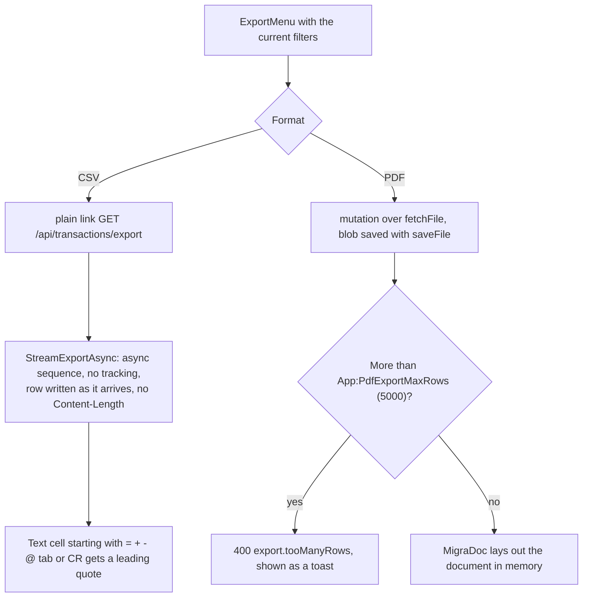

# Exports

Back to the [feature walkthrough](<../14. Feature walkthrough with diagrams.md>).

```mermaid
flowchart TD
    Menu["ExportMenu with the current filters"] --> Kind{"Format"}
    Kind -->|"CSV"| Link["plain link GET /api/transactions/export"]
    Link --> Stream["StreamExportAsync: async sequence, no tracking,<br/>row written as it arrives, no Content-Length"]
    Stream --> Guard["Text cell starting with = + - @ tab or CR gets a leading quote"]
    Kind -->|"PDF"| Fetch["mutation over fetchFile, blob saved with saveFile"]
    Fetch --> Cap{"More than App:PdfExportMaxRows (5000)?"}
    Cap -->|"yes"| Too["400 export.tooManyRows, shown as a toast"]
    Cap -->|"no"| Pdf["MigraDoc lays out the document in memory"]
```
## The yearly investment tax summary

