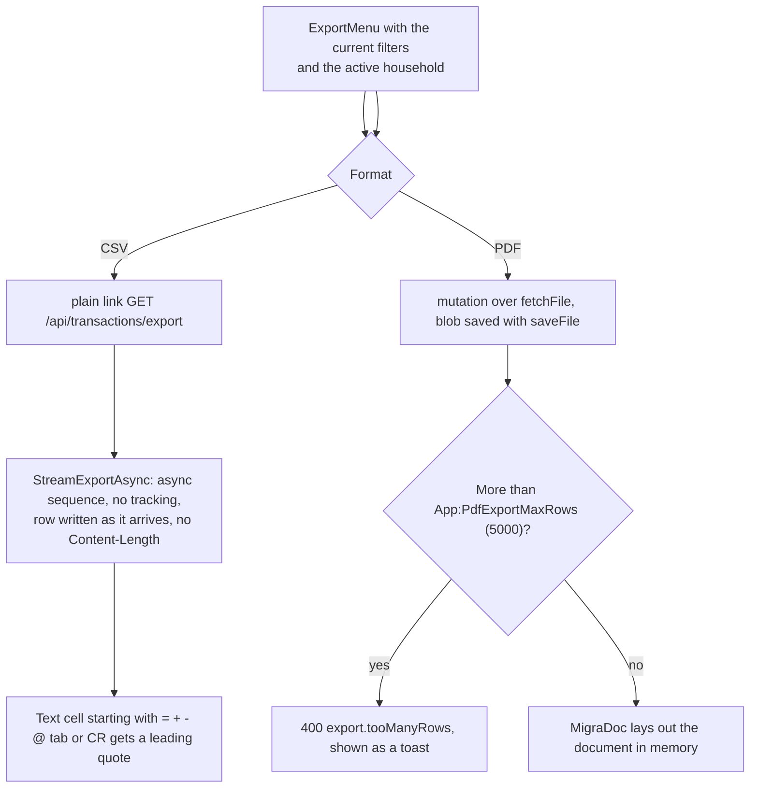
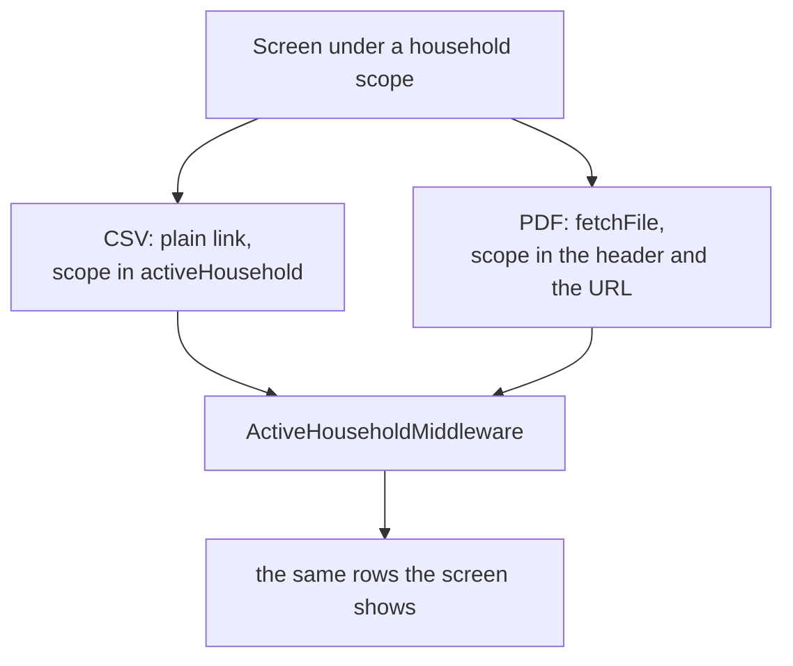

# Exports

Back to the [feature walkthrough](<../14. Feature walkthrough with diagrams.md>).

Every export answers the same scope as the screen it was started from. The filters of the screen are already in the URL; since 2026-09-21 the active household is there too, as `activeHousehold`, written by `useExportUrl` from the same browser preference the API client reads for its `X-Active-Household` header. A CSV is a plain `<a href>` and a browser sends no header of its own with one, so without that parameter a CSV downloaded under a household scope held rows the screen did not show, and disagreed with the PDF of the same screen.

The parameter is not a second rule. `ActiveHouseholdMiddleware` reads it on the three export routes only and puts it through the membership check the header gets, so an id the caller is not a member of, an unparsable value and an empty one all mean "Everything" and nothing can widen a view. The PDF carries both, because it goes through the API client and its URL is built the same way; the two must agree, and a request naming two different households is refused with 400 `household.scopeMismatch`. The [households page](<16. Households and sharing.md>) has the whole rule and the reason a household id is the one scope value allowed in a query string.

## The yearly investment tax summary

