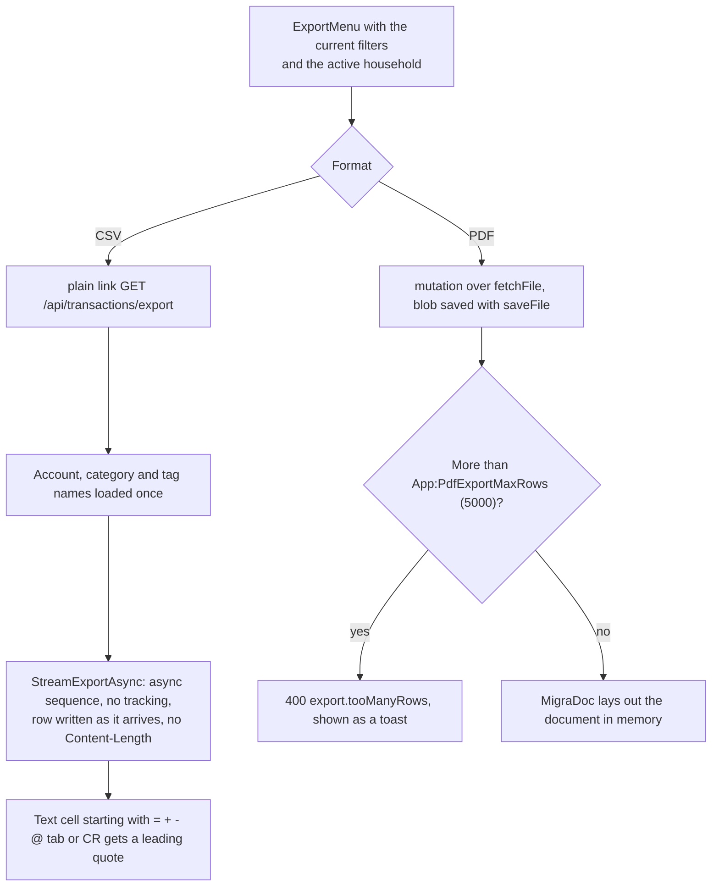
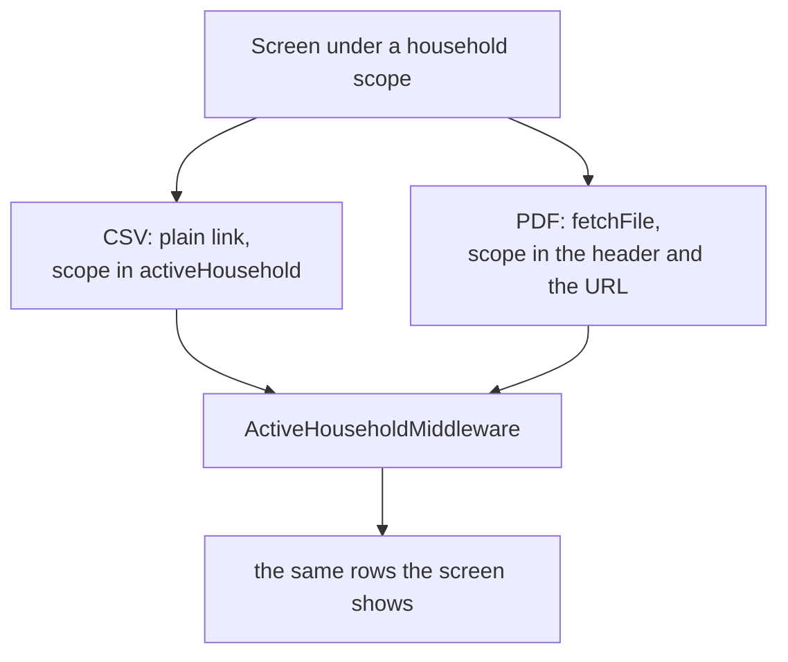
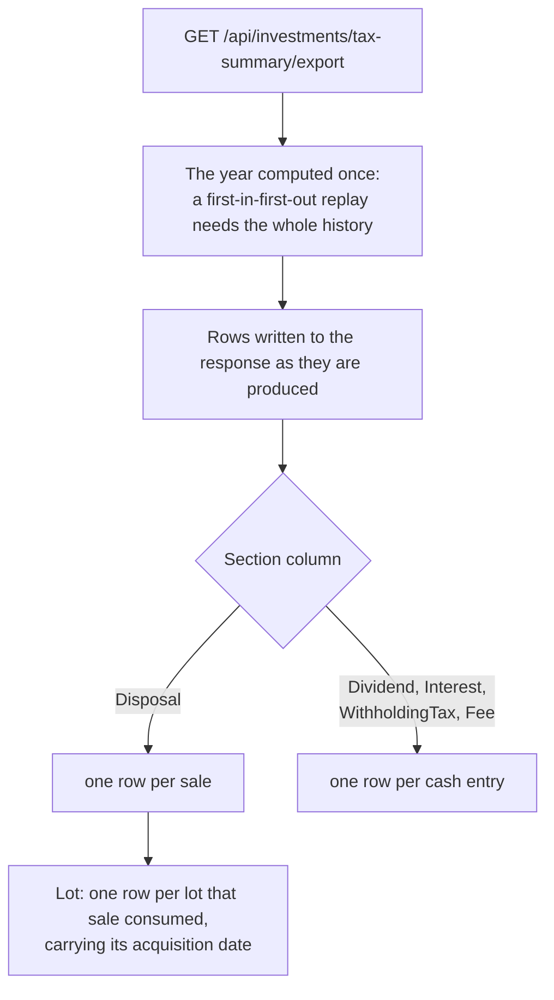

# Exports

Back to the [feature walkthrough](<../14. Feature walkthrough with diagrams.md>).

## The scope of an export

Every export answers the same scope as the screen it was started from. The filters of the screen are already in the URL; since 2026-09-21 the active household is there too, as `activeHousehold`, written by `useExportUrl` from the same browser preference the API client reads for its `X-Active-Household` header. A CSV is a plain `<a href>` and a browser sends no header of its own with one, so without that parameter a CSV downloaded under a household scope held rows the screen did not show, and disagreed with the PDF of the same screen.

The parameter is not a second rule. `ActiveHouseholdMiddleware` reads it on the three export routes only and puts it through the membership check the header gets, so an id the caller is not a member of, an unparsable value and an empty one all mean "Everything" and nothing can widen a view. The PDF carries both, because it goes through the API client and its URL is built the same way; the two must agree, and a request naming two different households is refused with 400 `household.scopeMismatch`. The [households page](<16. Households and sharing.md>) has the whole rule and the reason a household id is the one scope value allowed in a query string.

## Columns

The CSV carries `Date,Description,Account,Category,Tags,Type,Amount,Currency`. The PDF prints the same columns except the currency, which travels with each amount, and it lays them out with fixed widths for the date, the type and the amount and relative widths for the rest. The `Tags` cell holds the tag names joined with "; " — a semicolon rather than a comma, so the cell needs no quoting in the common case — and it is empty for a transaction that carries none.

Tags are the one column whose names the streamed row does not carry, so the CSV export loads the tag map of the filtered set in one query before it starts writing. A join row is two uuids, so that map is far smaller than the ledger it describes, and the rows themselves are still streamed one at a time. The PDF is capped at `App:PdfExportMaxRows` anyway, so it loads the tags of its own result. Tags are described on [Tags](<27. Tags.md>).

## The yearly investment tax summary

Since 2026-09-21 there is a second CSV, `GET /api/investments/tax-summary/export?year&accountIds`, described on [Investments](<20. Investments.md>). It writes its rows the same way — a `StreamWriter` over the response body, no `Content-Length`, the same leading-quote guard for a text cell that begins with `= + - @`, a tab or a carriage return — through the shared `Common/CsvCell` helper that the transaction export now also uses. Only text cells are guarded; a date, a number, a currency code or a section name is written as it is, so a negative amount keeps its minus sign.

It has no PDF. Printing that page under its print stylesheet replaces one, which keeps MigraDoc, and the row cap it needs, out of a report whose rows are already bounded by one year.

The columns are `Section,Date,Account,Security,Currency,Quantity,Amount,CostBasis,Gain,ReportingCurrency,ReportingAmount,ReportingCostBasis,ReportingGain,AcquiredOn,Description`. Each row carries the figure in the currency it was recorded in and again in the reporting currency at the frozen rate, which is why the currency appears twice. `Amount` is the proceeds of a disposal and the amount received or paid of a cash entry; withholding tax and fees are positive amounts paid. `Description` holds the security's full name on a `Disposal` row and the entry's note on a cash row. A `Lot` row repeats the date, account, security and currency of the disposal above it and fills only `Quantity`, `CostBasis`, `ReportingCostBasis` and `AcquiredOn`. There are no total rows: every row is a recorded entry, so a spreadsheet can sum a column without counting anything twice.
