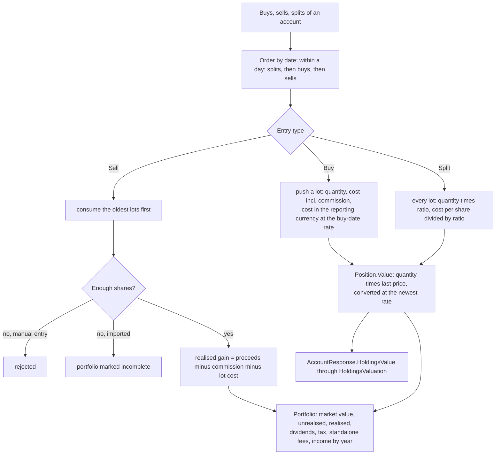
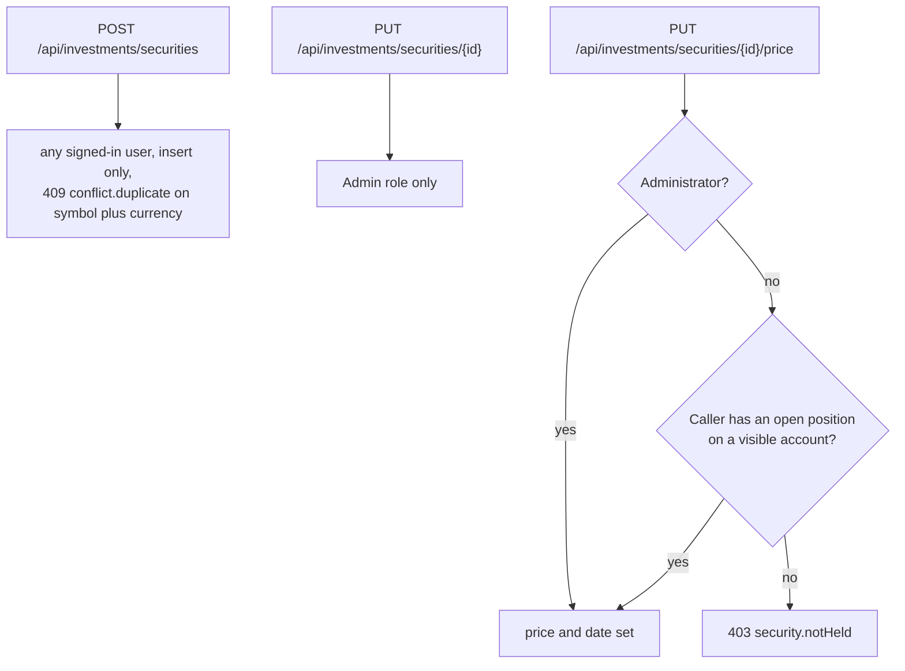
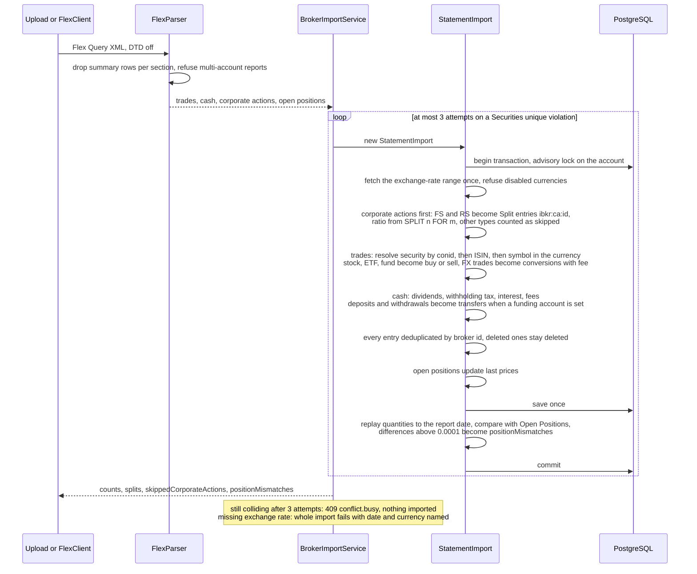
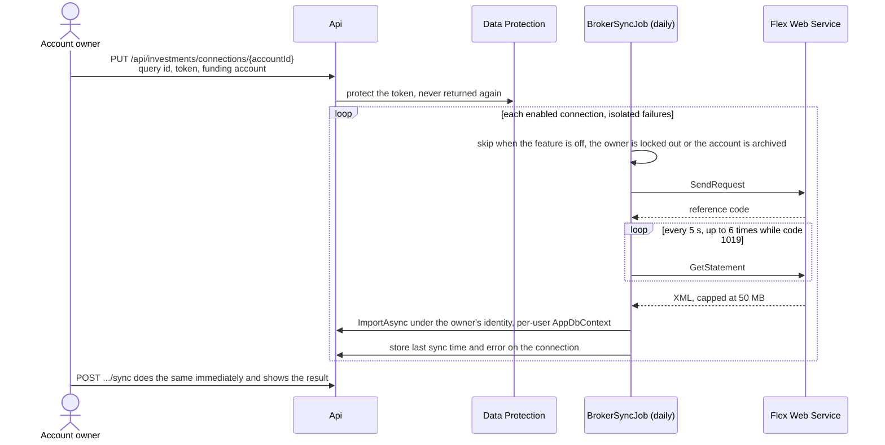

# Investments

Back to the [feature walkthrough](<../14. Feature walkthrough with diagrams.md>).

Backend `Investments` (`InvestmentService`, `HoldingsValuation`, `BrokerImportService`, `StatementImport`), `Infrastructure/Brokers/InteractiveBrokers` (`FlexParser`, `FlexClient`), page `/investments`.

## Positions by replay

Dividends, withholding tax, interest and fees move cash on the account through `CashAmount` but never count as income or expense in reports or budgets.

## Who may write a security

## Interactive Brokers import

## Automatic sync

