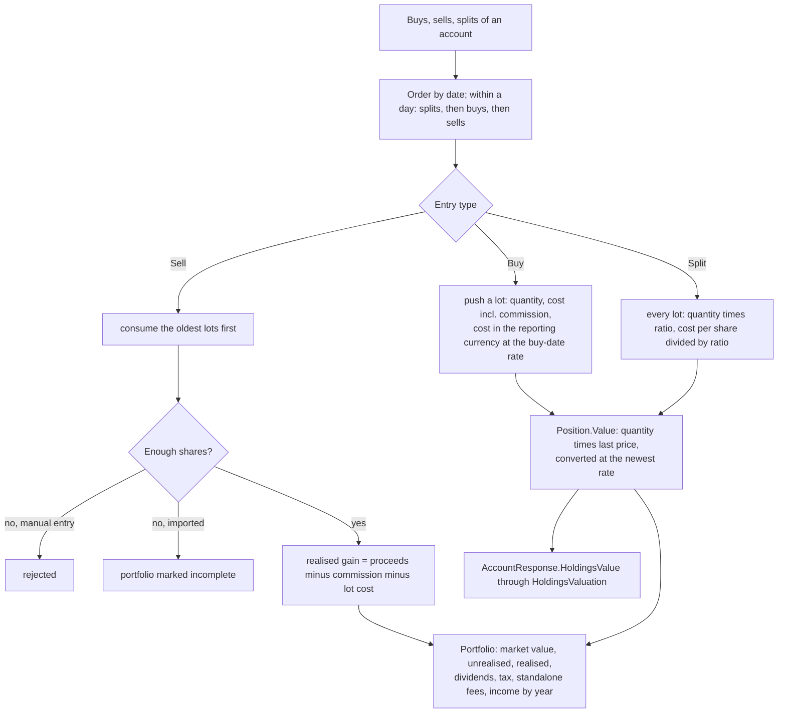
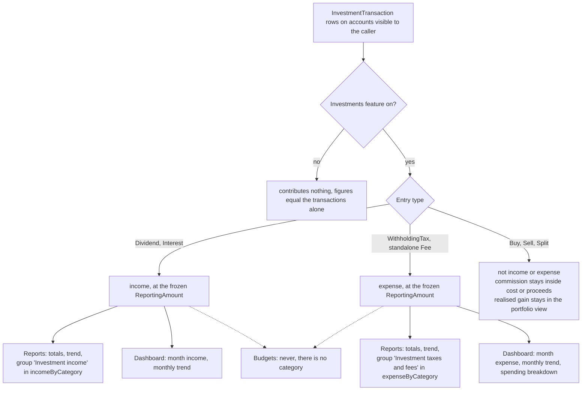
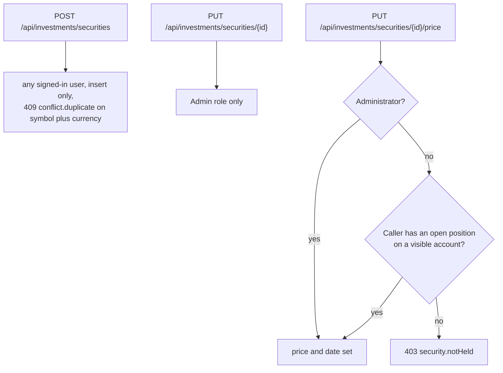
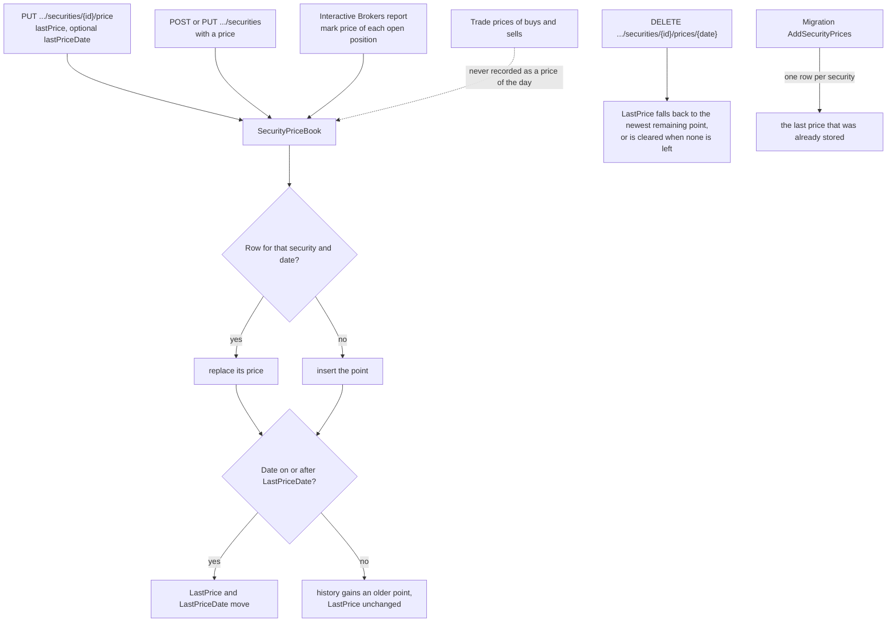
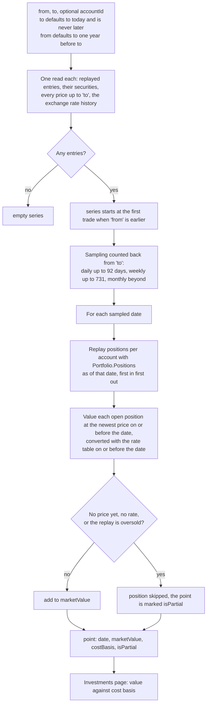
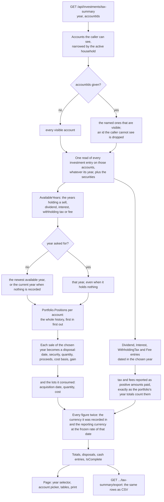
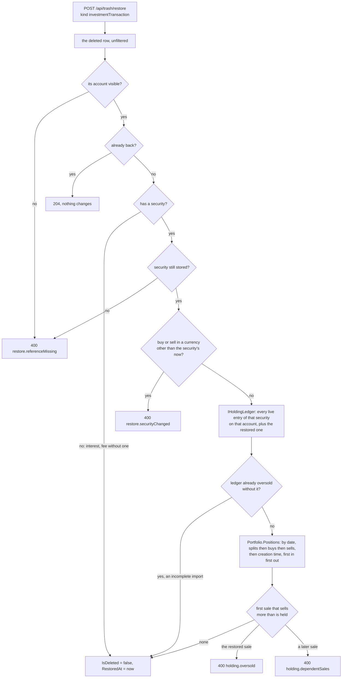
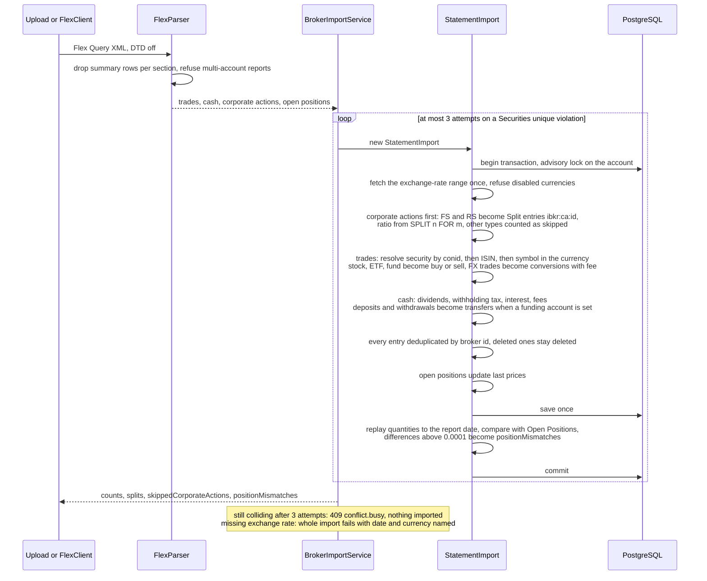
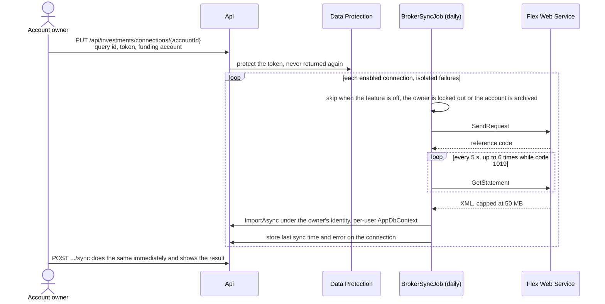

# Investments

Back to the [feature walkthrough](<../14. Feature walkthrough with diagrams.md>).

Backend `Investments` (`InvestmentService`, `HoldingsValuation`, `BrokerImportService`, `StatementImport`), `Infrastructure/Brokers/InteractiveBrokers` (`FlexParser`, `FlexClient`), page `/investments`.

## Positions by replay

## What feeds reports and the dashboard

Dividends, withholding tax, interest and fees move cash on the account through `CashAmount`. Since 2026-09-20 they also count in reports and on the dashboard, read by `IInvestmentCashFlowService` (`Common/InvestmentCashFlows`): dividends and interest as income, withholding tax and standalone fees as expense. Buys, sells and splits do not, and the realised gain of a sale is shown only in the portfolio. They never reach budgets, because a budget belongs to a category and these entries have none, and they are not rows of the transaction CSV or PDF export. The details of the response are on the [Reports page](<18. Reports.md>).

## Who may write a security

Deleting a point of the price history is allowed under the same rule as setting a price.

## Price history

Since 2026-09-20 a price is kept per security and date in `SecurityPrice`, and `Security.LastPrice` remains the newest point. Every write goes through `SecurityPriceBook`, so the three ways a price can arrive cannot disagree.

## Portfolio value over time

`GET /api/investments/value-history` computes the series on every request; nothing is stored. Net worth snapshots remain the only stored value series, and they cover the whole net worth rather than the portfolio.

Visibility follows the account as everywhere else, so a point only holds what the caller may see. The cost basis of each point is the reporting-currency cost of the lots still open on that date, which is why a sale lowers both lines at once.

## Yearly tax summary

Since 2026-09-21 the investments page has a second view, `/investments?view=taxSummary`, that shows one calendar year of what was recorded. It is a summary of recorded data and not tax advice: it applies no tax, no rate and no allowance, it computes nothing that could be called an amount owed, and it names no tax form. The page says so in English and Lithuanian above the tables. The Lithuanian annual declaration was the reason for building it, but everything on it is a neutral restatement of entries that already exist.

Where each number comes from:

| On the page | Read from | Frozen at |
| --- | --- | --- |
| Proceeds of a disposal | the sell entry's `CashAmount` (price times quantity less commission) | `ReportingAmount`, the rate of the sell date |
| Cost basis of a disposal | the buy entries the first-in-first-out replay consumed, commission included | each buy's `ReportingAmount`, the rate of its own buy date |
| Gain or loss | proceeds minus cost basis | the same two |
| A consumed lot | one buy entry, or the remainder of one, after every split that followed it | as above |
| Dividends, interest | `CashAmount` of `Dividend` and `Interest` entries | `ReportingAmount` |
| Withholding tax, fees | `CashAmount` of `WithholdingTax` and standalone `Fee` entries, sign flipped to the amount paid | `ReportingAmount` |

Nothing here reads a price. `SecurityPrice` and `Security.LastPrice` decide unrealised value only, so adding, changing or deleting a price cannot move a figure on this page. The price history described above and this summary never meet.

It also does not add anything to what reports already show. Since 2026-09-20 dividends and interest count as income in reports and on the dashboard, and withholding tax and standalone fees as expense; this page lists those same entries one by one for a single year, so a reader sees the detail behind a number they have already seen rather than a second number to add to it. The realised gain of a disposal is the one figure reports never carry, because a sale is not income; before this page it existed only as a portfolio total and a per-year row.

`IsComplete` is false when the replay of a chosen account is oversold, which happens when an imported sale has no recorded purchase behind it. The page then says that a cost basis is incomplete instead of hiding the year.

The chosen year and account selection travel in the URL (`taxYear`, `taxAccounts`), so the back button undoes a change, a reload keeps it and a printed page matches what was on screen. Nothing chosen means every visible account, which is also what the endpoint does when `accountIds` is absent.

### CSV and printing

`GET /api/investments/tax-summary/export` answers the same year as a CSV attachment named `investment-tax-summary-<year>.csv`, written the way the transaction CSV is: a `StreamWriter` over the response body, rows written as they are produced, no `Content-Length`, and a text cell that begins with `= + - @`, a tab or a carriage return gains a leading quote. It differs in one way, and the [decision log](<../9. Open questions & decisions.md>) records it: the rows cannot be streamed straight out of a query, because a first-in-first-out cost basis needs the whole history of a holding before the year can be reported, so the year is computed once in memory and then written out. The set is bounded by one year of one caller's entries. The columns are on the [Exports page](<19. Exports.md>).

The printable view is the page itself under a print stylesheet, not a second document. MigraDoc, which makes the transaction PDF, lays the whole document out in memory and therefore needs `App:PdfExportMaxRows`; a second MigraDoc document would mean a second layout of the same tables, a second row cap, and English-only text, because the PDF is written in the backend while this page is translated in the browser. Printing the page instead reuses the tables, the locale, the reporting-currency formatting and the frozen amounts that are already on screen, and it is bounded by what the page already holds. The sidebar, the mobile header and navigation, the banner and every control are `print:hidden`; the year and the list of included accounts are printed in their place.

## Deleting and restoring an entry

Since 2026-09-21 deleting any entry — buy, sell, split, dividend, withholding tax, interest or fee — writes a trash entry through `IDeletionRecorder` beside the soft delete, so the activity list raises the same undo toast as every other delete screen and the entry stays restorable for 30 days from the trash on the profile ([Trash and undo](<29. Trash and undo.md>)). Deleting a buy or a split is still refused with `holding.dependentSales` when later sales depend on it.

Restoring an entry is not a matter of flipping the flag back. The holding may have moved on while the entry was in the trash: the shares a deleted sale freed may have been sold again, or the purchase it drew on may itself have been deleted or moved later. The restore therefore replays the whole ledger of that security on that account, with the entry back in its original place, before it lets it in.

The replay is the one the create, edit and delete paths already ran, moved out of `InvestmentService` into `IHoldingLedger` in `Common/Holdings` so that `TrashService` calls the same code rather than a copy. `Position` now remembers the first sale that found too few lots, and the ledger answers that sale's id, which is what tells the two refusals apart. The restored row keeps its date and its creation time, so it lands exactly where it was in the order, and the check is over every point in time rather than the final quantity: a sale on 3 June is refused when the only purchase has since been moved to 10 June, although the holding ends with enough shares. As on the other paths, a ledger that is already oversold before the change — an imported sale with no recorded purchase — is not blamed on the entry being restored.

Restoring a buy can never oversell, and neither can a dividend, withholding tax, interest or fee, because none of them removes shares; a split with a ratio above one only adds them. A reverse split is the other entry that removes shares, and it answers `holding.dependentSales` when a later sale now needs them. The remaining questions each have a deliberate answer:

| Could make a restore unsound | Answer |
| --- | --- |
| The account was archived | refused with `restore.referenceMissing`; restore the account first from the accounts page, then the entry |
| The security is gone | refused with `restore.referenceMissing`. Securities have no delete operation, so this answers a state nothing in the product can reach today, and exists so that a future delete cannot bring an entry back pointing at nothing |
| The security's currency was changed | refused with `restore.securityChanged` for a buy or sell. A security's currency is locked only while live entries exist, so deleting the last one unlocks it; a restored trade would then carry cash in a currency the security no longer has. A dividend, tax, interest or fee may be recorded in any currency and is not affected |
| An imported entry was imported again | cannot happen. The unique index on (AccountId, ExternalId) covers deleted rows, and the importer reads the known broker ids with the query filters off, so a re-import counts the deleted entry as a duplicate and skips it. The restored row is the only one with that id |
| Its currency has been disabled since | not refused. Existing rows in a disabled currency stay valid everywhere else — an edit that keeps the currency is allowed — and the entry's `ReportingAmount` was frozen at its own date, so bringing it back converts nothing |
| The Investments feature is off | the row leaves the trash list and a restore answers 404 `feature.disabled`, as every kind of a switched-off feature does |

## Interactive Brokers import

## Automatic sync

