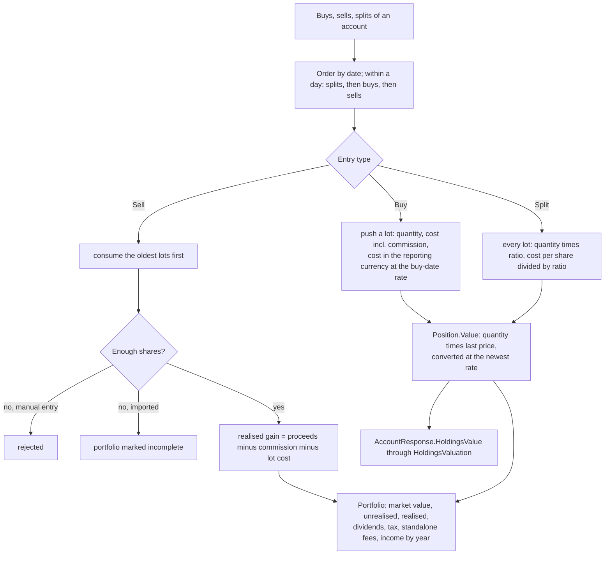
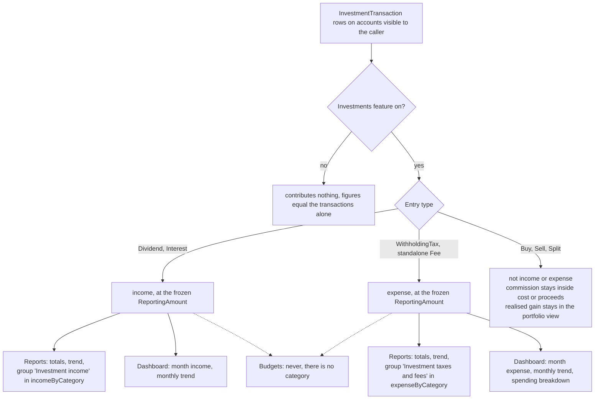
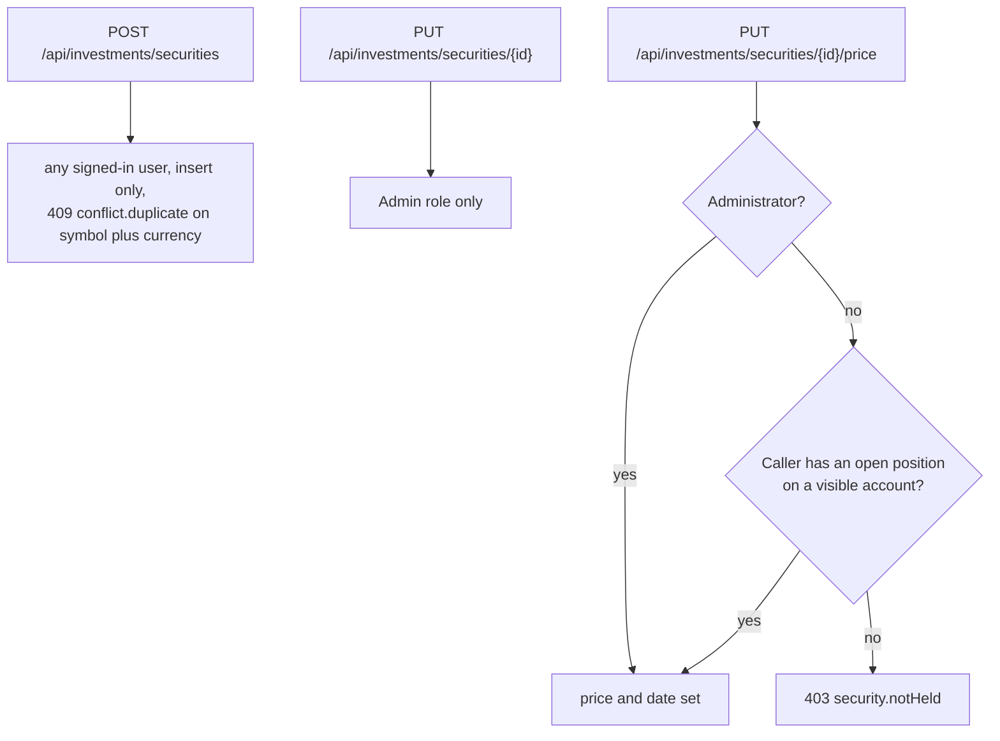
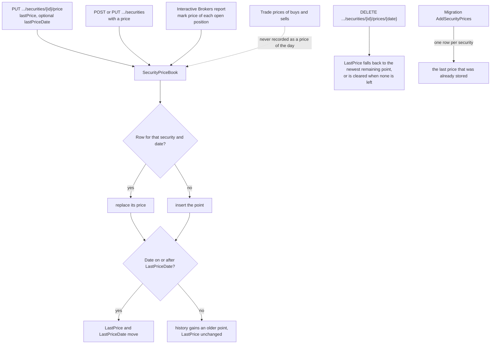
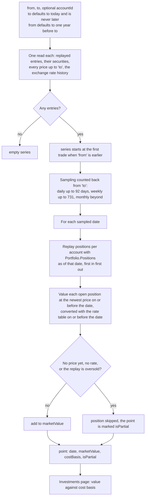
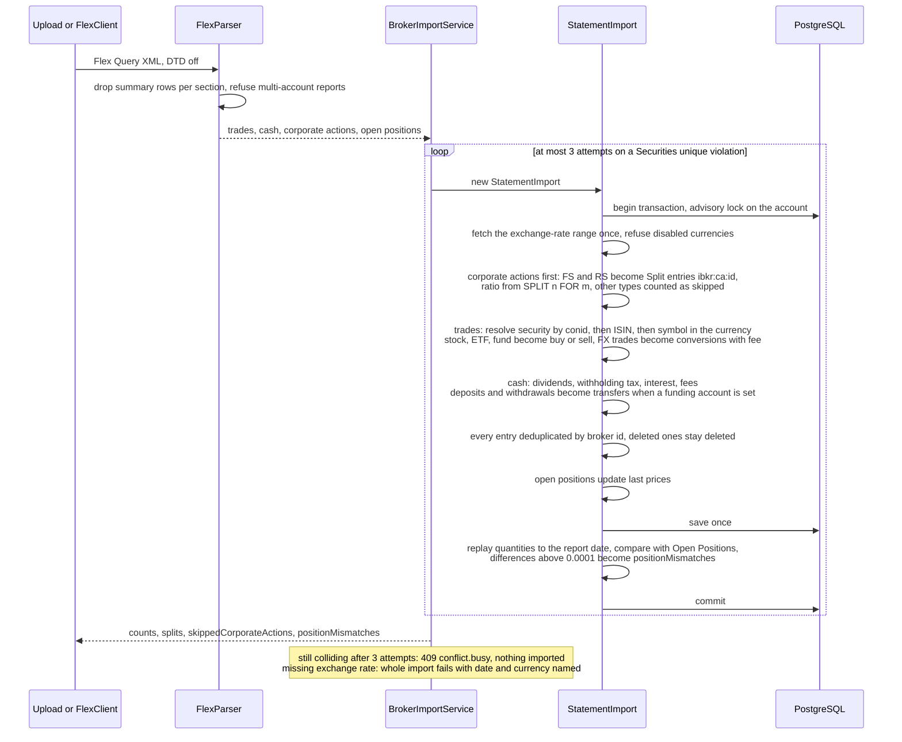
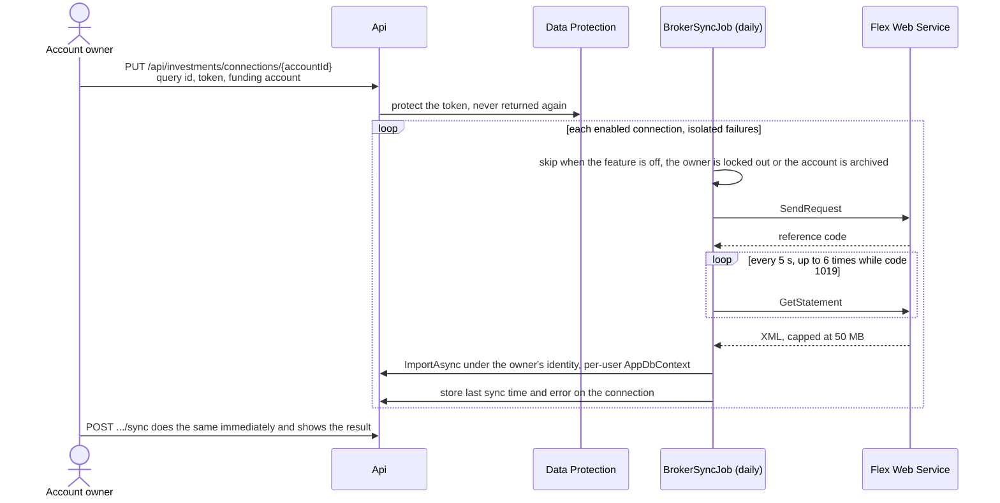

# Investments

Back to the [feature walkthrough](<../14. Feature walkthrough with diagrams.md>).

Backend `Investments` (`InvestmentService`, `HoldingsValuation`, `BrokerImportService`, `StatementImport`), `Infrastructure/Brokers/InteractiveBrokers` (`FlexParser`, `FlexClient`), page `/investments`.

## Positions by replay

Dividends, withholding tax, interest and fees move cash on the account through `CashAmount` but never count as income or expense in reports or budgets.
## What feeds reports and the dashboard

Dividends, withholding tax, interest and fees move cash on the account through `CashAmount`. Since 2026-09-20 they also count in reports and on the dashboard, read by `IInvestmentCashFlowService` (`Common/InvestmentCashFlows`): dividends and interest as income, withholding tax and standalone fees as expense. Buys, sells and splits do not, and the realised gain of a sale is shown only in the portfolio. They never reach budgets, because a budget belongs to a category and these entries have none, and they are not rows of the transaction CSV or PDF export. The details of the response are on the [Reports page](<18. Reports.md>).

## Who may write a security

## Price history

Since 2026-09-20 a price is kept per security and date in `SecurityPrice`, and `Security.LastPrice` remains the newest point. Every write goes through `SecurityPriceBook`, so the three ways a price can arrive cannot disagree.

## Portfolio value over time

`GET /api/investments/value-history` computes the series on every request; nothing is stored. Net worth snapshots remain the only stored value series, and they cover the whole net worth rather than the portfolio.

Visibility follows the account as everywhere else, so a point only holds what the caller may see. The cost basis of each point is the reporting-currency cost of the lots still open on that date, which is why a sale lowers both lines at once.

Where each number comes from:

| On the page | Read from | Frozen at |
| --- | --- | --- |
| Gain or loss | proceeds minus cost basis | the same two |
| A consumed lot | one buy entry, or the remainder of one, after every split that followed it | as above |
| Dividends, interest | `CashAmount` of `Dividend` and `Interest` entries | `ReportingAmount` |
| Withholding tax, fees | `CashAmount` of `WithholdingTax` and standalone `Fee` entries, sign flipped to the amount paid | `ReportingAmount` |

Nothing here reads a price. `SecurityPrice` and `Security.LastPrice` decide unrealised value only, so adding, changing or deleting a price cannot move a figure on this page. The price history described above and this summary never meet.

`IsComplete` is false when the replay of a chosen account is oversold, which happens when an imported sale has no recorded purchase behind it. The page then says that a cost basis is incomplete instead of hiding the year.

### CSV and printing

## Interactive Brokers import

## Automatic sync

