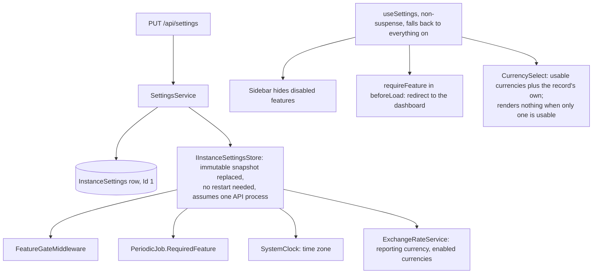

# Installation settings and feature switches

Back to the [feature walkthrough](<../14. Feature walkthrough with diagrams.md>).

Backend `Settings`, page `/settings` with sections `general`, `features`, `currencies`, `regional`, `defaults`, `email`, `import`, `backups`, `appearance`. Administrators only; `GET /api/settings/public` is anonymous and carries only the name, the default language and whether this installation can send email.

| Feature switch | Route prefixes gated | Also stops |
| --- | --- | --- |
| `Budgets` | `/api/budgets` | budget alert job, and the link on a budget alert in the bell |
| `Goals` | `/api/goals` | |
| `RecurringBills` | `/api/recurring-bills` | reminder job, and the link on a bill reminder in the bell |
| `NetWorth` | `/api/networth`, `/api/assets`, `/api/debts` | snapshot job |
| `Reports` | `/api/reports` | |
| `Import` | `/api/import` | |
| `Households` | `/api/households` (list answers empty) | |
| `MultiCurrency` | `/api/conversions` | foreign currency entry |
| `Investments` | `/api/investments` | broker sync job |

The mail server is the one installation setting that is not part of this form and not a feature switch. It has its own admin-only pair, `GET` and `PUT /api/settings/smtp`, and its own `enabled` flag, because `GET /api/settings` is readable by every signed-in user and an SMTP user name is a credential; because one save of the main form would have to either resend the password or lose it; and because `forgot-password`, `reset-password` and `verify-email` must keep answering even when sending is switched off, so gating them in `FeatureGateMiddleware` would break links that were already mailed. See [Email](<26. Email.md>).

Turning a feature off deletes nothing; turning it on brings the data back. `/api/notifications` is deliberately not in the table: the notification channel belongs to no single feature, so it answers whatever is switched on, and notifications already raised stay listed and countable after their producer is switched off.

`/api/tags` is not in the table either, and neither is `/api/transactions/bulk-tags`. A tag is an attribute of a transaction, exactly like its category, not a screen with its own data: `GET /api/transactions` would still answer `tagIds` and take the `tagIds` filter, both exports would still have to decide about their tag column and the report about `expenseByTag`, so a switch would buy a hidden management page at the price of a second shape for every one of those. A household that turned it off would also keep rows carrying tags it could no longer read or clear. Categories, the closest thing in the product, have no switch for the same reasons. See [Tags](<27. Tags.md>).

