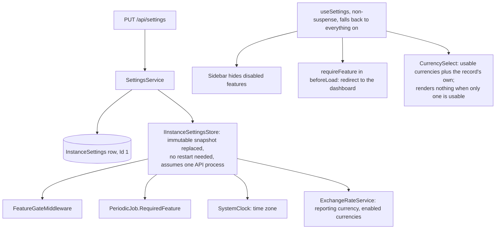

# Installation settings and feature switches

Back to the [feature walkthrough](<../14. Feature walkthrough with diagrams.md>).

Backend `Settings`, page `/settings` with sections `general`, `features`, `currencies`, `regional`, `defaults`, `import`, `backups`, `appearance`. Administrators only; `GET /api/settings/public` is anonymous and carries only the name and default language.

| Feature switch | Route prefixes gated | Also stops |
| --- | --- | --- |
| `Budgets` | `/api/budgets` | budget alert job, and the link on a budget alert in the bell |
| `Goals` | `/api/goals` | |
| `RecurringBills` | `/api/recurring-bills` | reminder job |
| `NetWorth` | `/api/networth`, `/api/assets`, `/api/debts` | snapshot job |
| `Reports` | `/api/reports` | |
| `Import` | `/api/import` | |
| `Households` | `/api/households` (list answers empty) | |
| `MultiCurrency` | `/api/conversions` | foreign currency entry |
| `Investments` | `/api/investments` | broker sync job |

Turning a feature off deletes nothing; turning it on brings the data back.
