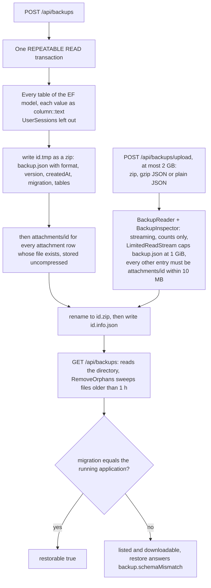
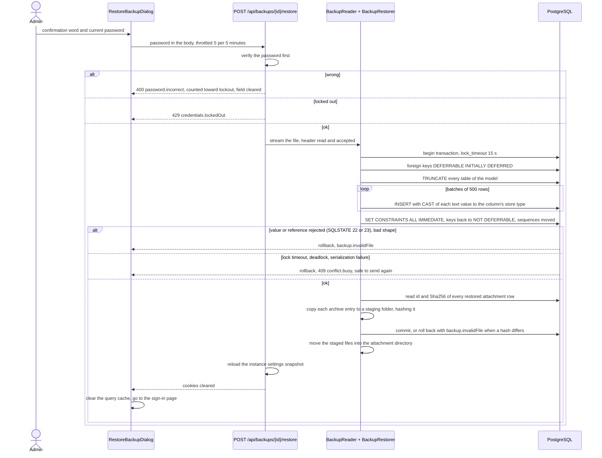

# Backup and restore

Back to the [feature walkthrough](<../14. Feature walkthrough with diagrams.md>).

Backend `Backups` (`BackupService`, `BackupArchive`, `BackupStore`, `BackupReader`, `BackupInspector`, `BackupRestorer`, `BackupDatabase`), Backups section of `/settings`. Administrators only; nothing is scheduled or copied offsite.

Since [attachments](<31. Attachments.md>) a backup is a zip archive: `backup.json`, the same JSON document as before, deflated, and one uncompressed entry `attachments/<id>` per attached file. A restore writes the files back after checking each one's SHA-256 against its restored row. Backups taken before are gzip-compressed JSON and are still listed, downloaded and uploaded as they are. The archive is about as large as the attachment directory plus the compressed data, so an upload may now be 2 GB, and the decompressed-size guard applies to `backup.json` alone.

## Taking and uploading

## Restore

