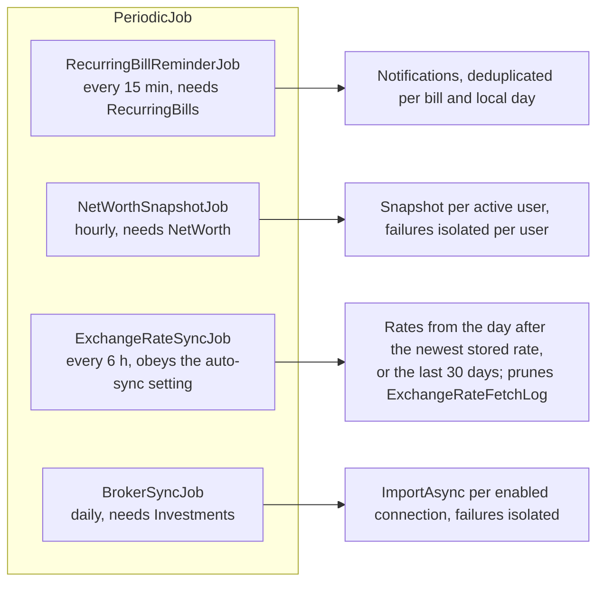
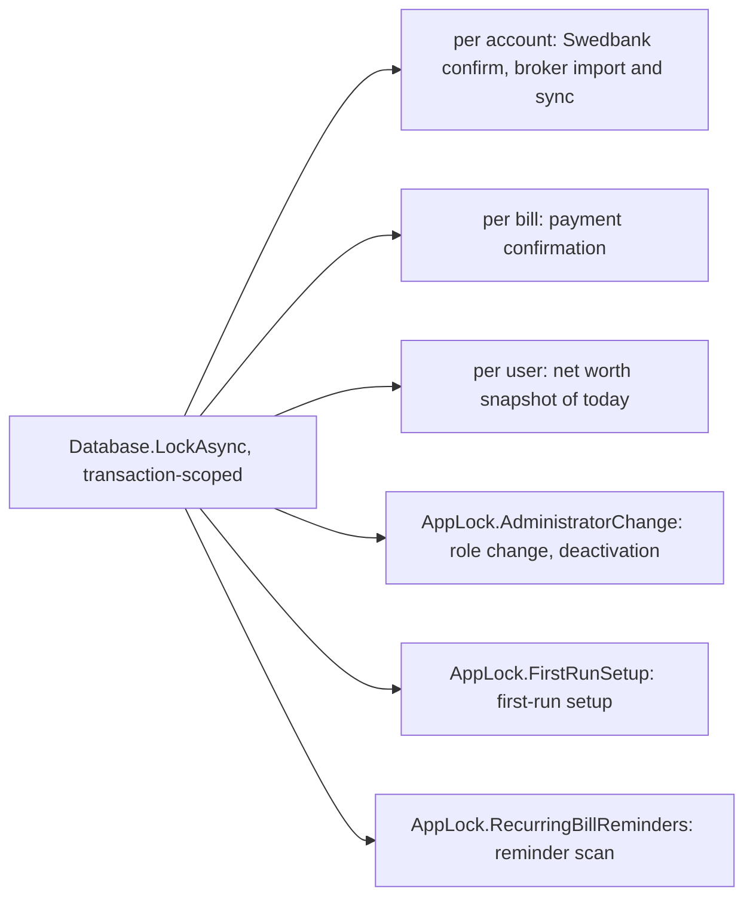

# Background jobs

Back to the [feature walkthrough](<../14. Feature walkthrough with diagrams.md>).

All four derive from `PeriodicJob`: a `PeriodicTimer` loop, a fresh service scope per pass, an optional feature gate, one pass immediately at startup, failures logged as "{Job} failed.".

## Advisory locks

